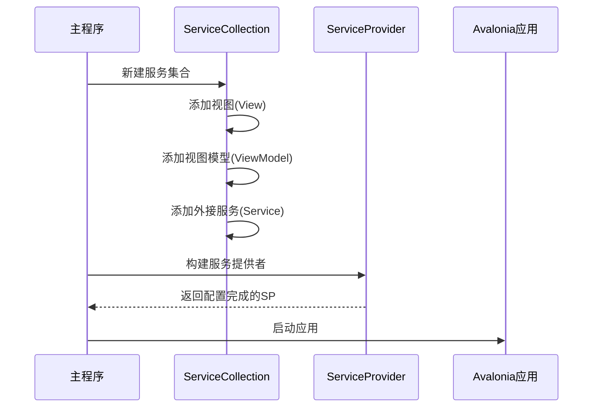

# Chapter 1: 依赖注入配置中心


想象你要组装一台智能家居控制面板，里面有很多电器模块——照明开关、温控器、监控摄像头。如果每次添加新设备都要重新布置整栋房子的电线，是不是很麻烦？💡

依赖注入配置中心就像**智能家居的中央配电箱**，让每个组件都能像「即插即用」的智能插座一样工作。本章带你用最简单的方式理解这个核心机制！

---

## 为什么需要配置中心？

假设我们有一个显示天气的页面 `WeatherView`，它需要获取天气数据的 `WeatherService`。传统方式可能这样写：

```csharp
// 传统紧耦合方式
public class WeatherView : UserControl 
{
    // 直接创建服务实例（像把电路焊死）
    private WeatherService _service = new WeatherService(); 
}
```

这会导致三个问题：
1. 🔌 组件像硬接线的电路，更换服务时要修改所有视图
2. 📦 测试时需要反复构造依赖对象
3. 🧩 新增服务时影响范围不可控

我们的解决方案是：**将组件注册到一个中央容器，按需取用**！

---

## 核心配置三步走

### 第一步：准备配电箱 (ServiceCollection)
```csharp
// 创建服务容器（像安装家庭配电箱）
var services = new ServiceCollection();
```

### 第二步：连接电器 (服务注册)
```csharp
// 注册ViewModel（将设备接入配电箱）
services.AddSingleton<MainWindowViewModel>();

// 注册服务（例如将空调接入电源插座）
services.AddSingleton<IWeatherService, WeatherService>();
```

### 第三步：供电系统 (ServiceProvider)
```csharp
// 构建服务提供者（启用全屋供电）
ServiceProvider = services.BuildServiceProvider();
```

---

## 看看真实代码怎么用

打开项目中的 `Program.cs`：
```csharp
public static void Main(string[] args)
{
    // 创建可扩展的服务容器
    var services = new ServiceCollection();
    
    // 批量注册组件（像安装智能家居套件）
    services.AddViews()        // 安装所有面板
           .AddViewModels()    // 连接各模块控制器
           .AddServices();     // 接入外设服务
    
    // 激活整个系统的供电
    ServiceProvider = services.BuildServiceProvider();
    
    // 启动Avalonia应用
    BuildAvaloniaApp().StartWithClassicDesktopLifetime(args);
}
```

注释说明：
- `AddViews()` → 像安装墙面开关面板
- `AddViewModels()` → 配对各面板的控制程序
- `AddServices()` → 连接外部天气/摄像头等服务

---

## 内部工作流程图解



当调用 `BuildServiceProvider()` 时：
1. 🧰 检查所有注册的类型
2. 🔗 建立类型间的依赖关系
3. 📦 为每个服务创建生命周期管理方案

---

## 配置中心的超能力

看这个扩展方法示例 (`ServiceCollectionExtensions.cs`)：
```csharp
public static IServiceCollection AddViewModels(this IServiceCollection services)
{
    // 添加三大核心控制模块
    services.AddSingleton<MainWindowViewModel>();  // 主控台
    services.AddSingleton<Page1ViewModel>();       // 页面1控制
    services.AddSingleton<Page2ViewModel>();       // 页面2控制
    
    return services; // 允许像乐高一样叠加扩展
}
```

通过返回 `IServiceCollection`，我们可以使用**链式调用**：
```csharp
services.AddViews()
        .AddViewModels()    // 延续之前的配置
        .AddServices();     // 继续扩展
```

就像在配电箱上逐个插入智能设备，每个扩展方法都是一个插件模块！

---

## 总结与预告

现在我们知道：**依赖注入配置中心通过统一注册管理，让组件像即插即用的智能设备一样工作**。这为后续的[服务注册工厂](02_服务注册工厂_.md)奠定了基础。

我们学会了：
1. 🧰 服务集合(ServiceCollection) 的作用相当于配电箱
2. 🔌 通过扩展方法规范插件的接入方式
3. ⚡ 服务提供者(ServiceProvider) 是系统的电力中枢

下一章我们将深入[服务注册工厂](02_服务注册工厂_.md)，学习如何优雅地批量安装这些「智能插件」！🚀

> 小思考：如果把我们的程序比作智能家居系统，你还能想到哪些组件可以「插拔式」接入呢？

---

Generated by [AI Codebase Knowledge Builder](https://github.com/The-Pocket/Tutorial-Codebase-Knowledge)