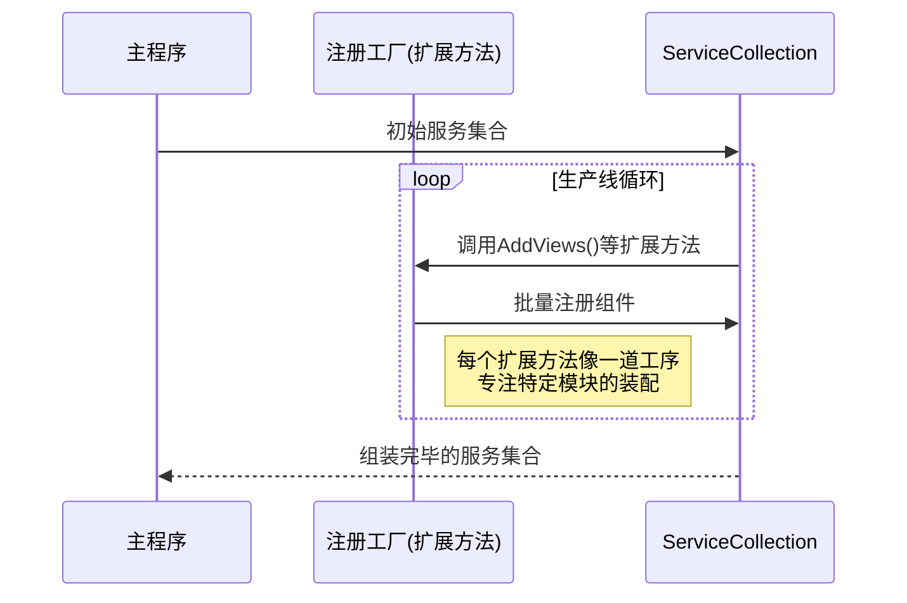

# Chapter 2: 服务注册工厂


上一章我们学会了在[依赖注入配置中心](01_依赖注入配置中心_.md)集中管理组件（像给智能家居配电箱接线）。但如果每次新增房间都要手动接线，也太费时了吧？🏗️

「服务注册工厂」就是**标准化乐高组件的装配说明书**，让视图、ViewModel等模块的注册像拼乐高一样简单可复用！

---

## 手工作坊的痛点

假设我们有30个视图需要注册，传统方式需要手动编写：

```csharp
// 原始手写方式（像逐个焊接电路）
services.AddSingleton<WeatherView>();
services.AddSingleton<LightControlView>();
services.AddSingleton<CameraView>();
...
// 重复30次！
```

这会带来三个问题：
1. 🚧 每次新增视图都要修改主程序代码
2. 🤯 容易遗漏或写错类型名
3. 🧩 不同模块的配置无法复用

解决方案——**用工厂批量化生产组件**！

---

## 乐高三步组装法

### 第一步：编写说明书（创建扩展类）
新建 `ServiceCollectionExtensions.cs`：
```csharp
public static class ServiceCollectionExtensions // 组装说明书
{
    public static IServiceCollection AddViews(this IServiceCollection services)
    {
        services.AddSingleton<MainWindow>();  // 安装主控台
        services.AddSingleton<Page1View>();   // 嵌入模块1
        services.AddSingleton<Page2View>();   // 嵌入模块2
        return services; // 继续组装其他零件
    }
}
```

这样的扩展方法就像**乐高说明书中的一页**，专注完成一个模块的装配。

### 第二步：组合套件（链式调用）
```csharp
// 像拼合不同说明书页
services.AddViews()  // 第一步安装面板
       .AddViewModels() // 第二步配控制器
       .AddServices();  // 第三步接入外部设备
```

每个方法返回服务集合本身，支持无限延续（就像不断拼接乐高块）。

---

## 看看真实工厂流水线

打开项目中的 `ServiceCollectionExtensions.cs`：
```csharp
public static IServiceCollection AddViews(this IServiceCollection services)
{
    services.AddSingleton<MainWindow>(); // 主控大屏幕
    services.AddSingleton<Page1View>();  // 分页1显示区
    services.AddSingleton<Page2View>();  // 分页2显示区
    return services; // 生产完成，流转到下一环节
}

public static IServiceCollection AddViewModels(this IServiceCollection services)
{
    services.AddSingleton<MainWindowViewModel>();  // 主控程序
    services.AddSingleton<Page1ViewModel>();       // 分页1逻辑
    services.AddSingleton<Page2ViewModel>();       // 分页2逻辑
    return services; // 继续传递组件到流水线末端
}
```

注释说明：
- `AddViews` → 装配显示模块（控制面板）
- `AddViewModels` → 安装控制芯片（逻辑处理）
- 返回类型让流水线上各工位无缝衔接

---

## 工厂运作流程图解



当主程序调用 `AddViews()` 时：
1. 🏭 自动为方法参数传入当前服务集合
2. 🔧 执行该扩展方法内的所有注册操作
3. 🚚 返回更新后的集合保持流水线运转

---

## 工厂秘技：自动扩展方法

理解这个语法糖：
```csharp
// 扩展方法的魔法：this关键字
public static IServiceCollection AddViews(this IServiceCollection services)
```

这个 `this` 参数让静态方法可以像原生的集合操作一样调用：
```csharp
// 原本需要这样调用：
ServiceCollectionExtensions.AddViews(services);

// 使用扩展方法后变形：
services.AddViews(); // 像为服务集合新增的能力
```

就像给乐高工厂的机械臂安装了新程序，新增操作更自然！

---

## 总结与进阶

我们已经掌握：**服务注册工厂通过扩展方法，实现了组件注入的批量化和模块化管理**。这种模式让我们的配置系统像现代化工厂一样高效可靠。

关键收获：
1. 📚 扩展方法是组织注册逻辑的理想载体
2. ⛓️ 链式调用让配置过程形成流水线
3. 🧱 每个扩展方法对应一个功能模块的组装规范

下一章我们将学习[应用启动引擎](03_应用启动引擎_.md)，看看这些「乐高成品」是如何被启动系统激活的！🚀

> 动手实验：试着在代码中添加一个 `AddOtherServices` 扩展方法，练习你的「工厂新技能」！

---

Generated by [AI Codebase Knowledge Builder](https://github.com/The-Pocket/Tutorial-Codebase-Knowledge)