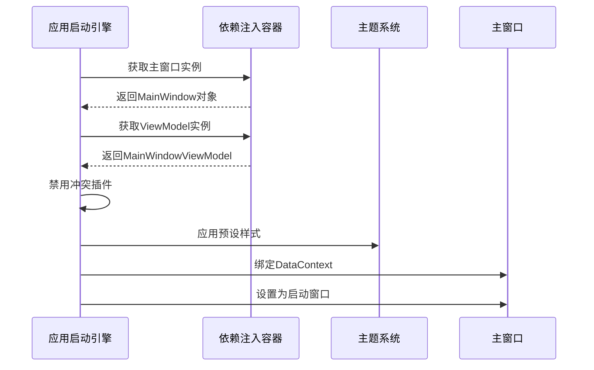

# Chapter 3: 应用启动引擎


在[依赖注入配置中心](01_依赖注入配置中心_.md)和[服务注册工厂](02_服务注册工厂_.md)准备好所有组件后，现在需要将这些「零部件」组装成真正的「宇宙飞船」！我们的应用启动引擎就像火箭发射控制台，确保所有系统就绪后才升空。

---

## 为什么需要启动引擎？

想象要给智能家居系统通电：
1. 🔌 先检查电路是否有短路风险
2. 🎨 统一所有房间的灯光配色方案
3. 🖥️ 激活中央控制面板与各个传感器的连接

如果直接启动会发生：
- ⚡ 两个数据验证插件同时运行导致冲突
- 🎭 不同组件使用不同的主题样式
- 🚪 主窗口无法找到对应的控制程序

应用启动引擎就是为解决这些问题而生的！

---

## 发射倒计时三步走

### 第一步：安全检查（禁用冲突插件）
在 `App.axaml.cs` 中：
```csharp
private void DisableAvaloniaDataAnnotationValidation()
{
    // 找到Avalonia的数据验证插件（就像排查冲突的供电线路）
    var pluginsToRemove = BindingPlugins.DataValidators
                        .OfType<DataAnnotationsValidationPlugin>().ToArray();
                        
    foreach(var plugin in pluginsToRemove)
    {
        BindingPlugins.DataValidators.Remove(plugin); // 拔掉有风险的线路
    }
}
```
为什么要这样做？🚨  
因为CommunityToolkit的验证器与Avalonia自带的会产生重复校验，就像两个门锁同时工作会卡死大门。

---

### 第二步：主题装饰（配置视觉风格）
在 `App.axaml` 中添加：
```xml
<Application.Styles>
    <FluentTheme /> <!-- 使用微软Fluent设计风格 -->
    <MaterialTheme /> <!-- 或者Google Material风格 -->
</Application.Styles>
```
这是给「宇宙飞船」喷涂统一的视觉效果，就像确定舱内灯光颜色和仪表盘样式。

---

### 第三步：连接控制中枢（绑定主窗口）
```csharp
// 获取注入的主窗口和ViewModel（像启动主控台）
var mainWindow = ServiceProvider.GetRequiredService<MainWindow>();
var mainViewModel = ServiceProvider.GetRequiredService<MainWindowViewModel>();

// 建立数据上下文连接（接驳神经网络）
mainWindow.DataContext = mainViewModel;

// 设置为应用的启动窗口（发射入口）
desktop.MainWindow = mainWindow;
```
这就完成了**硬件（Window）与软件（ViewModel）的最终对接**！

---

## 完整启动流程图解



当调用 `OnFrameworkInitializationCompleted` 时：
1. 📡 禁用冗余的数据验证插件（避免信号干扰）
2. 🎨 加载主题样式包（统一视觉语言）
3. 🤝 将窗口与ViewModel配对（建立双向通信）

---

## 引擎核心代码详解

打开 `App.axaml.cs` 的启动部分：
```csharp
public override void OnFrameworkInitializationCompleted()
{
    if (ApplicationLifetime is IClassicDesktopStyleApplicationLifetime desktop)
    {
        DisableAvaloniaDataAnnotationValidation(); // 第一步安全措施
        
        // 第二步获取核心组件
        var mainWindow = Program.ServiceProvider?.GetRequiredService<MainWindow>();
        var mainViewModel = Program.ServiceProvider?.GetRequiredService<MainWindowViewModel>();
        
        // 第三步建立关键连接
        if (mainWindow != null && mainViewModel != null)
        {
            mainWindow.DataContext = mainViewModel; // 神经连接建立
            desktop.MainWindow = mainWindow;       // 启动主控台
        }
    }
    
    base.OnFrameworkInitializationCompleted();    // 完成引擎预热
}
```

注释解密：
- `GetRequiredService` → 从依赖注入容器中提取已注册的组件
- `DataContext` 绑定 → 让窗口能自动识别ViewModel中的数据和命令
- `MainWindow` 设置 → 告诉Avalonia哪个窗口是入口

---

## 发射成功的三大要素

成功启动的秘诀在于：
1. **安全防护机制**  
通过移除 `DataAnnotationsValidationPlugin`，避免双重验证导致界面卡顿

2. **视觉系统预载**  
在XAML中预设主题，保证界面风格一致性

3. **控制中枢联通**  
通过依赖注入获取主窗口和ViewModel，建立数据绑定的「量子纠缠」

---

## 总结与太空漫游

我们已经掌握：**应用启动引擎通过关键的三步操作，确保程序像火箭发射一样平稳启动**。这为后续的[视图模型基座](04_视图模型基座_.md)奠定了基础。

核心收获：
1. 🚫 识别并禁用冲突插件的重要性
2. 🎭 主题样式的统一配置方式
3. 🔗 主窗口与ViewModel的依赖注入式连接

下一章我们将解锁[视图模型基座](04_视图模型基座_.md)，学习如何构建稳定可靠的「飞船控制核心」！🚀

> 思考时刻：如果把数据验证插件比作安全锁，你还知道哪些需要提前检查的「发射前清单」项目？

---

Generated by [AI Codebase Knowledge Builder](https://github.com/The-Pocket/Tutorial-Codebase-Knowledge)