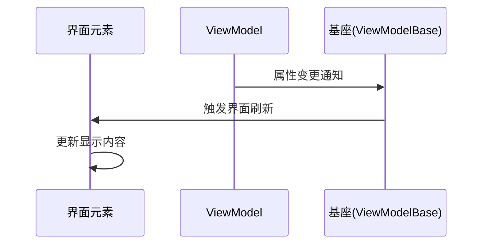

# Chapter 4: 视图模型基座


在前几章中我们配置好了[依赖注入配置中心](01_依赖注入配置中心_.md)和[应用启动引擎](03_应用启动引擎_.md)，现在需要让所有设备（ViewModel）都能「通电工作」。好比智能家居中的各种电器需要一个标准插座，视图模型基座就是为所有ViewModel提供统一接口的「万能插座」！

---

## 为什么需要基座？  

假设我们要开发一个智能灯光系统，每个按钮控制不同房间的照明：

```csharp
// 原始版本：没有继承基座的ViewModel
public class LightViewModel 
{
    private bool _isOn; // 灯光状态
    
    public void Toggle() 
    {
        _isOn = !_isOn;
        // 需要手动通知界面更新 🤯
    }
}
```

这会导致：
1. 🔌 每个ViewModel都要重复实现通知逻辑
2. ⚡ 容易忘记触发界面更新
3. 🧩 不同开发者的实现方式差异大

**视图模型基座通过统一的基类，让所有ViewModel自带标准化接口** 🎯

---

## 基座三大核心功能

### 功能一：插电就亮（内置通知机制）
```csharp
// 使用基座后的灯光ViewModel
public class LightViewModel : ViewModelBase // ← 继承自基座
{
    [ObservableProperty]
    private bool _isOn; // 灯光状态
    
    // 无需手动通知，就像插电即用！
}
```

通过继承 `ViewModelBase`，自动获得通知UI的能力。当 `IsOn` 变更时，界面会自动刷新！

---

### 功能二：统一接口（标准化属性）
```csharp
// 所有ViewModel都具有相同基础配置
public class LightViewModel : ViewModelBase
{
    // 统一使用[ObservableProperty]特性
    [ObservableProperty]
    private string _roomName = "主卧室";
}
```

这就像所有家电的插头形状统一为两相接口，确保每个插座都能匹配。

---

### 功能三：即插即用（便捷扩展）
```csharp
// 新增温控ViewModel只需继承基座
public class ThermoViewModel : ViewModelBase 
{
    [ObservableProperty]
    private double _temperature = 26.5;
    
    // 自动获得所有基础功能
}
```

添加新的功能模块就像插入新的智能设备一样简单快速！

---

## 如何搭建基座？

### 第一步：创建基类文件
新建 `ViewModelBase.cs`：
```csharp
using CommunityToolkit.Mvvm.ComponentModel; // 引入工具包

public class ViewModelBase : ObservableObject // ← MVVM工具类
{
    // 空基类只继承功能，像插座本体不带电器功能
}
```

这个简单的基类继承自 **CommunityToolkit.Mvvm** 的 `ObservableObject`，它自带了通知UI的基础能力。

---

### 第二步：开发电器模块
创建具体的ViewModel（以主界面为例）：
```csharp
public class MainViewModel : ViewModelBase 
{
    // 用户姓名属性（带自动通知）
    [ObservableProperty]
    private string _userName = "新用户";

    // 控制按钮是否可用
    [ObservableProperty]
    private bool _isEnabled = true;
}
```

注释说明：
- `[ObservableProperty]` → 魔法标记，自动生成通知代码
- 属性首字母自动大写 → `_userName` 会生成 `UserName` 属性

---

## 基座工作原理图解



当ViewModel中的 `_userName` 被修改时：
1. ⚡ 基座检测到属性变化
2. 📡 自动发出 `PropertyChanged` 事件
3. 🖥️ 界面接收到事件后更新对应UI元素

---

## 代码深度解析

打开项目中的 `ViewModelBase.cs`：
```csharp
public class ViewModelBase : ObservableObject 
{
    // 所有共享逻辑可在此处添加
    // 例如通用的弹窗服务或导航命令
}
```

虽然当前基类是空的，但通过继承 `ObservableObject`，它已经获得了以下超能力：
- 👓 属性变更追踪
- 📢 自动通知机制
- 🧩 可与任意View绑定的标准化接口

---

## 基座的设计哲学

就像智能家居的插座标准：
1. **统一性**：所有设备接口规范统一（继承基类）  
2. **扩展性**：电器功能自由扩展（ViewModel自定义属性）  
3. **自动化**：即插即用免配置（自动通知机制）

这种设计使得不同开发者的代码能够无缝协作，就像各种品牌的电器都能使用相同的插座。

---

## 总结与未来展望

我们了解了**视图模型基座通过统一继承体系和自动通知机制，为ViewModel建立了标准化的工作模式**。这为后续的[视图自动定位器](05_视图自动定位器_.md)提供了基础绑定能力。

关键收获：
1. 🧬 继承ObservableObject获得通知能力
2. 🏗️ 标准化属性声明方式
3. 🔌 View与ViewModel的解耦设计

下一章我们将探索[视图自动定位器](05_视图自动定位器_.md)，看看如何让基座上的「电器」自动找到对应的「控制面板」！🚀

> 思考题：如果基座要新增一个全局的加载动画状态属性，应该如何设计？

---

Generated by [AI Codebase Knowledge Builder](https://github.com/The-Pocket/Tutorial-Codebase-Knowledge)