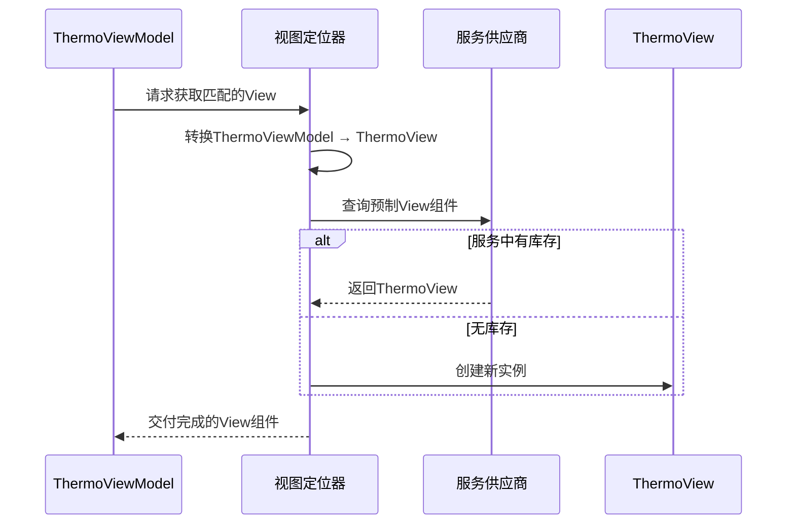

# Chapter 5: 视图自动定位器


在上一章[视图模型基座](04_视图模型基座_.md)中，我们统一了ViewModel的接口（就像为所有电器设计标准插座）。但当用户点击「打开空调」按钮时，界面如何知道该显示哪个温度控制面板？🤔

「视图自动定位器」就是**能理解命名规则的魔法连接器**，自动将ViewModel与其对应的View配对，像智能钥匙找到正确的锁具一样神奇！

---

## 手动连接的麻烦

假设我们有一个温控ViewModel：
```csharp
public class ThermoViewModel : ViewModelBase
{
    [ObservableProperty]
    private double _temperature = 26;
}
```

传统方式需要手动创建对应的View：
```csharp
public class ThermoView : UserControl // 温度控制界面
{
    public ThermoView()
    {
        // 手动设置数据上下文（像给钥匙贴标签）
        DataContext = new ThermoViewModel();
    }
}
```

这会导致两个问题：
1. 🔑 每新增一个功能模块都要手动编写连接代码
2. 🚪 更换ViewModel时需要同步修改所有关联View

解决方法——**通过命名约定实现自动化匹配**！

---

## 魔法钥匙的生成法则

### 规则一：后缀替换
ViewModel类型名后必须有 `ViewModel` 后缀，对应的View类型名则将 `ViewModel` 替换为 `View`。

以温度控制面板为例：
```
钥匙模板：*ViewModel → 锁具模板：*View
示例钥匙：ThermoViewModel → 对应锁具：ThermoView
```

### 规则二：命名空间映射
View和ViewModel通常需要在相同或对应的命名空间中：
```csharp
namespace SmartHome.ViewModels; // 钥匙仓库（ViewModel层）
public class ThermoViewModel { ... }

namespace SmartHome.Views;      // 锁具仓库（View层） 
public class ThermoView { ... }
```

---

## 看看定位器的魔法代码

打开项目中的 `ViewLocator.cs`：
```csharp
public class ViewLocator : IDataTemplate
{
    public Control? Build(object? param)
    {
        // 步骤1：检查钥匙形状（ViewModel类型）
        var viewModelType = param.GetType();
        
        // 步骤2：生成锁具名称（替换后缀）
        var viewTypeName = viewModelType.FullName!
            .Replace("ViewModel", "View", StringComparison.Ordinal);
        
        // 步骤3：寻找匹配锁具（查找View类型）
        var viewType = Type.GetType(viewTypeName);
        
        if (viewType != null)
        {
            // 优先从服务容器获取（使用预制零件）
            var view = Program.ServiceProvider?.GetService(viewType) as Control;
            if (view != null) return view;
            
            // 找不到时自己铸造钥匙（创建实例）
            return (Control)Activator.CreateInstance(viewType)!;
        }
        
        // 未找到提示（丢失钥匙的告警标签）
        return new TextBlock { Text = "Not Found: " + viewTypeName };
    }

    public bool Match(object? data) 
        => data is ViewModelBase; // 只处理标准钥匙类型
}
```

注释解析：
- `Replace("ViewModel", "View")` → 施展后缀替换魔法
- `GetService(viewType)` → 优先使用依赖注入容器中的预注册View
- `Activator.CreateInstance` → 应急铸造新实例的安全措施

---

## 实战演练：自动连接三部曲

### 第一步：创建温控界面对
```csharp
// View层（锁具）
public class ThermoView : UserControl { ... }

// ViewModel层（钥匙）
public class ThermoViewModel : ViewModelBase { ... }
```

### 第二步：享用自动匹配
当导航系统请求显示 `ThermoViewModel` 时：
```csharp
var thermoVM = new ThermoViewModel();
var thermoView = ViewLocator.Build(thermoVM); // 魔法召唤View！
```

### 第三步：直接使用视图组件
```csharp
MainWindow.Content = thermoView; // 将面板嵌入主界面
```

整个过程就像魔法商店自动递送匹配的魔杖一样神奇！

---

## 魔法原理流程图解



当运行 `Build` 方法时：
1. 🔍 定位器检查ViewModel的类型名称
2. ✏️ 将 `ViewModel` 后缀替换为 `View`
3. 📦 优先从服务容器获取已注册的View实例
4. 🛠️ 未找到时自动创建新的View实例

---

## 智能降级机制

观察这段应急处理代码：
```csharp
// 优先使用容器中的实例（依赖注入的优势）
var view = Program.ServiceProvider?.GetService(viewType) as Control;

// 降级方案：直接创建实例（即使未注册也能工作）
return (Control)Activator.CreateInstance(viewType)!;
```

这就像：
- 首选品牌零件（服务容器预注册）
- 若无库存则现场3D打印（动态创建）

保证系统在未完全配置时也能运行！

---

## 总结与魔法升级

我们已经掌握：**视图自动定位器通过命名约定和动态解析，实现了ViewModel与View的自动配对**。这为后续的[主控界面管理器](06_主控界面管理器_.md)提供了核心导航能力。

本章重点：
1. 🧙 通过后缀替换实现自动类型匹配
2. 🛠️ 结合依赖注入优先使用预制组件
3. ⚠️ 智能降级机制保证系统鲁棒性

下章我们将探索[主控界面管理器](06_主控界面管理器_.md)，学习如何高效调度这些自动配对的视图组件！🚀

> 魔咒练习：在代码中添加一个 `LightControlViewModel`，测试是否会自动找到 `LightControlView`？

---

Generated by [AI Codebase Knowledge Builder](https://github.com/The-Pocket/Tutorial-Codebase-Knowledge)