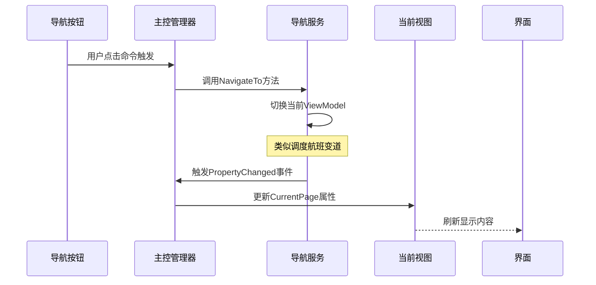

# Chapter 6: 主控界面管理器


当我们在[视图自动定位器](05_视图自动定位器_.md)中学会了「自动匹配钥匙和锁孔」的魔法后，现在需要一个掌控全局的指挥官！主控界面管理器就像**机场的中央塔台**，负责协调各个「界面飞机」（页面）的起降调度——当用户点击导航按钮时，它要精确指挥页面切换的时机和顺序。

---

## 为什么需要中央调度？

想象智能家居的触控大屏上有多个功能按钮：
- 点击「照明」显示灯光控制面板  
- 点击「温控」弹出空调调节界面  
- 点击「安防」切换监控摄像头视图  

如果每次都新建视图会非常浪费资源：
```csharp
// 错误示范：每次点击都创建新实例
private void Button_Click()
{
    CurrentPage = new Page1View(); // 如同不停生产新飞机 ➡️ 内存爆炸！
}
```

主控界面管理器的三大使命：
1. 📡 **状态管理** ：维护当前显示页面的引用（类似塔台的航班追踪雷达）  
2. 🎮 **命令响应** ：通过按钮点击触发导航动作（像调度员的指挥口令）  
3. 🔗 **服务协调** ：与[导航服务](07_导航服务控制器_.md)协同工作（好比塔台与跑道引导系统的数据共享）  

---

## 驾驶舱控制三要素

### 要素一：观察航班状态（CurrentPage属性）
```csharp
[ObservableProperty] // 自动通知属性
private ViewModelBase currentPage; // 当前显示页面（像雷达上的目标飞机）
```

这个属性存储当前显示的视图模型，相当于塔台的实时监控画面上的高亮航班。

---

### 要素二：控制仪表盘（RelayCommand指令）
```csharp
[RelayCommand] 
private void NavigateToPage1() // 页面切换指令（像塔台的起降许可）
{
    _navigationService.NavigateTo<Page1ViewModel>(); // 调度到1号跑道
}
```

当按钮绑定这个命令时，点击会触发导航服务的切换操作，就像飞行员收到许可后执行起飞动作。

---

### 要素三：航线监听员（事件订阅）
```csharp
// 监视导航服务的视图模型变更（像塔台持续监听航班动态）
_navigationService.PropertyChanged += (_, args) => 
{
    if (args.PropertyName == nameof(CurrentViewModel)) 
    {
        CurrentPage = _navigationService.CurrentViewModel; // 同步当前视图
    }
};
```

相当于塔台始终关注跑道活动，当有新飞机着陆时更新显示信息。

---

## 核心代码深度解析

打开 `MainWindowViewModel.cs`：
```csharp
public partial class MainWindowViewModel : ViewModelBase
{
    private readonly INavigationService _navigationService; // 导航服务接口

    public MainWindowViewModel(INavigationService navigationService)
    {
        // 注入导航服务（像塔台接收雷达信号源）
        _navigationService = navigationService;
        CurrentPage = _navigationService.CurrentViewModel;

        // 建立事件监听（24小时监控导航状态）
        ((NavigationService)_navigationService).PropertyChanged += OnNavigationChanged;
    }

    private void OnNavigationChanged(object? sender, PropertyChangedEventArgs e)
    {
        if (e.PropertyName == nameof(INavigationService.CurrentViewModel))
        {
            CurrentPage = _navigationService.CurrentViewModel; // 刷新当前页面
        }
    }

    // 页面导航指令1：飞向页面1
    [RelayCommand]
    private void NavigateToPage1() => _navigationService.NavigateTo<Page1ViewModel>();

    // 页面导航指令2：飞向页面2
    [RelayCommand] 
    private void NavigateToPage2() => _navigationService.NavigateTo<Page2ViewModel>();
}
```

注释说明：
- `INavigationService` → 导航服务的标准接口（塔台与跑道系统的通信协议）
- `PropertyChanged` 事件 → 接收导航状态变化通知（实时航班动态）
- `RelayCommand` 方法 → 将UI点击转换为导航指令（塔台调度员的无线电指令）

---

## 导航流程全图解



当用户点击导航按钮时：
1. 💥 按钮触发 `RelayCommand` 导航指令
2. 📞 主控管理器调用导航服务的切换方法
3. 🛠️ 导航服务更新当前ViewModel（新的目标视图）
4. 🔄 通过事件通知主控管理器同步更新CurrentPage
5. 🖥️ 界面自动刷新显示对应视图

---

## 代码实战：搭建你的塔台

### 第一步：准备导航服务依赖
```csharp
// MainWindowViewModel需要注入导航服务
public class MainWindowViewModel(INavigationService navigationService) 
{
    _navigationService = navigationService; // 塔台连接雷达系统
}
```

这相当于为塔台配备与航班追踪系统的数据线。

---

### 第二步：配置指挥按钮（XAML示例）
```xml
<Button Content="主页" Command="{Binding NavigateToPage1Command}"/>
<Button Content="设置" Command="{Binding NavigateToPage2Command}"/>
```

按钮的 `Command` 属性绑定到ViewModel的 `RelayCommand`，如同塔台的调度控制面板上的按钮。

---

### 第三步：数据上下文绑定
```xml
<Window.DataContext>
    <vm:MainWindowViewModel/> <!-- 告诉界面谁是塔台指挥官 -->
</Window.DataContext>
```

这个设置确保界面元素能够与主控管理器正确通信。

---

## 总结与控制权交接

我们已经掌握：**主控界面管理器通过整合导航服务和响应式属性，实现了对界面切换的中央化控制**。这为后续的[导航服务控制器](07_导航服务控制器_.md)打下了指挥基础。

本章核心：
1. 🎮 RelayCommand将用户操作转为导航指令
2. 📡 通过事件订阅同步界面状态
3. 🤖 INavigationService抽象导航实现细节

下一章我们将深入[导航服务控制器](07_导航服务控制器_.md)，揭开导航系统如何管理「空中交通」的神秘面纱！🚀

> 思考题：如果想添加一个「返回上一页」按钮，主控管理器需要如何升级？

---

Generated by [AI Codebase Knowledge Builder](https://github.com/The-Pocket/Tutorial-Codebase-Knowledge)