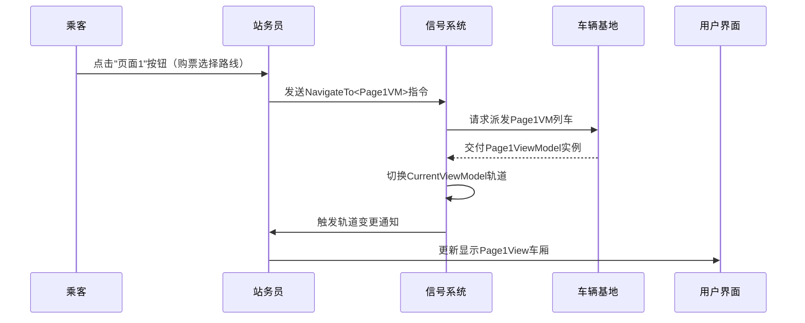

# Chapter 7: 导航服务控制器


在[主控界面管理器](06_主控界面管理器.md)中，我们已经认识了界面调度的"塔台指挥官"。现在需要一个更加底层的"地铁信号系统"来控制页面切换的精妙流动。导航服务控制器就是应用中的**轨道切换器**，通过`CurrentViewModel`追踪当前显示页面，用`NavigateTo`方法像换乘通道一样连接不同视图！

---

## 车厢调度员的烦恼

想象在一个地铁枢纽站：
- 列车员每次切换线路都要手动铺设轨道 ⚠️
- 中央调度无法实时追踪列车位置 🚄
- 新增线路需要重新培训所有工作人员 💼

类似的，如果界面切换这样写：
```csharp
// 手动切换风险高
mainWindow.Content = new Page1View(); // 直接设置内容
```

会带来三个问题：
1. 🛠️ 视图/ViewModel耦合严重
2. 🧭 无法统一管理导航状态
3. 🧩 新增页面需要修改多处代码

我们需要一个**中央化轨道控制系统**！

---

## 核心信号系统架构

### 第一部分：控制面板（接口定义）
```csharp
public interface INavigationService // 轨道交通蓝图
{
    ViewModelBase CurrentViewModel { get; } // 当前运行的列车
    void NavigateTo<T>() where T : ViewModelBase; // 轨道切换指令
}
```

这定义了导航服务的两个核心功能：
- 🔍 实时追踪当前ViewModel（显示哪个页面）
- 🔀 接收路由指令执行页面切换

---

### 第二部分：信号执行器（实现类）
```csharp
public partial class NavigationService : INavigationService
{
    [ObservableProperty] // 自动广播位置更新
    private ViewModelBase _currentViewModel; // 当前轨道状态

    public void NavigateTo<T>() where T : ViewModelBase 
    {
        // 使用依赖注入获取新列车（ViewModel）
        var nextVM = _serviceProvider.GetRequiredService<T>();
        CurrentViewModel = nextVM; // 执行轨道切换
    }
}
```

这相当于：
- 🚦 接收调度指令
- 🔌 从服务容器获取目标页面控制器（ViewModel）
- 🛤️ 更新当前活动轨道状态

---

### 第三部分：轨道定位器（动态映射）
参考`ViewLocator.cs`的转换逻辑：
```
Page1ViewModel → Page1View // 自动匹配视图
Page2ViewModel → Page2View
```

视图定位器就像站台的轨道导向标识，根据列车类型自动分配对应站台。

---

## 信号系统工作流程

当点击导航按钮时：


整个过程就像：
1. 🎫 乘客选择目的地
2. 📡 站务员向信号系统发送请求
3. 🚅 车辆基地派出对应列车
4. 🔀 信号系统切换轨道
5. 🖥️ 电子屏更新车次信息

---

## 实战演练：搭建信号系统

### 步骤一：注册导航服务
在`Program.cs`中注册服务：
```csharp
services.AddSingleton<INavigationService, NavigationService>();
```

这相当于在轨道交通总控室安装了核心信号设备。

---

### 步骤二：启用初始路线
在导航服务的构造函数中：
```csharp
public NavigationService()
{
    NavigateTo<HomeViewModel>(); // 启动默认路线：始发站
}
```

让应用在启动时自动进入首页。

---

### 步骤三：发送导航指令
在ViewModel中使用：
```csharp
// 发车！前往「设置」页面
_navigationService.NavigateTo<SettingsViewModel>();
```

这就像驾驶员呼叫调度中心请求变更线路。

---

## 高级调度功能解密

### 功能一：状态追踪
```csharp
[ObservableProperty] // 继承自MVVM工具包
private ViewModelBase _currentViewModel;
```

当`_currentViewModel`发生变化时：
1. 📢 自动触发属性变更事件
2. 📡 通知所有订阅者（如主控界面管理器）
3. 🖼️ 触发视图自动定位器更新显示

---

### 功能二：服务定位
```csharp
var vm = _serviceProvider.GetRequiredService<T>();
```

通过依赖注入容器获取ViewModel：
- 🏭 自动处理构造函数依赖
- 🔩 统一生命周期管理
- 🔋 支持单例或瞬态模式

就像车辆基地根据车型自动调配对应的列车组。

---

## 总结与运营时刻表

我们已经掌握：**导航服务控制器通过集中管理当前视图状态和标准化导航指令，实现了高效可靠的页面切换系统**。这为完整的MVVM架构补上了最后一块拼图！

本章关键：
1. 📍 CurrentViewModel是导航系统的位置追踪器
2. 🚦 NavigateTo方法负责执行精确的路线切换
3. 🔗 依赖注入保障导航指令与视图定位的高效协作

现在，你的应用已经具备像地铁网络一样发达的导航能力！所有课程已完结，期待你驾驶这辆"代码列车"驶向更广阔的世界！🚄

> 模拟训练：尝试添加一个「返回首页」按钮，体验如何通过导航服务实现快捷回家通道！

---

Generated by [AI Codebase Knowledge Builder](https://github.com/The-Pocket/Tutorial-Codebase-Knowledge)