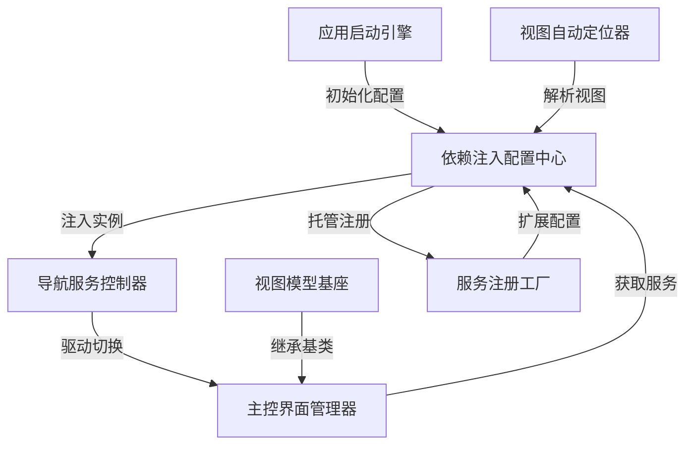

# Tutorial: Avalonia_With_Dependency_Injection_Example

这是一个演示 **Avalonia框架** 如何结合 **依赖注入** 实现模块化开发的示例项目。项目通过*服务注册中心*统一管理视图和逻辑层，使用*智能视图定位器*自动匹配View和ViewModel，并借助*导航控制器*实现页面切换。核心实现了*松耦合架构*，各组件像积木一样可插拔。

**Source Repository:** [https://github.com/Ming-jiayou/Avalonia_With_Dependency_Injection_Example](https://github.com/Ming-jiayou/Avalonia_With_Dependency_Injection_Example)

## Chapters

1. [依赖注入配置中心
](01_依赖注入配置中心_.md)
2. [服务注册工厂
](02_服务注册工厂_.md)
3. [应用启动引擎
](03_应用启动引擎_.md)
4. [视图模型基座
](04_视图模型基座_.md)
5. [视图自动定位器
](05_视图自动定位器_.md)
6. [主控界面管理器
](06_主控界面管理器_.md)
7. [导航服务控制器
](07_导航服务控制器_.md)

---

Generated by [AI Codebase Knowledge Builder](https://github.com/The-Pocket/Tutorial-Codebase-Knowledge)