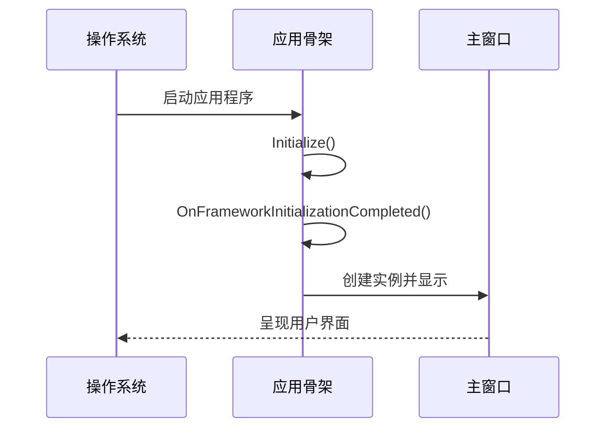

# Chapter 1: Avalonia应用骨架


## 为什么需要应用骨架？

想象你正在搭建一座房子🏠——在砌墙和装门窗之前，需要先打好地基、搭好梁柱。Avalonia应用骨架正是这样的基础结构，它负责：

1. 🏗️ 初始化整个应用的运行环境
2. 💡 配置主题样式（比如亮色/暗色模式）
3. ⏱️ 管理应用的生命周期
4. 🖼️ 创建主窗口并绑定数据上下文

## 最小化应用骨架示例

让我们看看最简单的Avalonia应用骨架长什么样：

```csharp
// App.axaml.cs
public partial class App : Application
{
    public override void Initialize()
    {
        AvaloniaXamlLoader.Load(this); // 加载XAML界面定义
    }

    public override void OnFrameworkInitializationCompleted()
    {
        if (ApplicationLifetime is IClassicDesktopStyleApplicationLifetime desktop)
        {
            desktop.MainWindow = new MainWindow() // 创建主窗口
            {
                DataContext = new MainWindowViewModel() // 绑定ViewModel
            };
        }
        base.OnFrameworkInitializationCompleted();
    }
}
```

这段代码做了三件事：
1. 通过`Initialize()`加载界面定义
2. 应用启动完成后创建主窗口
3. 为主窗口绑定ViewModel（数据上下文）

## 骨架的关键部件拆解

### 1. Application类
这是Avalonia应用的"大脑"，继承自`Avalonia.Application`。就像人体的中枢神经系统，它协调着整个应用的运行。

### 2. XAML配置文件
```xml
<!-- App.axaml -->
<Application xmlns="https://github.com/avaloniaui"
             xmlns:x="http://schemas.microsoft.com/winfx/2006/xaml"
             x:Class="MyApp.App">
    <Application.Styles>
        <FluentTheme /> <!-- 使用Fluent设计风格 -->
    </Application.Styles>
</Application>
```
这个文件像装修设计图，定义了：
- 应用使用的主题（这里是Fluent风格）
- 全局资源（后续章节会介绍）

### 3. 生命周期管理
应用骨架还处理各种生命周期事件：

| 事件阶段              | 用途                             |
|-----------------------|----------------------------------|
| `Initialize()`        | 加载XAML和初始化资源             |
| `OnFrameworkInitializationCompleted()` | 应用完全启动后创建主界面 |

## 深入：启动过程详解

让我们用序列图看看应用启动时的内部流程：



1. 操作系统加载程序集并启动应用
2. 应用骨架初始化XAML资源
3. 框架完全加载后创建主窗口
4. 主窗口显示到屏幕

## 实际应用：带DI的骨架

现在看看我们项目中更高级的实现（结合了[依赖注入服务容器](02_依赖注入服务容器_.md)）：

```csharp
// 使用服务容器获取窗口实例
var mainWindow = Program.ServiceProvider?.GetRequiredService<MainWindow>();
var mainViewModel = Program.ServiceProvider?.GetRequiredService<MainWindowViewModel>();

if (mainWindow != null && mainViewModel != null)
{
    mainWindow.DataContext = mainViewModel;
    desktop.MainWindow = mainWindow;
}
```

这种方法的好处：
- 🔍 自动解决依赖关系
- 🔄 方便替换实现
- 🧩 模块化管理组件

## 常见问题解答

❓ 为什么需要禁用数据验证插件？
```csharp
private void DisableAvaloniaDataAnnotationValidation()
{
    var plugins = BindingPlugins.DataValidators
        .OfType<DataAnnotationsValidationPlugin>().ToArray();
    
    foreach (var plugin in plugins)
    {
        BindingPlugins.DataValidators.Remove(plugin);
    }
}
```
这是为了避免与CommunityToolkit的验证功能冲突，就好像关掉一个重复的闹钟⏰

## 总结

本章我们学习了：
- Avalonia应用骨架的基础作用
- 核心组件和工作原理
- 如何结合依赖注入构建骨架

就好像学会了房屋建筑的框架结构，接下来我们要往这个骨架里添加" plumbing管道" —— [依赖注入服务容器](02_依赖注入服务容器_.md)将帮助我们更好地管理内部组件！

---

Generated by [AI Codebase Knowledge Builder](https://github.com/The-Pocket/Tutorial-Codebase-Knowledge)