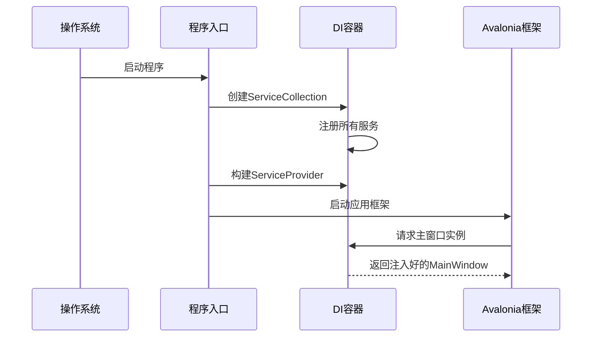

# Chapter 2: 依赖注入服务容器  

在[第一章：Avalonia应用骨架](01_avalonia应用骨架_.md)中，我们搭建了应用程序的基础结构。现在，我们需要一个"智能管家"来管理应用中各种组件的创建和协作——这就是**依赖注入服务容器**！

## 为什么需要服务容器？  

想象你要举办派对🎉：
- **没有管家**：你需要亲自打电话联系每个嘉宾、准备所有食物饮料，手忙脚乱！
- **有管家**：只需告诉管家"需要5份餐点和音乐服务"，管家会自动安排好一切。

服务容器就是这样的管家，它帮我们：
1. 🤖 自动创建各类服务实例
2. 🔗 解决服务间的依赖关系
3. ♻️ 管理服务生命周期（如单例模式）

## 最简单的服务容器示例  

让我们看一个极简的咖啡店场景：

```csharp
// 注册服务
var services = new ServiceCollection();
services.AddSingleton<ICoffeeMachine, PremiumCoffeeMachine>(); // 添加高档咖啡机
services.AddTransient<CoffeeShop>(); // 每次新建咖啡店实例

// 构建服务容器
var serviceProvider = services.BuildServiceProvider();

// 获取服务
var shop = serviceProvider.GetRequiredService<CoffeeShop>(); // 自动注入咖啡机
```

👉 发生了什么？
- 注册了两类服务（咖啡机和咖啡店）
- 容器会自动将咖啡机注入到咖啡店
- 无需手动`new PremiumCoffeeMachine()`

## 核心概念详解  

### 1. 服务注册表（ServiceCollection）
像餐厅的菜单📜，记录"什么客人对应什么服务"：  

| 注册方式                | 说明                     | 类比              |
|-------------------------|--------------------------|-------------------|
| `AddSingleton<T>()`     | 整个应用共用同一个实例   | 餐厅的招牌厨子👨‍🍳 |
| `AddTransient<T>()`     | 每次请求都新建实例       | 一次性餐具🍽️     |
| `AddScoped<T>()`        | 同一作用域内共用实例     | 包厢里的服务员🤵  |

### 2. 服务提供者（ServiceProvider）
像万能取货机🤖，根据注册表提供所需服务：
```csharp
var coffee = provider.GetService<ICoffee>(); // 可能返回null
var mustHave = provider.GetRequiredService<ICoffee>(); // 必须存在
```

## 实战：Avalonia中的DI  

观察项目的启动代码：
```csharp
// Program.cs
public static IServiceProvider? ServiceProvider { get; private set; }

public static void Main(string[] args)
{
    var services = new ServiceCollection();
    
    // 注册三大类服务（视图/ViewModel/功能服务）
    services.AddViews()
            .AddViewModels()
            .AddServices();
            
    ServiceProvider = services.BuildServiceProvider();
    // ...启动Avalonia应用
}
```

通过扩展方法组织注册（查看`ServiceCollectionExtensions.cs`）：
```csharp
// 注册所有窗口
public static IServiceCollection AddViews(this IServiceCollection services)
{
    services.AddSingleton<MainWindow>(); // 主窗口是单例
    return services;
}

// 注册ViewModel
public static IServiceCollection AddViewModels(this IServiceCollection services)
{
    services.AddSingleton<MainWindowViewModel>();
    return services;
}
```

## 生命周期流程图  



## 常见使用场景  

### 在ViewModel中使用服务
```csharp
public class MainWindowViewModel
{
    private readonly INavigationService _navService;
    
    // 构造函数自动注入导航服务
    public MainWindowViewModel(INavigationService navService)
    {
        _navService = navService; // 容器自动提供实例
    }
}
```

### 解决循环依赖
如果A依赖B，B也依赖A怎么办？🚨
- 使用接口解耦
- 引入第三方服务协调

## 总结  

本章我们学会了：
- 服务容器如何像管家一样管理依赖
- 三种主要的服务生命周期
- 在Avalonia中配置DI容器

就像给房子接入了智能家居系统💡，下一章我们将学习如何用[服务注册扩展](03_服务注册扩展_.md)更优雅地组织这些"家电"的安装配置！

---

Generated by [AI Codebase Knowledge Builder](https://github.com/The-Pocket/Tutorial-Codebase-Knowledge)