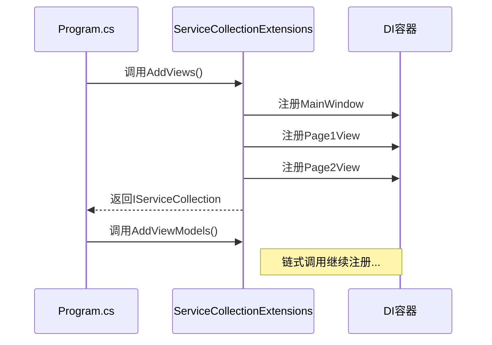

# Chapter 3: 服务注册扩展

欢迎来到第三章！在[上一章：依赖注入服务容器](02_依赖注入服务容器_.md)中，我们已经学会了如何使用"服务管家"（DI容器）来管理应用中的各种组件。现在，我们要给这位管家配备一本更高效的**服务目录册**——这就是服务注册扩展！

## 为什么需要注册扩展？

想象你开了一家超市🛒：
- **没有分类**：所有商品随意堆放在一起，顾客找东西像大海捞针
- **有分类展示架**：商品按"饮料区"、"零食区"、"日用品区"有序摆放，一目了然

服务注册扩展正是这样的分类展示架，它能：

1. 🏷️ 将服务按功能分组（视图/ViewModel/服务）
2. 📦 简化注册流程，避免遗漏
3. 🔍 提升代码可读性和维护性

## 超市商品分类实战

让我们看看如何组织一个简单的电商服务注册：

```csharp
// 传统方式：杂乱无章
services.AddSingleton<ProductService>();
services.AddSingleton<OrderService>();
services.AddSingleton<UserService>();
services.AddSingleton<HomePage>();
services.AddSingleton<CartPage>();

// 使用扩展方法：清晰分类
services.AddBusinessServices()  // 业务服务
        .AddAppPages()          // 页面视图
        .AddDataModels();       // 数据模型
```

## 核心概念：扩展方法

扩展方法就像是给现有工具加装**多功能配件🔧**，让我们能为`IServiceCollection`添加新功能：

```csharp
// 就像给螺丝刀加装磁性吸头
public static IServiceCollection AddTools(this IServiceCollection services)
{
    services.AddSingleton<Hammer>();
    services.AddSingleton<Screwdriver>();
    return services; // 注意必须返回以支持链式调用
}
```

关键点：
- `this IServiceCollection`表示扩展目标
- 必须`return services`才能链式调用
- 方法命名要见名知义（如`AddXXX`格式）

## 项目实战解析

观察我们项目中的`ServiceCollectionExtensions.cs`文件：

```csharp
// 视图注册专区
public static IServiceCollection AddViews(this IServiceCollection services)
{
    services.AddSingleton<MainWindow>();   // 主窗口
    services.AddSingleton<Page1View>();    // 页面1
    services.AddSingleton<Page2View>();    // 页面2
    return services;
}
```

这种组织方式就像把图书按主题放入不同书架📚：
- 修改视图时只需关注`AddViews`方法
- 新成员加入能快速找到注册位置

## 进阶技巧：模块化注册

大型项目中可以采用更细分的模块：

```csharp
// 用户模块专属注册
public static IServiceCollection AddUserModule(this IServiceCollection services)
{
    services.AddScoped<UserService>();
    services.AddTransient<LoginView>();
    services.AddSingleton<UserProfileViewModel>();
    return services;
}

// 在启动时组合模块
services.AddUserModule()
        .AddOrderModule()
        .AddPaymentModule();
```

## 工作流程图示



## 常见问题解答

❓ 为什么注册方法要返回`IServiceCollection`？
就像接力赛跑🏃‍♂️，每个选手（方法）必须把接力棒（services对象）传给下一个，才能实现链式调用：
```csharp
// 如果不返回services对象，就无法这样流畅调用
services.AddA().AddB().AddC();
```

❓ 何时使用单例(Singleton)？何时使用瞬时(Transient)？
- 单例：全局状态服务（如配置管理、日志服务）
- 瞬时：每次需要新实例的对象（如对话框）

## 总结

本章我们学会了：
- 服务注册扩展的分类管理思想
- 如何用扩展方法优雅地组织DI注册
- 模块化注册的实际应用技巧

就像一个优秀的图书管理员，我们为应用中的各项服务建立了清晰的分类目录。接下来，我们要开始布置"超市"的主入口——[主窗口视图](04_主窗口视图_.md)将是我们首个重点打造的展示区！

---

Generated by [AI Codebase Knowledge Builder](https://github.com/The-Pocket/Tutorial-Codebase-Knowledge)