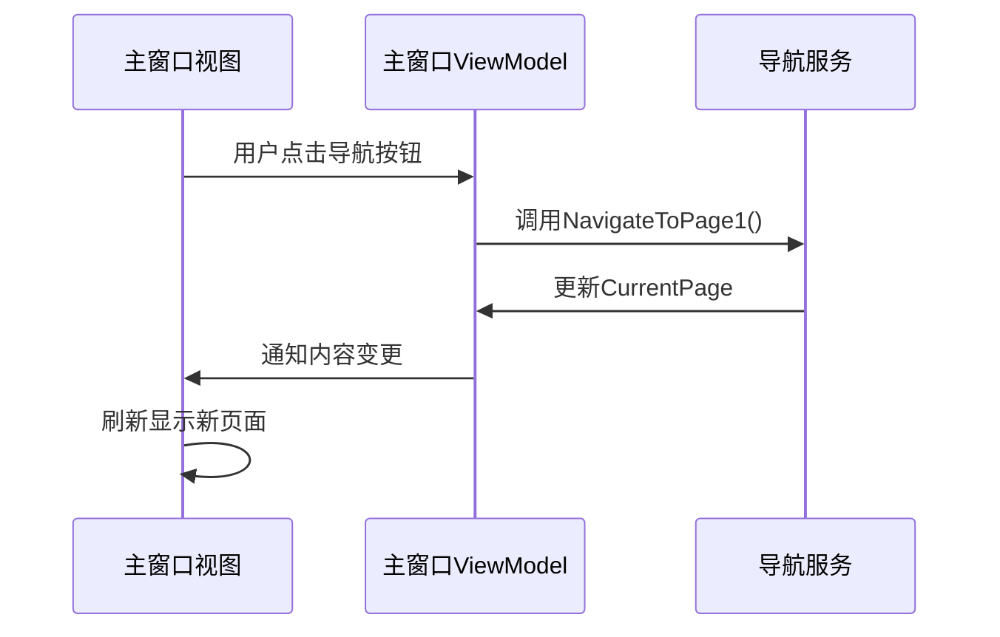

# Chapter 4: 主窗口视图

在[第三章：服务注册扩展](03_服务注册扩展_.md)中，我们学会了如何优雅地组织服务注册。现在，就像搭建好货架后要准备商店招牌一样，我们将重点打造应用程序的"门面"——主窗口视图。

## 为什么需要主窗口视图？

想象你去银行办理业务🏦：
- **传统窗口**：只有一个柜台，所有业务混在一起办理
- **现代银行**：左侧有清晰的业务导航，右侧是专门的办理区域

主窗口视图正是这样的现代化设计，它能：
1. 🧭 提供清晰的导航结构
2. 🖥️ 划分独立的内容展示区
3. 🔄 动态切换不同功能页面

## 最简单的窗口布局

让我们看看主窗口的基本结构（已简化）：

```xml
<!-- MainWindow.axaml -->
<Grid>
    <!-- 分为两列 -->
    <Grid.ColumnDefinitions>
        <ColumnDefinition Width="200"/> <!-- 左侧导航 -->
        <ColumnDefinition Width="*"/>    <!-- 右侧内容 -->
    </Grid.ColumnDefinitions>
    
    <!-- 导航区 -->
    <Border Grid.Column="0" Background="Gray">
        <StackPanel>
            <Button Content="功能1" Command="{Binding 切换页面1命令}"/>
            <Button Content="功能2" Command="{Binding 切换页面2命令}"/>
        </StackPanel>
    </Border>

    <!-- 内容区 -->
    <ContentControl Grid.Column="1" 
                   Content="{Binding 当前页面}"/>
</Grid>
```

这个布局很像书桌的构造：
- 左侧抽屉（导航栏）：放置常用工具
- 右侧桌面（内容区）：根据需求展示不同文档

## 核心组件详解

### 1. 网格布局(Grid)
相当于办公桌的隔板，通过`ColumnDefinitions`划分区域：

```xml
<!-- 定义两列 -->
<Grid.ColumnDefinitions>
    <ColumnDefinition Width="200"/> <!-- 固定宽度200像素 -->
    <ColumnDefinition Width="*"/>   <!-- 星号表示剩余所有空间 -->
</Grid.ColumnDefinitions>
```

### 2. 内容控件(ContentControl)
就像一个万能展示框：

```xml
<ContentControl Content="{Binding 当前页面}"/>
```
它通过与ViewModel的绑定（`CurrentPage`属性），可以动态显示不同的页面内容，就像魔术师的帽子🎩能变出各种东西。

## 数据绑定机制

在Avalonia中，视图与ViewModel通过绑定连接：



## 实战：导航按钮样式

让我们美化一下导航按钮（使用Avalonia样式系统）：

```xml
<Window.Styles>
    <Style Selector="Button.NavButton">
        <Setter Property="Background" Value="Transparent"/>
        <Setter Property="Foreground" Value="White"/>
        <!-- 更多样式设置... -->
    </Style>
    
    <!-- 鼠标悬停效果 -->
    <Style Selector="Button.NavButton:pointerover">
        <Setter Property="Background" Value="#2D2D2D"/>
    </Style>
</Window.Styles>
```

这些样式定义就像CSS：
- `Selector`指定作用目标（类名为NavButton的按钮）
- `Setter`定义具体样式属性

## 与MVVM模式配合

主窗口通过依赖注入获取ViewModel：

```csharp
// 在App初始化时
var mainWindow = new MainWindow
{
    DataContext = serviceProvider.GetRequiredService<MainWindowViewModel>()
};
```

这种设计带来的好处：
- 🧩 视图与业务逻辑完全分离
- 🔄 便于单元测试
- 🎨 设计师和开发者可以并行工作

## 常见问题解答

❓ 为什么我的按钮点击无效？
检查三个关键点：
1. ViewModel是否实现了`INotifyPropertyChanged`
2. 命令(Command)属性是否正确绑定
3. DataContext是否设置正确

❓ 如何添加新页面？
1. 创建新View和ViewModel
2. 在导航服务中注册路由
3. 添加导航按钮并绑定命令

## 总结

本章我们学会了：
- 主窗口的分区布局设计
- 内容控件的动态绑定原理
- Avalonia样式系统的使用技巧

就像设计了一个高效的办公空间，我们为应用搭建了良好的界面框架。接下来，这个框架需要聪明的"管理员"——[主窗口视图模型](05_主窗口视图模型_.md)将赋予它真正的智能！

---

Generated by [AI Codebase Knowledge Builder](https://github.com/The-Pocket/Tutorial-Codebase-Knowledge)