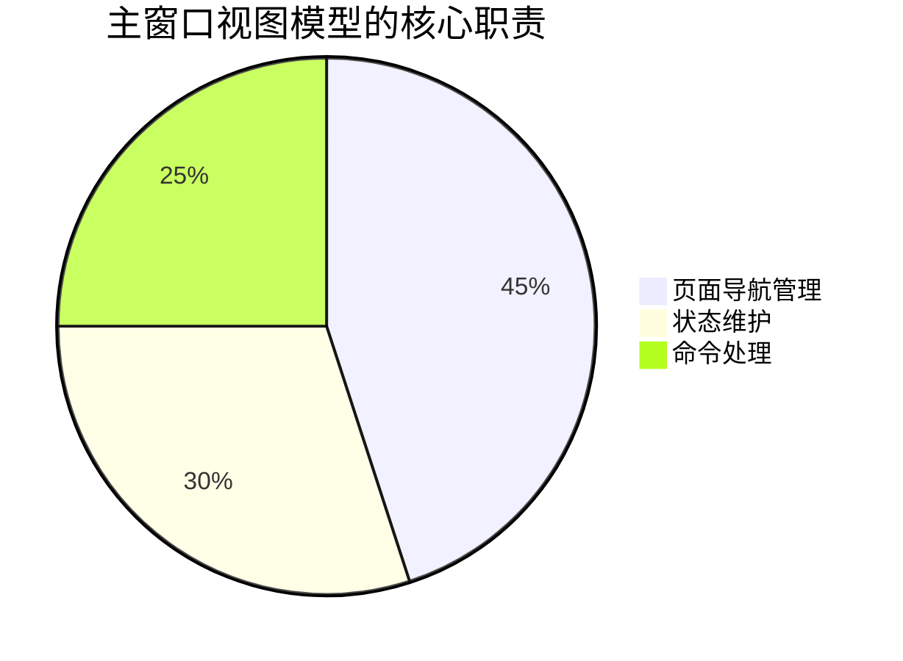
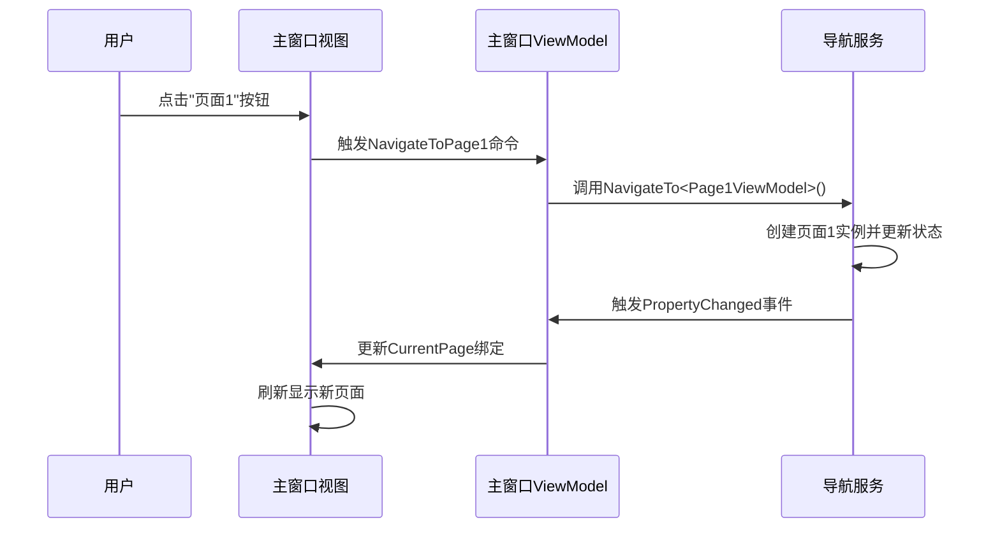

# Chapter 5: 主窗口视图模型

在[第四章：主窗口视图](04_主窗口视图_.md)中，我们设计了应用程序的漂亮"门面"。现在需要给它注入灵魂——这就是**主窗口视图模型**，它就像一位聪明的管家🧠，负责协调整个应用的运作。

## 为什么需要视图模型？

想象你家的智能中控系统：
- **传统灯开关**：直接控制电线通断（类似代码直接操作界面）
- **智能中控**：你通过手机APP发送指令，中控系统自动协调各类设备（类似ViewModel）

视图模型（ViewModel）的价值：
1. 🧩 将业务逻辑与界面分离
2. 🔄 自动化状态管理
3. 🤖 提供可测试的代码结构

## 核心职责图解



## 最简视图模型示例

看看基础结构（使用MVVM Toolkit简化）：

```csharp
public partial class MainWindowViewModel : ViewModelBase
{
    [ObservableProperty]
    private ViewModelBase currentPage; // 当前显示页面

    public MainWindowViewModel()
    {
        CurrentPage = new Page1ViewModel(); // 默认显示页面1
    }
}
```

这段代码：
- 继承`ViewModelBase`获得通知能力
- `[ObservableProperty]`自动生成属性变更通知
- 管理着当前显示的页面状态

## 关键组件详解

### 1. 页面导航
通过导航服务切换页面：

```csharp
private readonly INavigationService _navService;

// 构造函数注入导航服务
public MainWindowViewModel(INavigationService navService)
{
    _navService = navService;
    CurrentPage = _navService.CurrentViewModel;
}

[RelayCommand]
private void GoToPage1()
{
    _navService.NavigateTo<Page1ViewModel>(); // 像按下电梯楼层按钮
}
```

### 2. 状态订阅
像订阅报纸一样监听变化：

```csharp
_navService.PropertyChanged += (_, e) => 
{
    if (e.PropertyName == nameof(_navService.CurrentViewModel))
    {
        CurrentPage = _navService.CurrentViewModel; // 自动更新当前页面
    }
};
```

## 工作流程图示



## 实际项目对比

### 无DI版本（简单但不够灵活）
```csharp
[RelayCommand]
private void NavigateToPage1()
{
    CurrentPage = new Page1ViewModel(); // 直接创建实例
}
```

### 有DI版本（推荐方式）
```csharp
[RelayCommand]
private void NavigateToPage1()
{
    // 通过导航服务管理
    _navService.NavigateTo<Page1ViewModel>();
}
```

DI版本的优势：
- 💉 自动解决依赖关系
- 🔄 统一管理生命周期
- 🧪 便于单元测试

## 常见问题解答

❓ 为什么页面切换后按钮状态没更新？
检查是否实现了`INotifyPropertyChanged`接口，属性变更时是否触发了通知

❓ 如何添加新页面？
1. 创建新的View和ViewModel
2. 在导航服务注册
3. 添加导航命令方法

## 总结

本章我们学会了：
- 主窗口视图模型的协调作用
- 如何通过命令处理用户交互
- 配合导航服务实现页面切换

就像给智能家居配上了自动化控制系统，接下来我们要深入了解这个系统的"路由中枢"——[导航服务](06_导航服务_.md)是如何指挥页面流转的！

---

Generated by [AI Codebase Knowledge Builder](https://github.com/The-Pocket/Tutorial-Codebase-Knowledge)