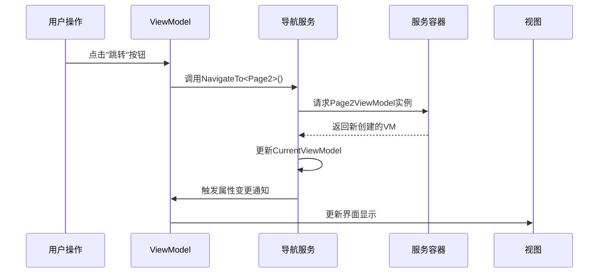

# Chapter 6: 导航服务

在[第五章：主窗口视图模型](05_主窗口视图模型_.md)中，我们见识了ViewModel如何像智能管家一样协调界面交互。现在，我们需要一个更专业的"导览员"——**导航服务**，它相当于应用程序的GPS系统🧭，专门负责在不同页面间规划最佳路线。

## 为什么需要导航服务？

想象你在游乐园游玩🎢：
- **没有地图**：每个景点都要问路，容易迷路且效率低下
- **有导览图**：清晰标注所有路线，随时知道当前位置和去处

导航服务提供的核心价值：
1. 🗺️ 维护页面路由地图
2. 🔄 管理当前显示状态
3. 🚪 提供统一的跳转接口

## 最简单的导航示例

看看如何使用导航服务切换页面：

```csharp
// 在ViewModel中注入服务
private readonly INavigationService _navService;

// 像使用地铁卡一样简单
[RelayCommand]
void GoToSettings()
{
    _navService.NavigateTo<SettingsViewModel>(); // 跳转到设置页
}
```

这段代码就像按下电梯按钮：
- 告诉导航服务目的地（`SettingsViewModel`）
- 服务自动处理路线规划
- 界面自动更新显示

## 服务接口解析

导航服务的"说明书"（接口定义）：

```csharp
public interface INavigationService
{
    ViewModelBase CurrentViewModel { get; } // 当前显示哪个页面
    void NavigateTo<T>() where T : ViewModelBase; // 跳转到指定页面
}
```

关键设计：
- `CurrentViewModel`：像GPS的当前位置标记
- `NavigateTo`：像导航系统的"开始导航"按钮

## 工作原理图解



## 实际实现揭秘

看看导航服务的内部构造：

```csharp
public partial class NavigationService : ObservableObject, INavigationService
{
    [ObservableProperty]
    private ViewModelBase _currentViewModel; // 当前页面的ViewModel

    private readonly IServiceProvider _serviceProvider; // 依赖服务容器

    public NavigationService(IServiceProvider provider)
    {
        _serviceProvider = provider;
        NavigateTo<HomeViewModel>(); // 默认显示主页
    }

    public void NavigateTo<T>() where T : ViewModelBase
    {
        // 像从自动售货机取货
        CurrentViewModel = _serviceProvider.GetRequiredService<T>();
    }
}
```

关键点：
- 继承`ObservableObject`实现属性变更通知
- 通过DI容器获取ViewModel实例
- 状态变更自动通知界面

## 最佳实践建议

### 1. 避免直接操作UI
❌ 错误方式：
```csharp
// 在ViewModel中直接控制UI组件
mainWindow.Content = new Page2View();
```

✅ 正确方式：
```csharp
// 通过导航服务间接操作
_navService.NavigateTo<Page2ViewModel>();
```

### 2. 处理初始化逻辑
可以在导航时执行额外操作：

```csharp
public void NavigateTo<T>() where T : ViewModelBase
{
    var page = _serviceProvider.GetRequiredService<T>();
    
    if (page is IInitializable initPage) // 如果页面需要初始化
    {
        initPage.Initialize(); // 调用初始化方法
    }
    
    CurrentViewModel = page;
}
```

## 常见问题解答

❓ 导航时如何传递参数？
可以扩展接口添加带参数的Navigate方法：
```csharp
void NavigateTo<T>(object parameter) where T : ViewModelBase;
```

❓ 为什么页面切换后按钮状态没更新？
检查ViewModel是否实现了`INotifyPropertyChanged`接口

## 总结

本章我们学会了：
- 导航服务的路由管理机制
- 如何通过DI容器获取页面实例
- MVVM模式下的页面跳转最佳实践

就像为应用配备了专业导游，导航服务让页面流转变得轻松自如。接下来，我们需要为各个页面建立统一的"身份证"——[页面视图模型基类](07_页面视图模型基类_.md)将为所有页面提供共同的基础能力！

---

Generated by [AI Codebase Knowledge Builder](https://github.com/The-Pocket/Tutorial-Codebase-Knowledge)