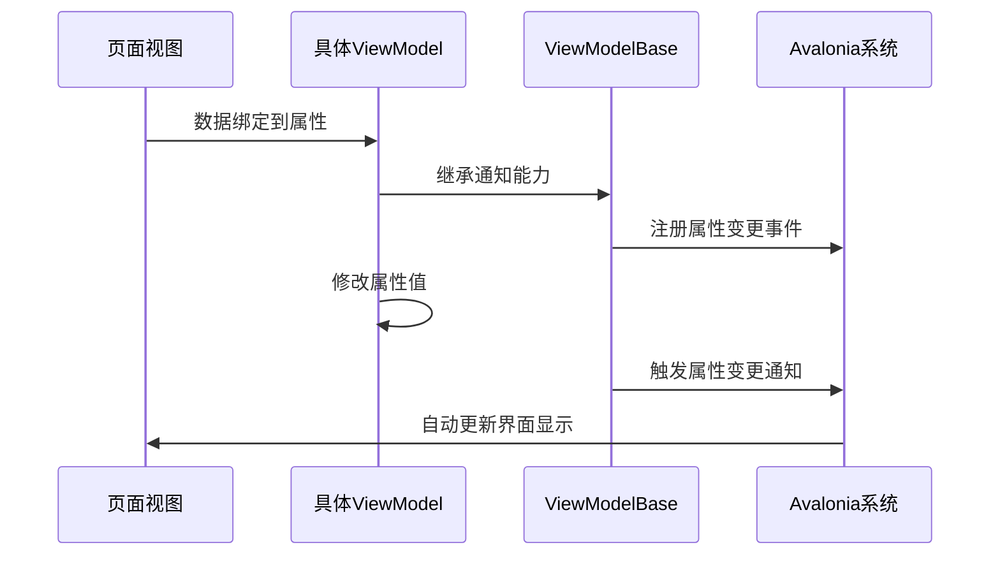

# Chapter 7: 页面视图模型基类

在[第六章：导航服务](06_导航服务_.md)中，我们学习了如何优雅地在页面间导航。现在，我们需要为所有页面ViewModels准备一个"通用插座"——这就是**页面视图模型基类**，它能确保每个页面都拥有同样的基础能力，就像所有电器插头都能适配标准插座一样🔌。

## 为什么需要基类？

想象你要装修一套公寓🏠：
- **不统一**：每个房间的开关位置、插座类型都不一样，使用起来非常混乱
- **标准化**：所有房间采用相同规格的开关插座，既美观又便于维护

页面视图模型基类的作用：
1. 📜 提供统一的属性变更通知机制
2. 🔌 预留共性功能接口
3. 🧩 确保所有页面VM可被导航系统识别

## 最简基类示例

看看我们的"标准插座"长什么样：

```csharp
// ViewModelBase.cs
using CommunityToolkit.Mvvm.ComponentModel;

namespace AvaloniaWithDependencyInjection.ViewModels
{
    public class ViewModelBase : ObservableObject
    {
        // 空类！所有魔法都来自继承的ObservableObject
    }
}
```

这个看似简单的类实际上是个"魔法盒子"：
- 继承自`ObservableObject`获得自动通知能力
- 像插座提供电力一样提供基础MVVM功能
- 所有页面ViewModel都应继承它

## 核心能力解析

### 1. 属性变更通知
当数据变化时自动刷新界面：

```csharp
public partial class Page1ViewModel : ViewModelBase
{
    [ObservableProperty] 
    private string _userName; // 自动生成可通知属性
    
    // 修改UserName会自动更新界面
    void ChangeName() => UserName = "张三";
}
```

这就像智能家居中控：
- 你调整温度设定（修改属性值）
- 空调自动响应变化（界面自动更新）

### 2. 命令支持
统一处理按钮点击等操作：

```csharp
[RelayCommand]
void SubmitForm()
{
    // 处理表单提交逻辑
}
```

## 工作原理图解

让我们看看基类如何运作：



## 实际应用场景

### 标准页面ViewModel模板

```csharp
// Page1ViewModel.cs
public partial class Page1ViewModel : ViewModelBase
{
    [ObservableProperty]
    private string _title = "页面1"; // 自动生成通知逻辑
    
    [ObservableProperty]
    private bool _isLoading; // 加载状态
    
    [RelayCommand]
    private async Task LoadDataAsync()
    {
        IsLoading = true;
        await Task.Delay(1000); // 模拟数据加载
        IsLoading = false;
    }
}
```

通过继承基类，我们获得了：
- 自动UI更新的`Title`属性
- 标准的`IsLoading`状态管理
- 现成的`LoadDataCommand`命令

## 进阶用法：扩展基类

可以为所有ViewModel添加共用功能：

```csharp
public class ViewModelBase : ObservableObject
{
    protected void ShowToast(string message)
    {
        // 实现统一的提示框功能
    }
}

// 在任何子类中可直接使用
public class HomeViewModel : ViewModelBase
{
    void OnLoaded() => ShowToast("欢迎回家！");
}
```

## 常见问题解答

❓ 为什么我的属性修改后界面没更新？
检查三点：
1. 是否继承自`ViewModelBase`
2. 是否使用`[ObservableProperty]`
3. 属性名前是否带下划线（如`_userName`）

❓ 可以多重继承吗？
C#不支持，但可以通过接口组合功能：

```csharp
public class MyViewModel : ViewModelBase, IValidatable
{
    // 同时具备两种能力
}
```

## 总结

本章我们学会了：
- 页面视图模型基类的基础作用
- 如何使用属性变更通知
- 通过继承实现功能复用

就像为所有电器建立了标准化供电系统，接下来我们需要一个"智能配电盘"——[视图定位器](08_视图定位器_.md)将帮助我们自动连接视图和ViewModel！

---

Generated by [AI Codebase Knowledge Builder](https://github.com/The-Pocket/Tutorial-Codebase-Knowledge)