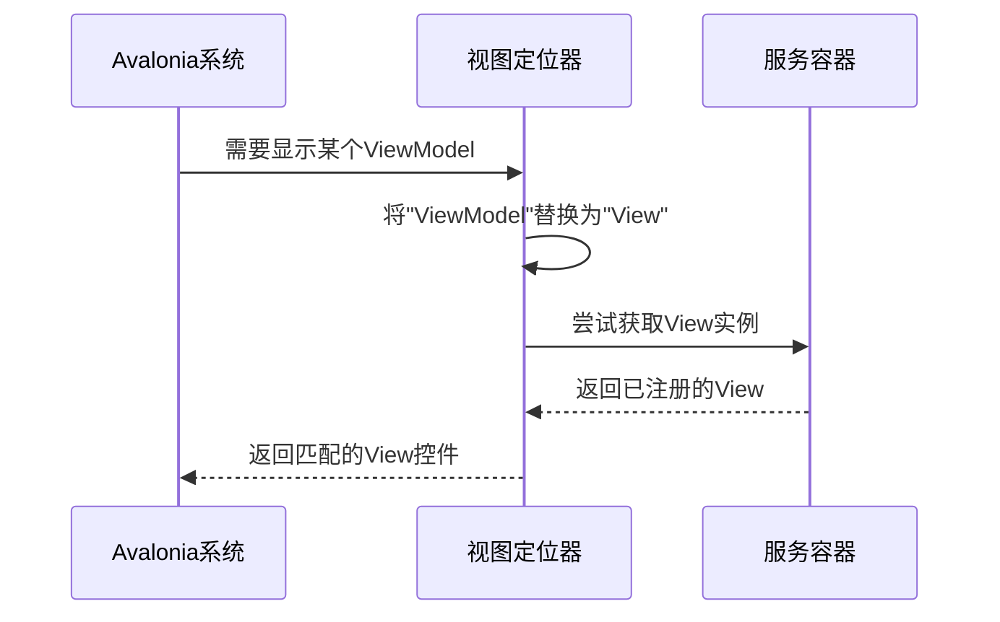

# Chapter 8: 视图定位器

在[第七章：页面视图模型基类](07_页面视图模型基类_.md)中，我们为所有ViewModel建立了标准化的基础能力。现在，我们需要一个智能的"红娘"——**视图定位器**，它能自动为ViewModel找到与之匹配的View，就像月老牵红线一样巧妙！

## 为什么需要视图定位器？

想象你去参加相亲大会💑：
- **手动配对**：需要记住每个嘉宾的编号，手动匹配双方信息
- **智能匹配系统**：输入姓名后自动显示合适对象的所有资料

视图定位器就是这样的智能系统，它解决的核心问题：
1. 🔗 自动关联View与ViewModel
2. 🧩 减少手动绑定的重复代码
3. 🚀 实现真正的MVVM分离

## 最简单的匹配规则

大多数情况下，View和ViewModel遵循命名约定：
- ViewModel名称：`MainWindowViewModel`
- 对应View名称：`MainWindowView`

就像情侣装👫，通过相同的前缀就能识别配对关系。

## 核心工作原理

视图定位器继承自`IDataTemplate`接口，这是Avalonia的数据模板系统：



## 实战代码解析

观察项目中的`ViewLocator.cs`实现：

```csharp
public Control? Build(object? param)
{
    if (param is null) return null; // 空值检查
    
    // 像翻译官一样转换名称
    var viewTypeName = param.GetType().FullName!
        .Replace("ViewModel", "View", StringComparison.Ordinal);
    
    // 尝试从DI容器获取视图
    var view = Program.ServiceProvider?.GetService(viewType) as Control;
    if (view != null) return view; // 容器中有就直接返回
    
    // 容器中没有就新建实例
    return (Control)Activator.CreateInstance(viewType)!;
}
```

这段代码就像智能售货机：
1. 接收ViewModel硬币（输入参数）
2. 自动换算成对应的View商品名称
3. 先检查VIP货架（DI容器）
4. 没有再到普通货架（动态创建）取货

## 自动匹配机制

关键的`Match`方法决定哪些对象使用此定位器：

```csharp
public bool Match(object? data)
{
    return data is ViewModelBase; // 只要是ViewModelBase的子类就匹配
}
```

这相当于相亲会的入场规则：
- 只有携带`ViewModelBase`身份证的嘉宾才能参与匹配

## 两种运行模式对比

### 1. 依赖注入模式（推荐）
```csharp
// 优先从容器获取
var view = Program.ServiceProvider?.GetService(viewType) as Control;
```
优点：
- 可利用DI生命周期管理
- 支持依赖注入

### 2. 动态创建模式
```csharp
// 直接实例化
return (Control)Activator.CreateInstance(viewType)!;
```
优点：
- 更轻量
- 不需要提前注册

## 常见问题解答

❓ 如何自定义匹配规则？
重写`Build`方法，修改名称转换逻辑：
```csharp
var viewTypeName = param.GetType().FullName!
    .Replace("Model", "Page", StringComparison.Ordinal);
```

❓ View找不到怎么办？
定位器会返回提示文本：
```csharp
return new TextBlock { Text = "Not Found: " + viewTypeName };
```

## 总结

本章我们学会了：
- 视图定位器的自动匹配原理
- 两种视图解析方式（DI优先）
- 如何通过命名约定关联View和ViewModel

就像为应用配备了智能婚介系统，视图定位器让View和ViewModel的配对变得轻松自然。至此，我们已经构建了一个完整的MVVM应用框架！

---

Generated by [AI Codebase Knowledge Builder](https://github.com/The-Pocket/Tutorial-Codebase-Knowledge)