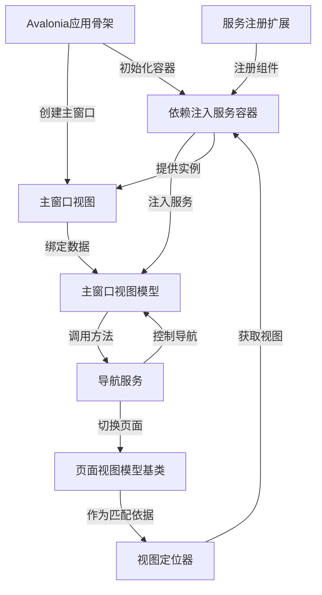

# Tutorial: Avalonia_With_Dependency_Injection_Example

这是一个展示**Avalonia框架**如何结合**依赖注入(DI)**构建桌面应用的示例项目。  
*核心功能*包括：通过**服务容器**管理所有组件，使用**导航服务**实现页面切换，以及通过**视图定位器**自动匹配ViewModel和View。  
项目重点演示了**松耦合架构**，各模块通过接口交互，方便测试和维护。

**Source Repository:** [https://github.com/Ming-jiayou/Avalonia_With_Dependency_Injection_Example](https://github.com/Ming-jiayou/Avalonia_With_Dependency_Injection_Example)

## Chapters

1. [Avalonia应用骨架
](01_avalonia应用骨架_.md)
2. [依赖注入服务容器
](02_依赖注入服务容器_.md)
3. [服务注册扩展
](03_服务注册扩展_.md)
4. [主窗口视图
](04_主窗口视图_.md)
5. [主窗口视图模型
](05_主窗口视图模型_.md)
6. [导航服务
](06_导航服务_.md)
7. [页面视图模型基类
](07_页面视图模型基类_.md)
8. [视图定位器
](08_视图定位器_.md)

---

Generated by [AI Codebase Knowledge Builder](https://github.com/The-Pocket/Tutorial-Codebase-Knowledge)