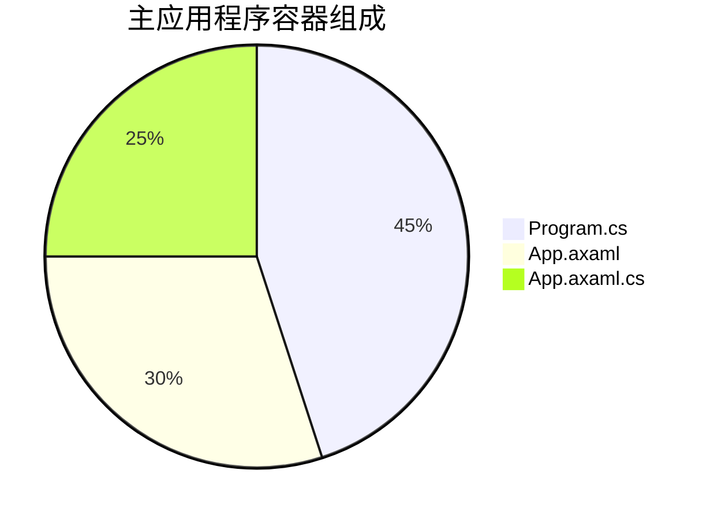
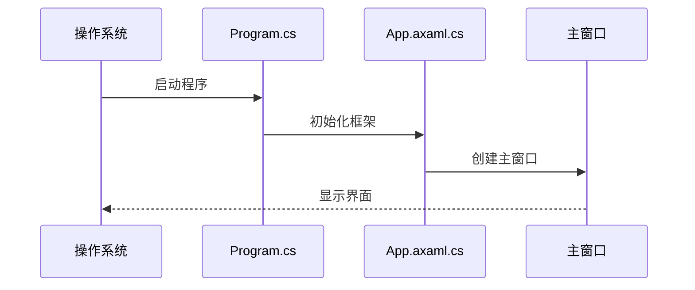

# Chapter 1: 主应用程序容器


## 为什么需要总控制台？

想象你要开办一家餐厅：
1. 需要采购食材（初始化资源）
2. 安排厨师和服务员（启动服务）
3. 确保每天正常营业（维护生命周期）

在Avalonia应用中，"主应用程序容器"就是这样一个**餐厅总管**角色，它负责：

- ✅ 启动应用程序
- ✅ 管理所有核心组件
- ✅ 处理退出清理

## 核心零件箱

主容器主要由三个关键文件组成：



## 1. 程序启动器 (Program.cs)

这是整个应用的"电源开关"：

```csharp
public static void Main(string[] args)
{
    // 创建一个服务集合（就像准备工具包）
    var services = new ServiceCollection();
    
    // 注册各种服务（放入工具包）
    services.AddViews().AddViewModels().AddServices();
    
    // 完成工具包装配
    ServiceProvider = services.BuildServiceProvider();
    
    // 启动Avalonia应用
    BuildAvaloniaApp().StartWithClassicDesktopLifetime(args);
}
```

► 工作原理就像组装玩具：
1. 准备空箱子（`ServiceCollection`）
2. 放入零件（服务注册）
3. 封箱打包（`BuildServiceProvider`）
4. 按下启动按钮（`StartWithClassicDesktopLifetime`）

## 2. 应用配置文件 (App.axaml)

这是应用的"装饰蓝图"：

```xml
<Application xmlns="https://github.com/avaloniaui">
    <!-- 指定视图定位器（自动匹配视图和ViewModel） -->
    <Application.DataTemplates>
        <local:ViewLocator/>
    </Application.DataTemplates>
  
    <!-- 设置默认主题风格 -->
    <Application.Styles>
        <FluentTheme />
    </Application.Styles>
</Application>
```

## 3. 生命周期管家 (App.axaml.cs)

管理应用生命周期的关键阶段：

```csharp
public override void OnFrameworkInitializationCompleted()
{
    if (ApplicationLifetime is IClassicDesktopStyleApplicationLifetime desktop)
    {
        // 获取主窗口和它的ViewModel
        var mainWindow = Program.ServiceProvider?.GetRequiredService<MainWindow>();
        var mainViewModel = Program.ServiceProvider?.GetRequiredService<MainWindowViewModel>();

        // 组装窗口并设置为应用主窗口
        mainWindow.DataContext = mainViewModel;
        desktop.MainWindow = mainWindow;
    }
    base.OnFrameworkInitializationCompleted();
}
```

🔧 内部工作流程：



## 常见问题解答

❓ 为什么要禁用数据验证插件？
```csharp
private void DisableAvaloniaDataAnnotationValidation()
{
    // 移除可能导致冲突的验证插件
    var plugins = BindingPlugins.DataValidators.OfType<DataAnnotationsValidationPlugin>();
    foreach (var plugin in plugins) { BindingPlugins.DataValidators.Remove(plugin); }
}
```
因为我们使用[依赖注入系统](03_依赖注入系统_.md)来管理验证逻辑，避免重复验证。

## 总结与实践

今天我们已经学会了：
- 主容器是应用的"中央控制系统"
- 三件核心组件的分工协作
- 应用的启动生命周期管理

试着修改`Program.cs`：
```csharp
// 在服务注册处添加你的自定义服务
services.AddViews().AddViewModels().AddServices();
```

下节课我们将学习[主窗口架构](02_主窗口架构_.md)，了解如何构建应用的主界面框架！

---

Generated by [AI Codebase Knowledge Builder](https://github.com/The-Pocket/Tutorial-Codebase-Knowledge)