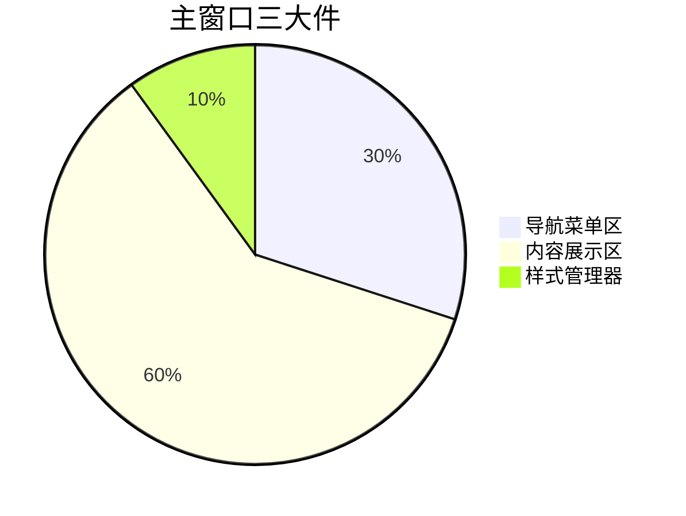
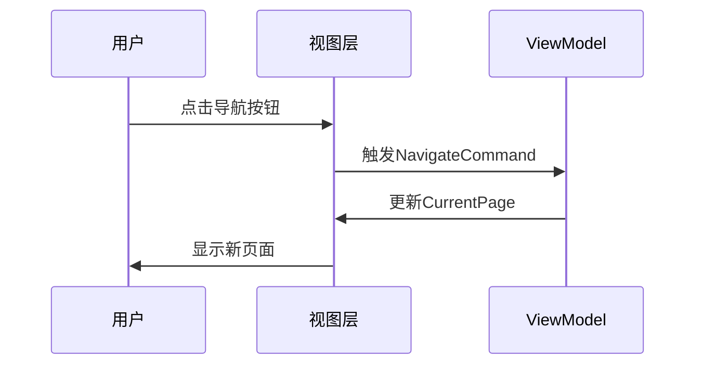

# Chapter 2: 主窗口架构


大家好！在上一章我们学习了[主应用程序容器](01_主应用程序容器_.md)，现在让我们来看看一个Avalonia应用的门面担当——主窗口架构。

## 为什么需要主窗口架构？

想象你的应用就像一家书店：
- 🚪左侧是书架（导航菜单）
- 📖右侧是阅读区（内容展示）

主窗口架构就是用清晰的结构把这两个区域组织起来，让用户能够自由导航和浏览内容。

## 主窗口的基本结构

主窗口通常由三个核心部分组成：



### 1. 骨架搭建 (MainWindow.axaml)

这是定义窗口布局的骨架代码：

```xml
<Grid>
    <!-- 定义两列布局 -->
    <Grid.ColumnDefinitions>
        <ColumnDefinition Width="200" />   <!-- 左侧固定200像素 -->
        <ColumnDefinition Width="*" />     <!-- 右侧自适应剩余空间 -->
    </Grid.ColumnDefinitions>
    
    <!-- 左侧导航栏 -->
    <Border Grid.Column="0" Background="Gray">
        <StackPanel Margin="0,20,0,0">
            <!-- 导航按钮会放在这里 -->
        </StackPanel>
    </Border>

    <!-- 右侧内容区域 -->
    <ContentControl Grid.Column="1"
                   Content="{Binding CurrentPage}"
                   Margin="20"/>
</Grid>
```

🛠️ 这个布局相当于：
- 左边灰色区域放菜单按钮
- 右边白色区域显示动态内容

### 2. 导航按钮实现

看看如何给左侧菜单添加点击功能：

```xml
<Button Name="页面1"
        Command="{Binding NavigateToPage1Command}"
        HorizontalAlignment="Stretch"
        Height="50"
        Margin="10,5"
        Classes="NavButton">
    <StackPanel Orientation="Horizontal">
        <TextBlock Text="Page1" VerticalAlignment="Center" FontSize="15"/>
    </StackPanel>
</Button>
```

按钮的关键属性：
- `Command`：绑定了ViewModel中的导航命令
- `Classes="NavButton"`：应用统一按钮样式
- `TextBlock`：显示按钮文字

### 3. 样式美化

这是让按钮更漂亮的"化妆品"：

```xml
<Window.Styles>
    <Style Selector="Button.NavButton">
        <Setter Property="Background" Value="Transparent"/>
        <Setter Property="Foreground" Value="White"/>
    </Style>
</Window.Styles>
```

## 内部工作原理

主窗口的运行流程如下：



## 实际应用示例

让我们看看如何组合使用这些功能：

```xml
<!-- 完整导航栏示例 -->
<StackPanel Margin="0,20,0,0">
    <Button Command="{Binding NavigateToPage1Command}" Classes="NavButton">
        <TextBlock Text="首页"/>
    </Button>
    <Button Command="{Binding NavigateToPage2Command}" Classes="NavButton">
        <TextBlock Text="个人中心"/>
    </Button>
</StackPanel>
```

对应ViewModel中的命令处理：

```csharp
public ICommand NavigateToPage1Command => new RelayCommand(() => {
    CurrentPage = new Page1View(); // 切换到页面1
});
```

## 常见问题

❓ 为什么按钮样式不生效？
检查是否：
1. 按钮正确设置了`Classes="NavButton"`
2. 样式定义在正确的`Window.Styles`部分
3. 属性值没有被子样式覆盖

❓ 内容区域为什么不显示？
确保：
- 已正确绑定`CurrentPage`
- 绑定的ViewModel已正确初始化

## 总结与练习

今天我们学到了：
- 主窗口的分区布局方法
- 导航按钮的实现原理
- 样式美化基础技巧

动手尝试：
1. 修改导航按钮的文字和间距
2. 添加第三个导航按钮

下节课我们将深入探索[依赖注入系统](03_依赖注入系统_.md)，了解如何优雅管理各种服务组件！

---

Generated by [AI Codebase Knowledge Builder](https://github.com/The-Pocket/Tutorial-Codebase-Knowledge)