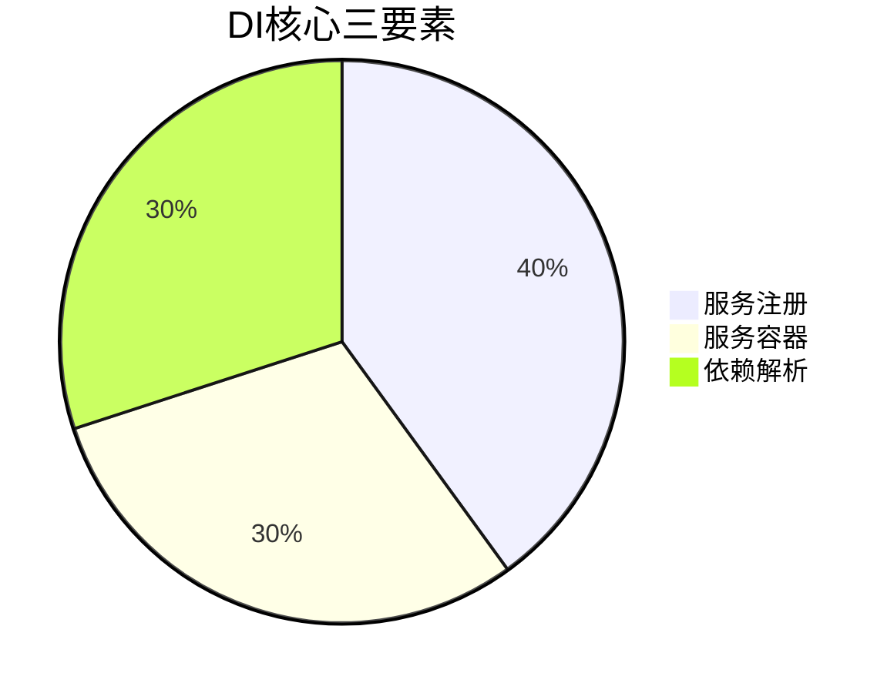
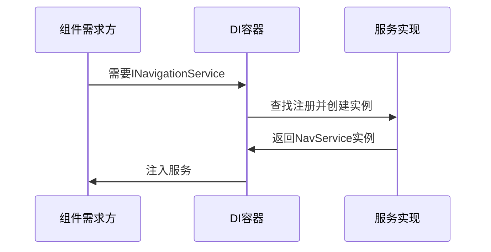

# Chapter 3: 依赖注入系统

欢迎回来！在上一章我们学习了[主窗口架构](02_主窗口架构_.md)，今天让我们一起探索使组件间协作变得优雅的秘密武器——依赖注入系统(Dependency Injection, DI)。

## 为什么需要依赖注入？

想象你经营一家奶茶店：
- 🧋每种原料（服务）都需要按配方组合
- 🤹手动调配每杯奶茶（手动创建依赖）非常麻烦
- 📦如果能把原料分装好自动配送就轻松多了！

依赖注入系统就是这样一个**智能奶茶配送机器人**：
- ✅ 自动准备所需原料（服务实例）
- ✅ 准时送到指定位置（注入组件）
- ✅ 保持配方一致性（生命周期管理）

## 核心组成三要素



### 1. 服务注册 (ServiceCollection)

就像在奶茶店的原料清单上登记：

```csharp
// 在Program.cs中注册服务
services.AddSingleton<INavigationService, NavigationService>();
services.AddTransient<IUserService, UserService>();
```

两种常见注册方式：
- `AddSingleton`：整个应用共用同一杯奶茶（单例）
- `AddTransient`：每次要都做新的一杯（瞬时）

### 2. 服务容器 (ServiceProvider)

相当于奶茶店的中央厨房：

```csharp
// 构建服务容器
ServiceProvider = services.BuildServiceProvider();
```

这个容器会：
- 📌 记住所有注册服务
- ⏱️ 管理它们的生命周期
- 🎁 按需"打包"服务实例

### 3. 依赖解析

顾客点单时的自动配送流程：

```csharp
// 在需要的地方获取服务
var navService = ServiceProvider.GetRequiredService<INavigationService>();
```

这相当于：
1. 顾客下单（请求服务）
2. 厨房找配方（查找注册）
3. 机器人配送（返回实例）

## 实际应用示例

让我们看一个完整场景——为主窗口注入导航服务：

```csharp
// MainWindowViewModel.cs
public class MainWindowViewModel
{
    private readonly INavigationService _navService;
    
    // 构造函数注入：DI系统自动提供导航服务
    public MainWindowViewModel(INavigationService navService)
    {
        _navService = navService;
    }
    
    public void NavigateToPage1()
    {
        _navService.NavigateTo<Page1ViewModel>(); // 使用注入的服务
    }
}
```

关键点：
- 🚫 不再需要手动`new NavService()`
- 🔄 更换实现时只需修改注册代码
- 🔍 依赖关系一目了然

## 内部工作原理

看看DI系统如何完成自动配送：



## 生命周期管理

不同"保鲜方式"的对比：

| 注册方式       | 创建时机              | 适用场景              |
|----------------|-----------------------|-----------------------|
| Singleton      | 首次请求时创建1次     | 全局共享的服务        |
| Transient      | 每次请求都创建新实例  | 轻量无状态的服务      |
| Scoped         | 同一作用域内共享      | Web请求级服务         |

## 常见问题解答

❓ 如何处理循环依赖？
避免构造函数互相引用，改用属性注入或重构设计

❓ 为什么获取服务返回null？
检查：
1. 服务是否已正确注册
2. 是否在容器构建后调用
3. 泛型参数是否匹配

## 总结与练习

今天我们掌握了：
- 依赖注入的本质是自动化管理
- 服务注册的三种主要方式
- 构造函数注入的最佳实践

动手时间：
1. 在`ServiceCollectionExtensions.cs`中添加新服务
2. 尝试在不同生命周期注册方式间切换

下节课我们将学习[导航服务](04_导航服务_.md)，让页面切换变得像翻书一样简单！

---

Generated by [AI Codebase Knowledge Builder](https://github.com/The-Pocket/Tutorial-Codebase-Knowledge)