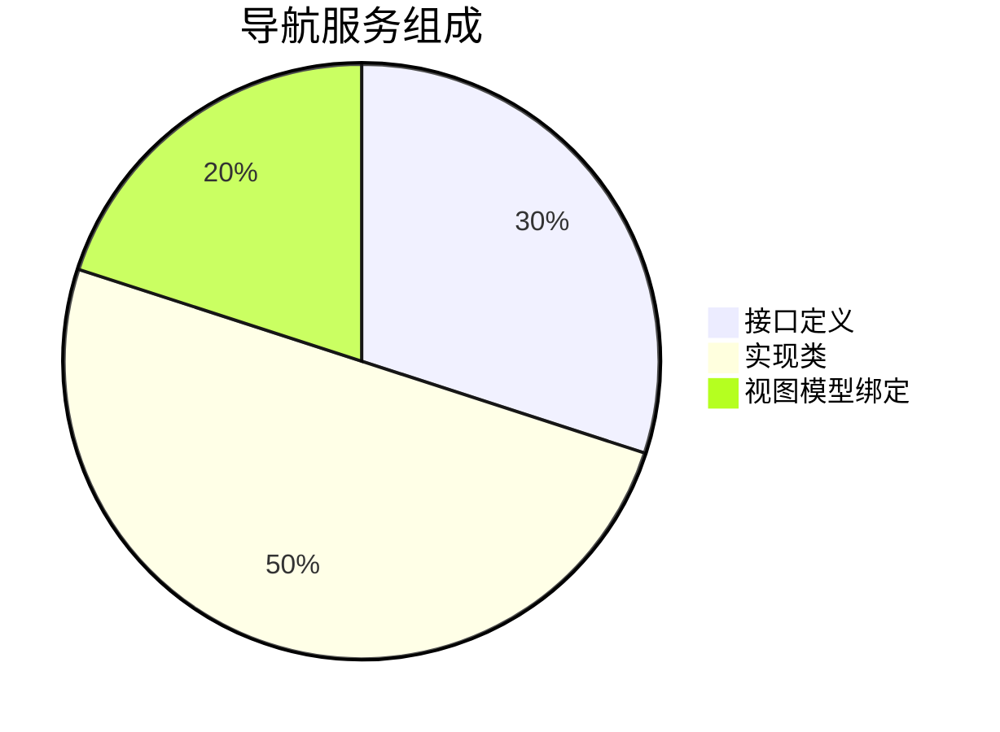
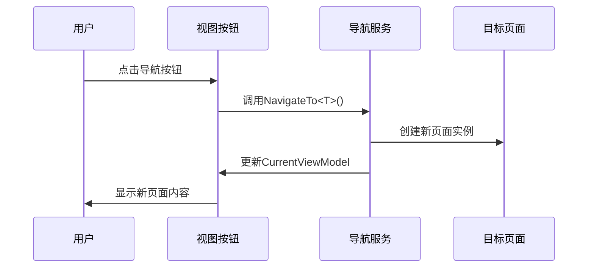

# Chapter 4: 导航服务

欢迎回来！在上一章我们学习了[依赖注入系统](03_依赖注入系统_.md)，现在让我们一起探索如何像地铁换乘一样轻松切换页面——这就是神奇的导航服务！

## 为什么需要导航服务？

想象你去图书馆借书：
1. 📚 你想从"科幻区"去"历史区"
2. 🏃‍ 不想自己跑来跑去搬书（手动创建/销毁页面）
3. 🧙‍♂️ 希望有魔法自动完成书架切换

导航服务就是这样的**图书馆向导精灵**：
- 🚪 自动打开目标页面
- 🔄 优雅关闭当前页面
- 🗺️ 管理所有页面状态

## 核心组件三明治

导航服务主要由三层组成：



### 1. 导航接口 (INavigationService.cs)

这是导航服务的"使用说明书"：

```csharp
public interface INavigationService
{
    ViewModelBase CurrentViewModel { get; }  // 当前显示的页面
    void NavigateTo<T>() where T : ViewModelBase; // 跳转到指定页面
}
```

关键功能：
- `CurrentViewModel`：获取当前展示的页面
- `NavigateTo<T>`：跳转到目标页面类型

### 2. 服务实现 (NavigationService.cs)

看看向导精灵如何施展魔法：

```csharp
public partial class NavigationService : ObservableObject, INavigationService
{
    [ObservableProperty]
    private ViewModelBase _currentViewModel; // 当前页面(自动生成属性)

    private readonly IServiceProvider _serviceProvider; // 依赖注入容器

    public NavigationService(IServiceProvider serviceProvider)
    {
        _serviceProvider = serviceProvider;
        NavigateTo<Page1ViewModel>(); // 默认显示首页
    }

    public void NavigateTo<T>() where T : ViewModelBase
    {
        // 从容器获取新页面实例
        var viewModel = _serviceProvider.GetRequiredService<T>();
        CurrentViewModel = viewModel; // 更新当前页面
    }
}
```

导航步骤解析：
1. 🧰 使用依赖注入容器获取新页面
2. 🔄 更新`CurrentViewModel`属性
3. 🎉 界面自动刷新显示新页面

### 3. 主窗口绑定 (MainWindowViewModel.cs)

看看页面切换如何与UI联动：

```csharp
public partial class MainWindowViewModel : ViewModelBase
{
    private readonly INavigationService _navigationService;
    
    [ObservableProperty]
    private ViewModelBase currentPage; // 绑定到界面ContentControl

    public MainWindowViewModel(INavigationService navigationService)
    {
        _navigationService = navigationService;
        currentPage = _navigationService.CurrentViewModel;
        
        // 监听导航服务的页面变化
        ((NavigationService)_navigationService).PropertyChanged += (_, args) =>
        {
            if (args.PropertyName == nameof(INavigationService.CurrentViewModel))
            {
                currentPage = _navigationService.CurrentViewModel;
            }
        };
    }
}
```

## 工作原理图解

导航服务的运行流程就像地铁调度：



## 实际应用示例

添加两个导航按钮的完整示例：

```xml
<!-- MainWindow.axaml -->
<StackPanel>
    <Button Command="{Binding NavigateToPage1Command}" Content="首页"/>
    <Button Command="{Binding NavigateToPage2Command}" Content="设置"/>
</StackPanel>
```

对应ViewModel中的命令：

```csharp
[RelayCommand]
private void NavigateToPage1()
{
    _navigationService.NavigateTo<Page1ViewModel>();
}

[RelayCommand]
private void NavigateToPage2()
{
    _navigationService.NavigateTo<Page2ViewModel>();
}
```

## 常见问题解答

❓ 为什么页面切换后按钮状态不变？
这是正常现象，导航服务只负责页面内容切换，菜单状态需要单独管理

❓ 如何传递参数给目标页面？
可以在`NavigateTo`方法中添加参数，并在目标ViewModel中接收

## 总结与练习

今天我们学会了：
- 导航服务如何实现页面切换
- CurrentViewModel的核心作用
- 导航命令与按钮的绑定方法

动手尝试：
1. 添加第三个导航按钮跳转到新页面
2. 修改默认显示页面为Page2

下节课我们将学习[页面视图模型](05_页面视图模型_.md)，了解如何构建具体的页面逻辑！

---

Generated by [AI Codebase Knowledge Builder](https://github.com/The-Pocket/Tutorial-Codebase-Knowledge)