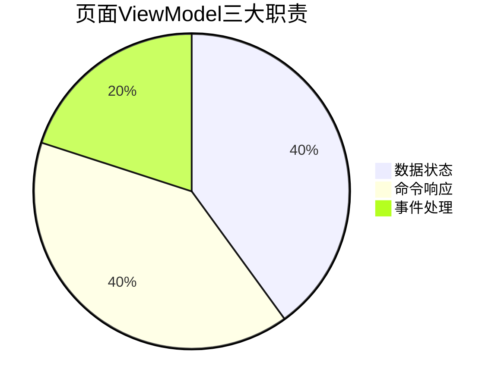
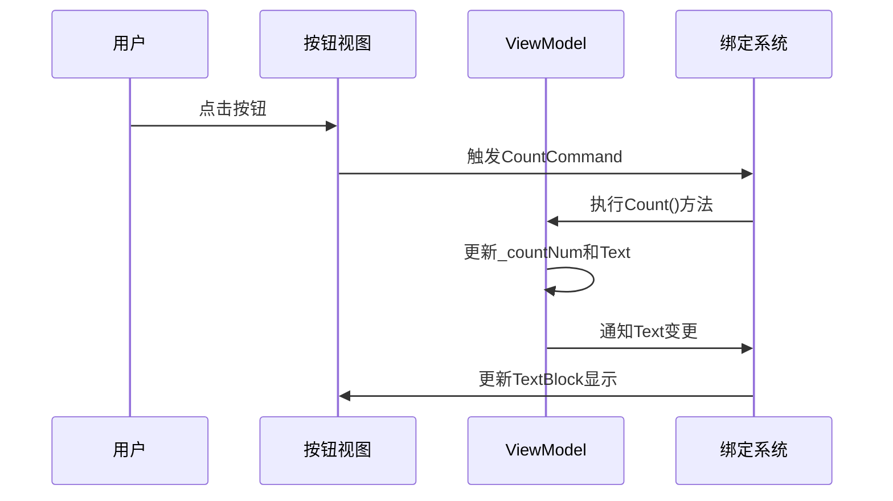

# Chapter 5: 页面视图模型

欢迎继续学习！在上一章我们掌握了[导航服务](04_导航服务_.md)的用法后，现在我们终于要认识Avalonia应用中最活蹦乱跳的主角了——页面视图模型(Page ViewModel)！

## 为什么需要页面视图模型？

想象你在玩电子游戏：
- 🎮 游戏界面(视图)负责显示画面
- 🧠 游戏逻辑(ViewModel)记录分数、判断胜负
- 👆 你点击按钮时，两者需要默契配合

页面视图模型就是游戏的**隐形大脑**，它负责：
- 📊 管理页面专属数据状态（如计数器值）
- 🔄 处理用户交互逻辑（按钮点击响应）
- 🔗 连接视图与业务逻辑的桥梁

## 解剖页面视图模型

让我们通过一个计数器示例，看看这个"大脑"如何工作：



### 1. 数据状态管理 (计数器值)

就像游戏存档记录当前状态：

```csharp
// Page1ViewModel.cs
private int _countNum = 0;  // 私有计数器字段
[ObservableProperty] 
private string _text = "你还没点击"; // 可观察的文本属性
```

特性说明：
- `[ObservableProperty]`：自动生成可通知变化的属性
- 当`Text`值改变时，界面会自动更新！

### 2. 命令响应 (按钮点击)

这是处理玩家操作的"操作手柄"：

```csharp
[RelayCommand]
public void Count()
{
    _countNum++;
    Text = $"你点击了{_countNum}次"; // 更新显示文本
}
```

魔法注解：
- `[RelayCommand]`：自动将方法转换为可绑定的命令
- 当按钮被点击时，这个方法会被调用

### 3. 与视图绑定 (XAML界面)

视图和ViewModel像连体婴一样协作：

```xml
<!-- Page1View.axaml -->
<StackPanel>
    <TextBlock Text="{Binding Text}" FontSize="20"/>
    <Button Command="{Binding CountCommand}" Content="点我计数"/>
</StackPanel>
```

绑定要点：
- `{Binding Text}`：显示ViewModel中的文本
- `{Binding CountCommand}`：绑定按钮点击命令

## 内部工作原理图解

看看点击按钮时发生了什么：



## 实际应用演练

让我们扩展功能，添加重置按钮：

```csharp
// 在ViewModel中添加
[RelayCommand]
public void Reset()
{
    _countNum = 0;
    Text = "计数器已重置";
}
```

对应XAML添加：

```xml
<Button Command="{Binding ResetCommand}" Content="重置" Margin="0,10"/>
```

现在你的计数器可以：
1. 点击"点我计数"增加数值
2. 点击"重置"归零计数器
3. 所有操作实时反映在界面上

## 常见问题解答

❓ 为什么点击按钮没反应？
检查：
1. 方法是否标记了`[RelayCommand]`
2. XAML中命令名称是否正确（方法名+Command）
3. DataContext是否设置正确

❓ 如何传递参数给命令？
使用带参数的命令方法：
```csharp
[RelayCommand]
public void Add(int num) { ... }
// 绑定方式：CommandParameter="5"
```

## 总结与挑战

今天我们掌握了：
- 页面ViewModel的核心职责
- ObservableProperty的自动通知机制
- RelayCommand的命令绑定方法

试试这些扩展练习：
1. 添加"减一"按钮减少计数值
2. 当计数超过10时显示特殊提示文字

下节课我们将学习[视图模型基类](06_视图模型基类_.md)，了解如何打造可复用的ViewModel基础功能！

---

Generated by [AI Codebase Knowledge Builder](https://github.com/The-Pocket/Tutorial-Codebase-Knowledge)