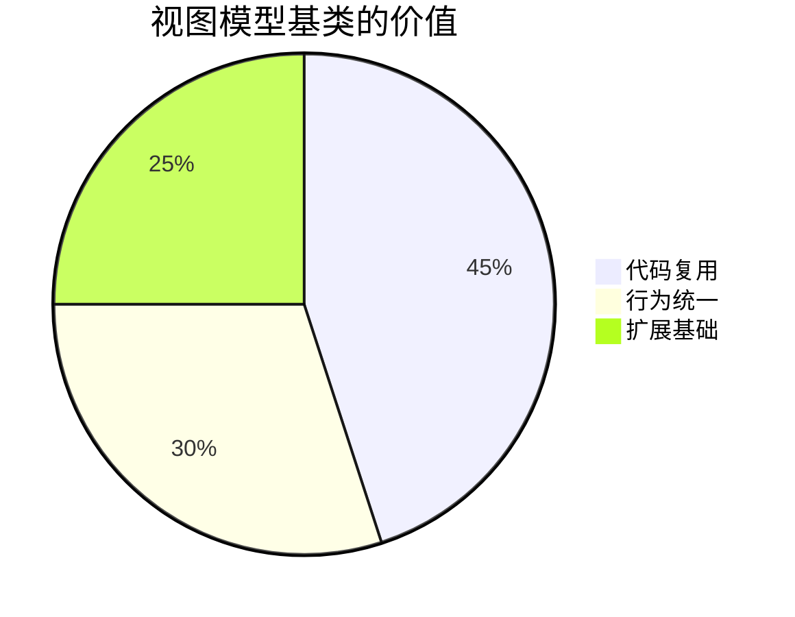
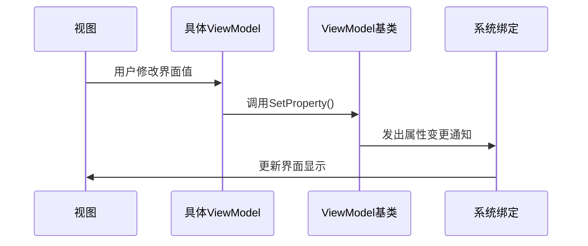

# Chapter 6: 视图模型基类

欢迎回到我们的学习旅程！在上一章我们探索了[页面视图模型](05_页面视图模型_.md)的具体实现后，今天我们要认识一个让所有ViewModel都变得更强壮的"功夫师父"——视图模型基类。

## 为什么需要基类？

想象武侠世界里的门派：
- 🏯 少林寺有72绝技（公共功能）
- 🧑‍🎓 每个弟子（具体ViewModel）都从基础功法练起
- 💪 节省修炼时间，保证武功路数一致

视图模型基类就是这样的**门派秘籍**，它为所有ViewModel提供：

- 📜 标准化的武功心法（通用属性/方法）
- ⚡ 即时通知更新的内力（`ObservableObject`能力）
- 🧩 统一的行为接口（后续扩展基础功能）



## 解剖基础功法

### 1. 核心能力继承

就像弟子们都要学扎马步：

```csharp
// ViewModelBase.cs
public class ViewModelBase : ObservableObject 
{
    // 所有子类自动获得可观察能力！
}
```

关键点：
- `ObservableObject`：提供了属性变更通知的"内功"
- 继承后自动获得：`SetProperty`、`OnPropertyChanged`等方法

### 2. 实际应用示例

看看具体页面如何"拜师学艺"：

```csharp
// Page1ViewModel.cs
public class Page1ViewModel : ViewModelBase // 继承基类
{
    private string _message = "Hello";
    
    public string Message
    {
        get => _message;
        set => SetProperty(ref _message, value); // 使用基类提供的方法
    }
}
```

这样做的好处：
- 🚀 不需要重复实现属性通知逻辑
- 🛡️ 保证所有ViewModel行为一致
- 📦 方便未来添加公共功能

## 内部修炼图解

基类如何帮助属性更新：



## 扩展基础功能

### 添加全局Loading状态

在基类中添加公共功能：

```csharp
// 在ViewModelBase中添加
private bool _isLoading;
public bool IsLoading
{
    get => _isLoading;
    set => SetProperty(ref _isLoading, value);
}

public virtual void OnNavigatedTo() {} // 可被子类重写的导航方法
```

现在所有页面都能：
1. 使用`IsLoading`控制加载状态
2. 实现`OnNavigatedTo`响应页面导航事件

### 使用示例

```csharp
// Page2ViewModel.cs
public override void OnNavigatedTo()
{
    IsLoading = true;
    // 加载数据...
    IsLoading = false;
}
```

## 常见问题解答

❓ 为什么要用`SetProperty`而不是直接赋值？
- 直接赋值不会触发界面更新
- `SetProperty`会检查值是否变化并自动通知

❓ 可以多重继承吗？
C#不支持，但可以通过[依赖注入系统](03_依赖注入系统_.md)组合功能

## 总结与练习

今天我们掌握了：
- 视图模型基类的核心作用
- `ObservableObject`提供的强大能力
- 如何扩展公共功能

动手尝试：
1. 在基类添加`Title`公共属性
2. 让所有页面自动显示统一页脚

下节课我们将学习[视图定位器](07_视图定位器_.md)，了解如何自动匹配视图和ViewModel！

---

Generated by [AI Codebase Knowledge Builder](https://github.com/The-Pocket/Tutorial-Codebase-Knowledge)