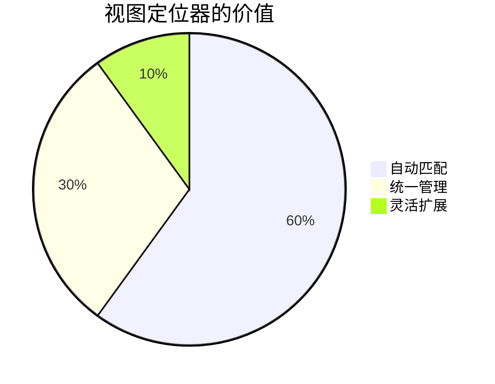
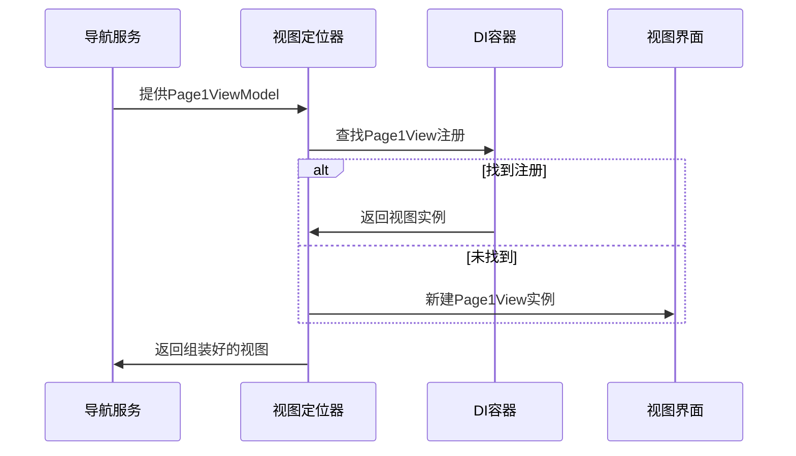

# Chapter 7: 视图定位器

欢迎回来！在上一章我们学习了如何用[视图模型基类](06_视图模型基类_.md)打造统一的ViewModel基础设施后，今天我们要认识一个神奇的"红娘"——视图定位器(ViewLocator)，它能自动为ViewModel找到合适的视图对象！

## 为什么需要视图定位器？

想象你在玩拼图游戏：
- 🧩 每块拼图(ViewModel)都需要找到正确的位置(视图)
- 🔍 手动匹配每一个太费时间
- 🧙 如果能有个魔法使自动配对就太棒了！

视图定位器就是这样的**智能月老**：
- 🤝 按照命名规则自动配对视图和ViewModel
- ⚡ 省去手动绑定DataContext的繁琐步骤
- 🔄 保持视图创建逻辑统一规范



## 视图定位器如何工作？

### 1. 基础配对原理

就像红娘牵线看姓氏：

```csharp
// ViewLocator.cs的核心匹配逻辑
public bool Match(object? data)
{
    return data is ViewModelBase; // 只要是ViewModelBase的子类就能匹配
}
```

这个简单的规则告诉我们：
- ✅ 只要是继承自`ViewModelBase`的对象
- 🎯 视图定位器就会尝试为它找到对应视图

### 2. 视图构建过程

看看红娘如何制造"缘分"：

```csharp
public Control? Build(object? param)
{
    if (param is null) return null;
    
    // 把"ViewModel"替换成"View"来寻找视图类型
    var viewTypeName = param.GetType().FullName!.Replace("ViewModel", "View");
    var viewType = Type.GetType(viewTypeName);
    
    if (viewType != null) 
    {
        // 优先从DI容器获取视图实例
        var view = Program.ServiceProvider?.GetService(viewType) as Control;
        return view ?? (Control)Activator.CreateInstance(viewType)!;
    }
    
    return new TextBlock { Text = "找不到视图: " + viewTypeName };
}
```

配对步骤：
1. 📛 获取ViewModel的类型名（如`Page1ViewModel`）
2. 🔄 替换后缀为`View`（变成`Page1View`）
3. 🎁 尝试从DI容器创建视图实例
4. ✨ 容器没有则直接新建实例

## 工作原理图解

视图定位器的运作就像自动售货机：



## 实际应用示例

### 标准命名规则

要让红娘成功牵线，必须遵循"门当户对"的命名：
- ViewModel类名：`[功能名]ViewModel`（如`LoginViewModel`）
- 视图类名：`[功能名]View`（如`LoginView`）

### 注册视图定位器

在`App.axaml`中配置红娘上岗：

```xml
<Application.DataTemplates>
    <local:ViewLocator/> <!-- 这就是我们的红娘 -->
</Application.DataTemplates>
```

这样配置后：
- 所有`ContentControl`的内容如果是ViewModel
- 都会自动通过视图定位器找到对应视图显示

## 常见问题解答

❓ 为什么视图显示"Not Found"？
检查：
1. View和ViewModel是否在同一个程序集
2. 命名是否符合`[Xxx]View`和`[Xxx]ViewModel`规则
3. 视图类是否是`public`可访问

❓ 如何自定义匹配逻辑？
继承`ViewLocator`并重写`Build`和`Match`方法

## 总结与练习

今天我们认识了：
- 视图定位器的自动匹配魔法
- 视图/ViewModel的命名约定
- DI容器与视图创建的优先级

动手尝试：
1. 创建新的`SettingsViewModel`和`SettingsView`对
2. 观察导航服务如何自动显示正确视图

下节课我们将探索[主题管理系统](08_主题管理系统_.md)，学习如何一键切换应用皮肤！

---

Generated by [AI Codebase Knowledge Builder](https://github.com/The-Pocket/Tutorial-Codebase-Knowledge)