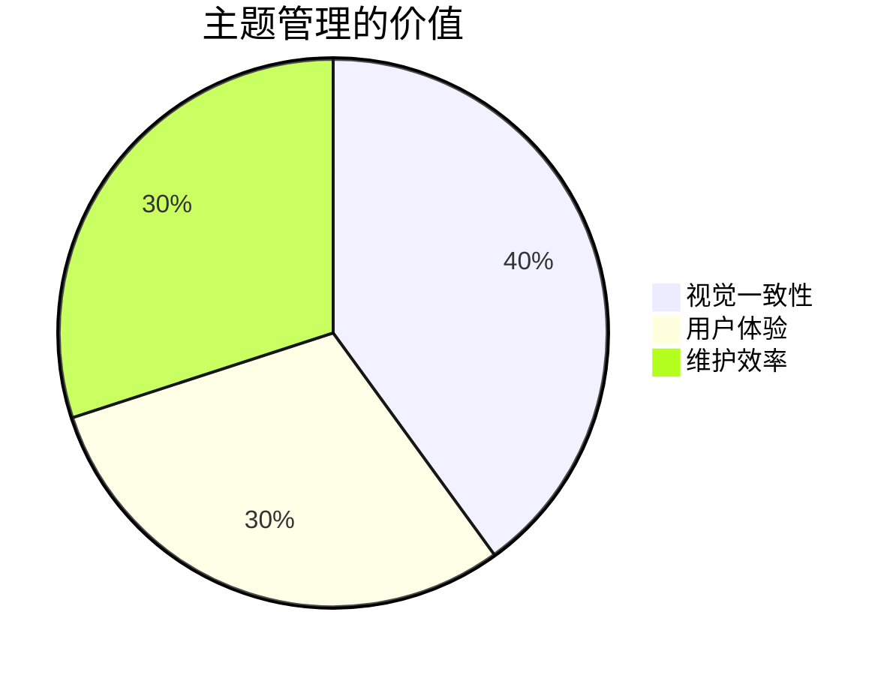
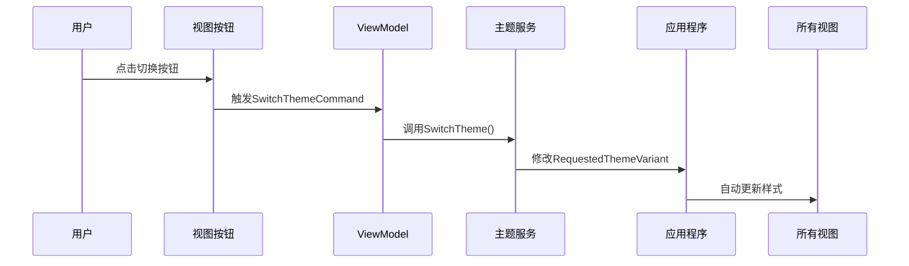

# Chapter 8: 主题管理系统

欢迎来到我们的新章节！在上一章我们学会了用[视图定位器](07_视图定位器_.md)自动匹配视图和ViewModel后，今天让我们一起探索如何像变色龙一样随心变换应用外观——这就是强大的主题管理系统！

## 为什么要管理主题？

想象你的手机有深色和浅色模式：
- 🌙 晚上用深色模式保护眼睛
- ☀️ 白天用浅色模式清晰可见
- 🎨 还可以自定义喜欢的配色方案

主题管理系统就是应用界的**时尚设计师**，它能让你：
- 🎭 一键切换应用整体视觉风格
- 🖌️ 统一管理所有界面元素样式
- 🧥 打造专属于你的独特外观



## 主题系统三大法宝

### 1. 主题配置 (App.axaml)

这是定义基础主题的"调色盘"：

```xml
<Application.Styles>
    <FluentTheme Mode="Dark"/> <!-- 默认使用深色主题 -->
</Application.Styles>
```

关键参数：
- `FluentTheme`：使用Fluent设计风格
- `Mode`：可选`Dark`/`Light`/`Default`(跟随系统)

### 2. 动态切换 (ThemeService.cs)

来看看"时尚设计师"如何换装：

```csharp
public class ThemeService
{
    private readonly IServiceProvider _serviceProvider;
    
    public ThemeService(IServiceProvider serviceProvider)
    {
        _serviceProvider = serviceProvider;
    }

    public void SwitchTheme(ThemeMode mode)
    {
        var app = _serviceProvider.GetRequiredService<Application>();
        app.RequestedThemeVariant = mode == ThemeMode.Dark 
            ? ThemeVariant.Dark 
            : ThemeVariant.Light; // 切换主题变体
    }
}
```

可选的`ThemeMode`枚举：
```csharp
public enum ThemeMode { Light, Dark }
```

### 3. 主题切换按钮 (MainWindow.axaml)

给用户一个"换装按钮"：

```xml
<Button Command="{Binding SwitchThemeCommand}" 
        Content="切换主题" 
        HorizontalAlignment="Right"/>
```

对应的ViewModel命令：
```csharp
[RelayCommand]
private void SwitchTheme()
{
    _themeService.SwitchTheme(ThemeMode.Dark); // 调用主题服务
}
```

## 内部换装流程

主题切换就像舞台灯光控制：



## 实际应用示例

完整实现主题切换功能：

1. 注册主题服务：
```csharp
// Program.cs
services.AddSingleton<ThemeService>();
```

2. 注入使用：
```csharp
public MainWindowViewModel(ThemeService themeService)
{
    _themeService = themeService;
}
```

3. 增强版切换逻辑：
```csharp
public void SwitchTheme()
{
    var current = Application.Current.RequestedThemeVariant;
    var newTheme = current == ThemeVariant.Dark 
        ? ThemeMode.Light 
        : ThemeMode.Dark; // 自动反转当前主题
    _themeService.SwitchTheme(newTheme);
}
```

## 常见问题解答

❓ 为什么主题切换无效？
检查：
1. 是否正确调用了`RequestedThemeVariant`
2. 所有样式是否使用了主题感知的颜色
3. 是否在正确的作用域修改主题

❓ 如何添加自定义主题？
可以继承`FluentTheme`并重写资源字典，或者创建完整的新`Styles`集合

## 总结与练习

今天我们学会了：
- 主题管理的基本原理
- 动态切换主题的实现方法
- 主题服务与界面交互的方式

动手挑战：
1. 添加"跟随系统"主题选项
2. 实现三个主题切换按钮(亮/暗/系统)

下节课我们将继续深入Avalonia的精彩世界！

---

Generated by [AI Codebase Knowledge Builder](https://github.com/The-Pocket/Tutorial-Codebase-Knowledge)