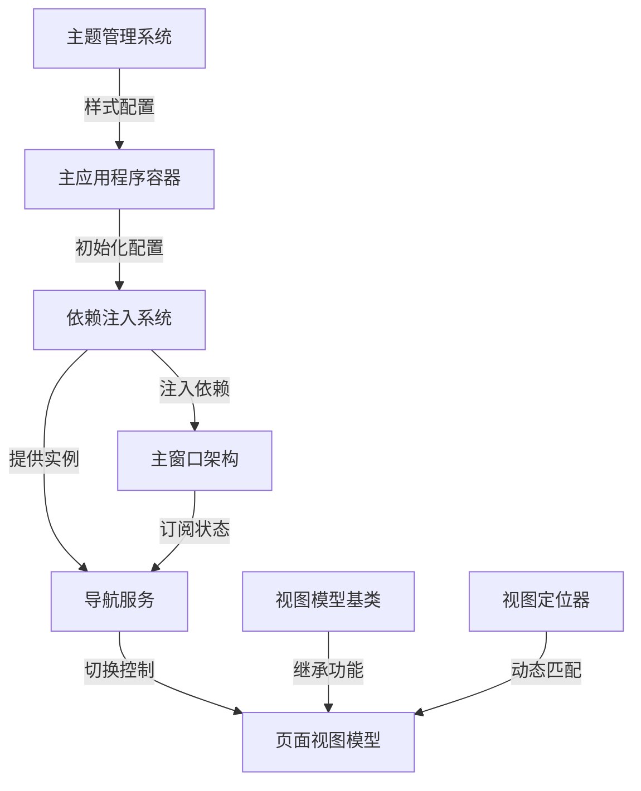

# Tutorial: Avalonia_With_Dependency_Injection_Example

本项目是一个使用Avalonia框架开发的跨平台桌面应用，**主要演示了依赖注入(DI)在MVVM架构中的实践**。核心功能包括：

1. *主窗口*采用左右分栏布局，左侧导航栏可切换到不同页面
2. 通过**依赖注入容器**自动管理所有视图和视图模型的生命周期
3. **导航服务**负责协调页面跳转逻辑
4. 视图定位器实现视图模型的自动匹配渲染
5. 主题系统支持浅色/深色模式切换

**Source Repository:** [https://github.com/Ming-jiayou/Avalonia_With_Dependency_Injection_Example](https://github.com/Ming-jiayou/Avalonia_With_Dependency_Injection_Example)

## Chapters

1. [主应用程序容器
](01_主应用程序容器_.md)
2. [主窗口架构
](02_主窗口架构_.md)
3. [依赖注入系统
](03_依赖注入系统_.md)
4. [导航服务
](04_导航服务_.md)
5. [页面视图模型
](05_页面视图模型_.md)
6. [视图模型基类
](06_视图模型基类_.md)
7. [视图定位器
](07_视图定位器_.md)
8. [主题管理系统
](08_主题管理系统_.md)

---

Generated by [AI Codebase Knowledge Builder](https://github.com/The-Pocket/Tutorial-Codebase-Knowledge)