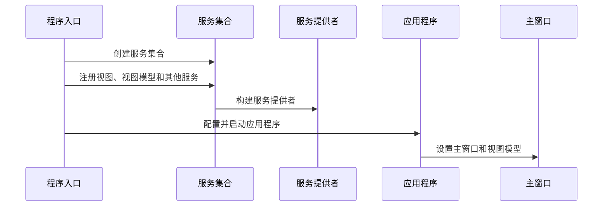

# Chapter 1: 主应用程序配置

## 欢迎初学者！

欢迎来到我们的第一个章节！在这个章节中，我们将学习如何配置和启动Avalonia应用程序。如果你是第一次接触Avalonia或者依赖注入（Dependency Injection, DI），请不要担心，我们将通过具体的例子来一步步引导你。

## 为什么要配置主应用程序？

在开发任何应用程序时，首先需要做的一件事情就是配置和启动它。在Avalonia中，主应用程序配置类似于一家公司的前台，负责接待访客并引导他们进入正确的房间。在这个例子中，我们的“前台”会做一些必要的初始化工作，比如设置主窗口和初始化依赖注入。这样的配置能确保应用程序能够顺利启动，用户可以使用所有的功能。

## 具体实现

### 1. 创建应用程序类

我们从创建应用程序类开始。在Avalonia中，应用程序类继承自`Application`，并重写一些方法来配置应用程序。我们来看一下`App.axaml.cs`文件中的代码：

```csharp
using System.Linq;
using Avalonia;
using Avalonia.Controls.ApplicationLifetimes;
using Avalonia.Data.Core;
using Avalonia.Data.Core.Plugins;
using Avalonia.Markup.Xaml;
using AvaloniaWithDependencyInjection.ViewModels;
using AvaloniaWithDependencyInjection.Views;
using Microsoft.Extensions.DependencyInjection;

namespace AvaloniaWithDependencyInjection
{
    public partial class App : Application
    {
        public override void Initialize()
        {
            AvaloniaXamlLoader.Load(this);
        }

        public override void OnFrameworkInitializationCompleted()
        {
            if (ApplicationLifetime is IClassicDesktopStyleApplicationLifetime desktop)
            {
                DisableAvaloniaDataAnnotationValidation();

                var mainWindow = Program.ServiceProvider?.GetRequiredService<MainWindow>();
                var mainViewModel = Program.ServiceProvider?.GetRequiredService<MainWindowViewModel>();

                if (mainWindow != null && mainViewModel != null)
                {
                    mainWindow.DataContext = mainViewModel;
                    desktop.MainWindow = mainWindow;
                }
            }

            base.OnFrameworkInitializationCompleted();
        }

        private void DisableAvaloniaDataAnnotationValidation()
        {
            var dataValidationPluginsToRemove =
                BindingPlugins.DataValidators.OfType<DataAnnotationsValidationPlugin>().ToArray();

            foreach (var plugin in dataValidationPluginsToRemove)
            {
                BindingPlugins.DataValidators.Remove(plugin);
            }
        }
    }
}
```

### 代码解释

1. **Initialize 方法**:
   - `AvaloniaXamlLoader.Load(this);`：加载XAML资源，初始化用户界面。

2. **OnFrameworkInitializationCompleted 方法**:
   - `ApplicationLifetime`：检查应用程序是否在传统的桌面环境中运行。
   - `DisableAvaloniaDataAnnotationValidation()`：禁用Avalonia的数据注释验证，避免与CommunityToolkit重复验证。
   - `Program.ServiceProvider.GetRequiredService<MainWindow>()` 和 `Program.ServiceProvider.GetRequiredService<MainWindowViewModel>()`：从依赖注入服务中获取主窗口和主窗口视图模型。
   - `mainWindow.DataContext = mainViewModel;`：将主窗口的 DataContext 设置为主窗口视图模型。
   - `desktop.MainWindow = mainWindow;`：设置应用程序的主窗口。

3. **DisableAvaloniaDataAnnotationValidation 方法**:
   - 从数据验证插件中移除Avalonia的数据注释验证插件，避免重复验证。

### 2. 配置依赖注入

接下来，我们来看看如何配置依赖注入。在`Program.cs`文件中，我们会创建一个服务集合，并注册所需的依赖项：

```csharp
using System;
using Avalonia;
using Microsoft.Extensions.DependencyInjection;

namespace AvaloniaWithDependencyInjection
{
    internal sealed class Program
    {
        public static IServiceProvider? ServiceProvider { get; private set; }

        [STAThread]
        public static void Main(string[] args)
        {
            var services = new ServiceCollection();
            
            services.AddViews()
                    .AddViewModels()
                    .AddServices();
            
            ServiceProvider = services.BuildServiceProvider();
            
            BuildAvaloniaApp().StartWithClassicDesktopLifetime(args);
        }

        public static AppBuilder BuildAvaloniaApp()
            => AppBuilder.Configure<App>()
                .UsePlatformDetect()
                .WithInterFont()
                .LogToTrace();
    }
}
```

### 代码解释

1. **Main 方法**:
   - `var services = new ServiceCollection();`：创建一个服务集合。
   - `services.AddViews().AddViewModels().AddServices();`：注册视图、视图模型和其他服务。
   - `ServiceProvider = services.BuildServiceProvider();`：构建服务提供者。
   - `BuildAvaloniaApp().StartWithClassicDesktopLifetime(args);`：配置并启动Avalonia应用程序。

2. **BuildAvaloniaApp 方法**:
   - `AppBuilder.Configure<App>()`：配置应用程序。
   - `UsePlatformDetect()`：自动检测平台。
   - `WithInterFont()`：使用Inter字体。
   - `LogToTrace()`：将日志记录到跟踪。

### 内部实现

#### 步骤详解

1. **创建应用程序类**:
   - 继承自`Application`。
   - 重写`Initialize`方法，加载XAML资源。
   - 重写`OnFrameworkInitializationCompleted`方法，配置主窗口和依赖注入。

2. **配置依赖注入**:
   - 创建服务集合。
   - 注册所需的视图、视图模型和其他服务。
   - 构建服务提供者。
   - 启动Avalonia应用程序。

#### 序列图



## 结论

通过本章，我们学习了如何配置和启动Avalonia应用程序。我们介绍了应用程序类的创建和依赖注入的配置。希望你现在已经能够理解这些基本概念，并能够自己动手配置一个简单Avalonia应用程序。

接下来，我们将深入学习依赖注入的更多内容。请继续阅读：[依赖注入](02_依赖注入_.md)。

---

Generated by [AI Codebase Knowledge Builder](https://github.com/The-Pocket/Tutorial-Codebase-Knowledge)