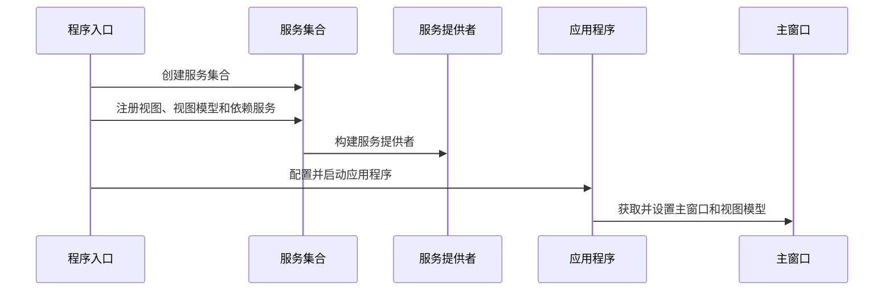

# Chapter 2: 依赖注入

## 从上一章过渡

在上一章 [主应用程序配置](01_主应用程序配置_.md) 中，我们学习了如何配置和启动一个Avalonia应用程序。我们介绍了应用程序类的创建和依赖注入的基本概念。在这一章中，我们将深入探讨依赖注入（Dependency Injection, 简称DI）这一重要的设计模式。通过理解依赖注入，你将能够更灵活地管理和使用应用程序中的各个组件。

## 依赖注入的基本概念

### 为什么使用依赖注入？

假设你正在开发一个应用程序，其中包含多个组件，例如视图（View）、视图模型（ViewModel）和服务（Service）。每个组件都可能需要依赖其他组件来完成特定的功能。例如，一个视图模型可能会依赖一个服务来获取数据。如果没有依赖注入，每个组件都需要自己创建或查找依赖，这样会导致代码耦合度高，难以测试和维护。

依赖注入通过将依赖关系从组件内部移到外部来解决这个问题。就像在一个团队中，领导分配任务，而不是每个成员自己找任务。这种方式使得组件更加独立和模块化，更容易测试和维护。

### 依赖注入的关键概念

1. **依赖（Dependency）**：
   - 一个组件需要使用的其他组件。例如，视图模型可能需要一个服务来获取数据。

2. **注入（Injection）**：
   - 通过构造函数、属性或方法将依赖传递给组件的过程。这种方式使得组件不需要自己创建或查找依赖。

3. **依赖注入容器（Dependency Injection Container）**：
   - 管理和提供依赖的工具。在Avalonia中，我们使用 `Microsoft.Extensions.DependencyInjection` 来创建和管理依赖注入容器。

## 如何使用依赖注入

### 一个简单的例子

假设我们有一个视图模型 `MainWindowViewModel`，它需要使用一个服务 `DataService` 来获取数据。我们可以通过依赖注入来实现这一点。

#### 定义服务

首先，我们定义一个服务 `DataService`：

```csharp
namespace AvaloniaWithDependencyInjection.Services
{
    public interface IDataService
    {
        string GetData();
    }

    public class DataService : IDataService
    {
        public string GetData()
        {
            return "Hello, World!";
        }
    }
}
```

#### 注册服务

接下来，我们需要在依赖注入容器中注册这个服务。我们已经在 `Program.cs` 文件中完成了这一部分：

```csharp
public static AppBuilder BuildAvaloniaApp()
    => AppBuilder.Configure<App>()
        .UsePlatformDetect()
        .WithInterFont()
        .LogToTrace();

[STAThread]
public static void Main(string[] args)
{
    var services = new ServiceCollection();

    services.AddViews()
            .AddViewModels()
            .AddServices();

    ServiceProvider = services.BuildServiceProvider();

    BuildAvaloniaApp().StartWithClassicDesktopLifetime(args);
}
```

在 `ServiceCollectionExtensions.cs` 文件中，我们注册了所有的视图、视图模型和服务：

```csharp
public static class ServiceCollectionExtensions
{
    public static IServiceCollection AddViews(this IServiceCollection services)
    {
        services.AddSingleton<MainWindow>();
        services.AddSingleton<Page1View>();
        services.AddSingleton<Page2View>();

        return services;
    }

    public static IServiceCollection AddViewModels(this IServiceCollection services)
    {
        services.AddSingleton<MainWindowViewModel>();
        services.AddSingleton<Page1ViewModel>();
        services.AddSingleton<Page2ViewModel>();

        return services;
    }

    public static IServiceCollection AddServices(this IServiceCollection services)
    {
        services.AddSingleton<IDataService, DataService>();

        return services;
    }
}
```

#### 注入依赖

现在，我们可以在 `MainWindowViewModel` 中注入 `DataService`：

```csharp
namespace AvaloniaWithDependencyInjection.ViewModels
{
    public class MainWindowViewModel
    {
        private readonly IDataService _dataService;

        public string Data { get; private set; }

        public MainWindowViewModel(IDataService dataService)
        {
            _dataService = dataService;
            Data = _dataService.GetData();
        }
    }
}
```

### 代码解释

1. **定义服务**：
   - `DataService` 实现了 `IDataService` 接口，并提供了 `GetData` 方法。

2. **注册服务**：
   - 在 `ServiceCollectionExtensions` 中，我们通过 `AddServices` 方法注册了 `DataService`。

3. **注入依赖**：
   - 在 `MainWindowViewModel` 中，我们通过构造函数注入了 `IDataService`，并在构造函数中调用了 `GetData` 方法。

### 运行结果

当应用程序启动时，依赖注入容器会自动创建 `DataService` 实例，并将其传递给 `MainWindowViewModel` 的构造函数。`MainWindowViewModel` 会调用 `GetData` 方法，并将返回的数据赋值给 `Data` 属性。最终，`Data` 属性的值会显示在主窗口中。

## 内部实现

### 依赖注入容器的工作原理

1. **创建服务集合**：
   - 在 `Program.cs` 中，我们创建了一个 `ServiceCollection` 实例。

2. **注册依赖**：
   - 通过 `AddViews`、`AddViewModels` 和 `AddServices` 方法，我们注册了所有的视图、视图模型和服务。

3. **构建服务提供者**：
   - 使用 `services.BuildServiceProvider()` 方法，我们构建了一个 `IServiceProvider` 实例。

4. **获取服务**：
   - 在 `App.axaml.cs` 文件中，我们通过 `Program.ServiceProvider.GetRequiredService<MainWindow>()` 和 `Program.ServiceProvider.GetRequiredService<MainWindowViewModel>()` 方法从服务提供者中获取主窗口和主窗口视图模型。

### 序列图



## 结论

通过本章，我们深入探讨了依赖注入的基本概念和使用方法。我们学习了如何通过依赖注入来管理和使用应用程序中的各个组件，使得代码更加模块化和易于测试。希望你现在能够理解依赖注入的重要性和使用方法。

接下来，我们将学习 [应用程序生命周期](03_应用程序生命周期_.md) 的相关内容。请继续阅读，了解应用程序的各个生命周期阶段。

---

Generated by [AI Codebase Knowledge Builder](https://github.com/The-Pocket/Tutorial-Codebase-Knowledge)