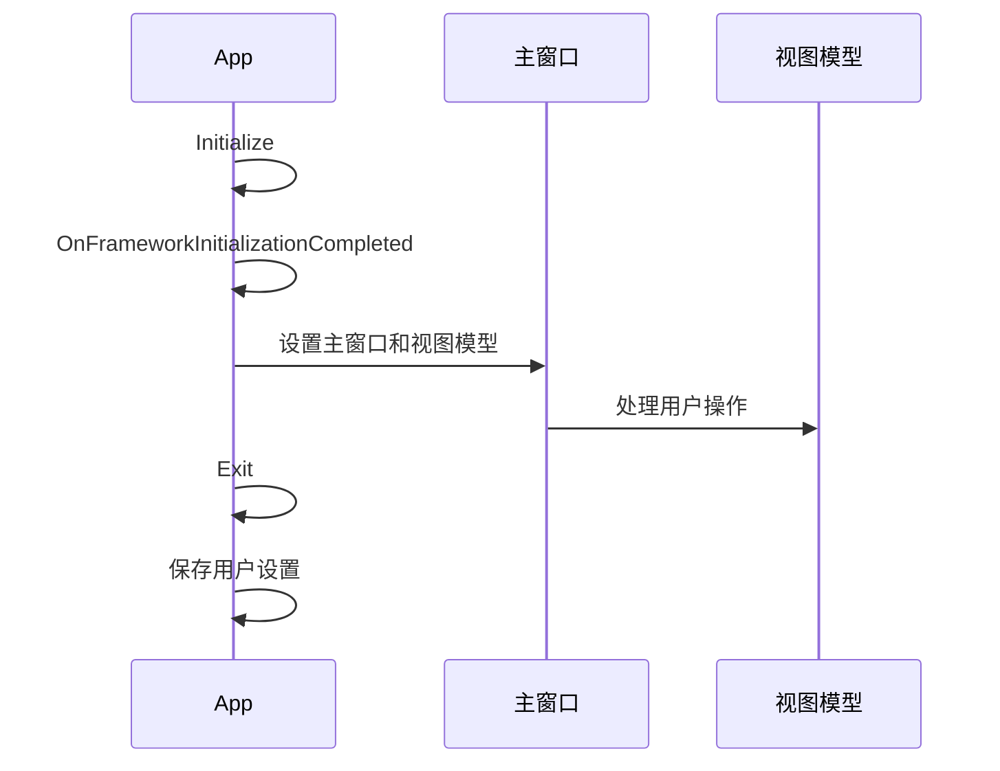

# Chapter 3: 应用程序生命周期

## 从上一章过渡

在上一章 [依赖注入](02_依赖注入_.md) 中，我们深入探讨了依赖注入（Dependency Injection, 简称DI）这一重要的设计模式。通过理解依赖注入，我们能够更灵活地管理和使用应用程序中的各个组件。在这一章中，我们将学习应用程序生命周期（Application Lifecycle）的概念，了解应用程序从启动、运行到关闭的整个过程。

## 什么是应用程序生命周期？

应用程序生命周期管理应用程序的启动、运行和关闭过程。可以将其比作一天的时间管理，包括早晨起床、日常工作和晚上休息。理解应用程序的生命周期可以帮助我们更好地管理应用程序的状态和资源，确保应用程序在不同阶段都能正确运行。

### 中心用例

假设我们正在开发一个简单的Avalonia应用程序，其中包含一个主窗口和一些按钮。我们希望在应用程序启动时显示一个欢迎消息，在关闭应用程序时保存用户的设置。通过理解应用程序生命周期，我们可以实现这些功能。

## 应用程序生命周期的关键概念

### 1. **应用程序启动**

当应用程序启动时，Avalonia会调用 `App` 类的 `Initialize` 和 `OnFrameworkInitializationCompleted` 方法。在这些方法中，我们可以进行应用程序的初始化工作，例如加载资源、设置主窗口等。

### 2. **应用程序运行**

在应用程序运行期间，用户可以与应用程序的各个组件进行交互。在这个阶段，我们可以监听用户的操作，处理事件，并根据需要更新UI。

### 3. **应用程序关闭**

当用户关闭应用程序时，Avalonia会调用 `App` 类的 `Exit` 方法。在这个方法中，我们可以进行清理工作，例如保存用户设置、释放资源等。

## 如何管理应用程序的生命周期

### 1. **应用程序启动**

在 `App.axaml.cs` 文件中，我们可以通过重写 `Initialize` 和 `OnFrameworkInitializationCompleted` 方法来管理应用程序的启动过程。

#### 示例代码

```csharp
public partial class App : Application
{
    public override void Initialize()
    {
        // 加载XAML资源
        AvaloniaXamlLoader.Load(this);
    }

    public override void OnFrameworkInitializationCompleted()
    {
        // 检查是否在传统桌面环境中运行
        if (ApplicationLifetime is IClassicDesktopStyleApplicationLifetime desktop)
        {
            // 禁用Avalonia的数据注释验证
            DisableAvaloniaDataAnnotationValidation();

            // 获取主窗口和主窗口视图模型
            var mainWindow = Program.ServiceProvider?.GetRequiredService<MainWindow>();
            var mainViewModel = Program.ServiceProvider?.GetRequiredService<MainWindowViewModel>();

            if (mainWindow != null && mainViewModel != null)
            {
                // 设置主窗口的 DataContext
                mainWindow.DataContext = mainViewModel;
                // 设置应用程序的主窗口
                desktop.MainWindow = mainWindow;
            }
        }

        base.OnFrameworkInitializationCompleted();
    }

    private void DisableAvaloniaDataAnnotationValidation()
    {
        // 移除数据验证插件
        var dataValidationPluginsToRemove =
            BindingPlugins.DataValidators.OfType<DataAnnotationsValidationPlugin>().ToArray();

        foreach (var plugin in dataValidationPluginsToRemove)
        {
            BindingPlugins.DataValidators.Remove(plugin);
        }
    }
}
```

#### 代码解释

1. **Initialize 方法**:
   - `AvaloniaXamlLoader.Load(this);`：加载XAML资源，初始化用户界面。

2. **OnFrameworkInitializationCompleted 方法**:
   - `ApplicationLifetime is IClassicDesktopStyleApplicationLifetime desktop`：检查应用程序是否在传统桌面环境中运行。
   - `DisableAvaloniaDataAnnotationValidation()`：禁用Avalonia的数据注释验证，避免与CommunityToolkit重复验证。
   - `Program.ServiceProvider.GetRequiredService<MainWindow>()` 和 `Program.ServiceProvider.GetRequiredService<MainWindowViewModel>()`：从依赖注入服务中获取主窗口和主窗口视图模型。
   - `mainWindow.DataContext = mainViewModel;`：将主窗口的 DataContext 设置为主窗口视图模型。
   - `desktop.MainWindow = mainWindow;`：设置应用程序的主窗口。

### 2. **应用程序运行**

在应用程序运行期间，我们可以监听用户的操作，处理事件，并根据需要更新UI。例如，可以在主窗口视图模型中处理按钮点击事件。

#### 示例代码

```csharp
public class MainWindowViewModel
{
    private readonly IDataService _dataService;

    public MainWindowViewModel(IDataService dataService)
    {
        _dataService = dataService;
        Data = _dataService.GetData();
    }

    public string Data { get; private set; }

    public void OnButtonClicked()
    {
        // 处理按钮点击事件
        Data = _dataService.GetData();
    }
}
```

#### 代码解释

1. **MainWindowViewModel 构造函数**:
   - 通过构造函数注入 `IDataService`，并在构造函数中调用 `GetData` 方法。

2. **OnButtonClicked 方法**:
   - 处理按钮点击事件，调用 `GetData` 方法并更新 `Data` 属性。

### 3. **应用程序关闭**

在 `App.axaml.cs` 文件中，我们可以通过重写 `Exit` 方法来管理应用程序的关闭过程。

#### 示例代码

```csharp
public partial class App : Application
{
    public override void Exit applicationContext)
    {
        // 保存用户设置
        SaveUserSettings();

        // 其他清理工作
        base.Exit(applicationContext);
    }

    private void SaveUserSettings()
    {
        // 例如，将用户设置保存到文件
        // File.WriteAllText("settings.txt", "User settings");
    }
}
```

#### 代码解释

1. **Exit 方法**:
   - `SaveUserSettings()`：保存用户设置。
   - `base.Exit(applicationContext);`：调用基类的 `Exit` 方法，完成其他清理工作。

## 内部实现

### 应用程序生命周期的工作原理

1. **应用程序启动**：
   - 在 `App` 类的 `Initialize` 方法中，加载XAML资源。
   - 在 `OnFrameworkInitializationCompleted` 方法中，设置主窗口和视图模型。

2. **应用程序运行**：
   - 用户与应用程序交互，处理事件和更新UI。

3. **应用程序关闭**：
   - 在 `App` 类的 `Exit` 方法中，进行清理工作，例如保存用户设置。

### 序列图



## 结论

通过本章，我们学习了应用程序生命周期的概念，了解了如何管理应用程序的启动、运行和关闭过程。通过这些知识，我们可以更好地管理和优化应用程序的状态和资源。接下来，我们将学习视图定位器（View Locator）的相关内容。请继续阅读：[视图定位器](04_视图定位器_.md)。

---

Generated by [AI Codebase Knowledge Builder](https://github.com/The-Pocket/Tutorial-Codebase-Knowledge)