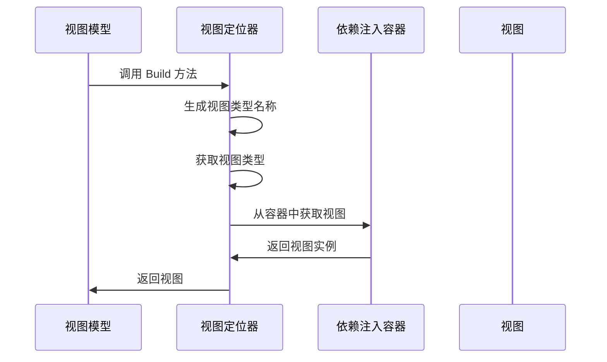

# Chapter 4: 视图定位器

## 从上一章过渡

在上一章 [应用程序生命周期](03_应用程序生命周期_.md) 中，我们学习了应用程序从启动、运行到关闭的整个过程。通过理解应用程序生命周期，我们可以更好地管理应用程序的状态和资源。在这一章中，我们将学习视图定位器（View Locator）的概念，了解如何根据视图模型找到对应的视图。

## 什么是视图定位器？

视图定位器负责根据视图模型找到对应的视图。可以将其比作一个地图，帮助应用程序找到与特定视图模型匹配的视图。例如，假设你有一个 `MainWindowViewModel`，视图定位器会帮助你找到 `MainWindow`。

### 中心用例

假设我们有一个简单的Avalonia应用程序，其中包含一个主窗口视图模型 `MainWindowViewModel` 和一个页面视图模型 `Page1ViewModel`。我们希望在用户导航到这些视图模型时，自动显示对应的视图。通过使用视图定位器，我们可以轻松实现这一功能。

## 如何使用视图定位器

### 1. 创建视图定位器类

首先，我们需要创建一个视图定位器类 `ViewLocator`，继承自 `IDataTemplate`。这个类会根据视图模型找到对应的视图。

#### 示例代码

```csharp
namespace AvaloniaWithDependencyInjection
{
    public class ViewLocator : IDataTemplate
    {
        public Control? Build(object? param)
        {
            if (param is null)
                return null;

            var viewModelType = param.GetType();
            var viewTypeName = viewModelType.FullName!.Replace("ViewModel", "View", StringComparison.Ordinal);
            var viewType = Type.GetType(viewTypeName);

            if (viewType != null)
            {
                // 尝试从依赖注入容器中获取视图
                var view = Program.ServiceProvider?.GetService(viewType) as Control;
                if (view != null)
                {
                    return view;
                }

                // 如果视图未注册，则创建一个新的实例
                return (Control)Activator.CreateInstance(viewType)!;
            }

            return new TextBlock { Text = "未找到视图: " + viewTypeName };
        }

        public bool Match(object? data)
        {
            return data is ViewModelBase;
        }
    }
}
```

#### 代码解释

1. **Build 方法**:
   - `if (param is null)`：检查参数是否为空。
   - `var viewModelType = param.GetType();`：获取视图模型的类型。
   - `var viewTypeName = viewModelType.FullName!.Replace("ViewModel", "View", StringComparison.Ordinal);`：通过替换 `ViewModel` 为 `View`，生成视图的类型名称。
   - `var viewType = Type.GetType(viewTypeName);`：根据类型名称获取视图的类型。
   - `var view = Program.ServiceProvider?.GetService(viewType) as Control;`：从依赖注入容器中获取视图。
   - `return (Control)Activator.CreateInstance(viewType)!;`：如果没有找到视图，则创建一个新的实例。
   - `return new TextBlock { Text = "未找到视图: " + viewTypeName };`：如果无法创建视图，返回一个文本块显示错误信息。

2. **Match 方法**:
   - `return data is ViewModelBase;`：检查数据是否是 `ViewModelBase` 类型。

### 2. 在应用程序中使用视图定位器

接下来，我们需要在应用程序中使用视图定位器。我们通过在 `App.xaml` 文件中设置 `DataTemplates` 来实现这一点。

#### 示例代码

```xml
<Application xmlns="https://github.com/avaloniaui"
             xmlns:vm="clr-namespace:AvaloniaWithDependencyInjection.ViewModels"
             xmlns:local="clr-namespace:AvaloniaWithDependencyInjection">
    <Application.DataTemplates>
        <DataTemplate DataType="{x:Type vm:ViewModelBase}">
            <local:ViewLocator />
        </DataTemplate>
    </Application.DataTemplates>
</Application>
```

#### 代码解释

1. **DataTemplate 元素**:
   - `DataType="{x:Type vm:ViewModelBase}"`：指定数据模板的类型为 `ViewModelBase`。
   - `<local:ViewLocator />`：使用 `ViewLocator` 类作为数据模板。

### 3. 创建视图模型和视图

为了测试视图定位器，我们需要创建一些视图模型和视图。

#### 示例代码

```csharp
// MainWindowViewModel.cs
using AvaloniaWithDependencyInjection.Services;

namespace AvaloniaWithDependencyInjection.ViewModels
{
    public class MainWindowViewModel : ViewModelBase
    {
        private readonly IDataService _dataService;

        public string Data { get; private set; }

        public MainWindowViewModel(IDataService dataService)
        {
            _dataService = dataService;
            Data = _dataService.GetData();
        }
    }
}
```

#### 代码解释

1. **MainWindowViewModel 构造函数**:
   - 通过构造函数注入 `IDataService`，并在构造函数中调用 `GetData` 方法。

#### 示例代码

```csharp
// MainWindow.xaml.cs
using Avalonia.Controls;

namespace AvaloniaWithDependencyInjection.Views
{
    public partial class MainWindow : Window
    {
        public MainWindow()
        {
            InitializeComponent();
        }
    }
}
```

#### 代码解释

1. **MainWindow 构造函数**:
   - 调用 `InitializeComponent` 方法，初始化XAML资源。

## 内部实现

### 视图定位器的工作原理

1. **获取视图模型**：
   - 视图定位器通过 `Build` 方法获取视图模型。

2. **生成视图类型名称**：
   - 通过替换 `ViewModel` 为 `View`，生成视图的类型名称。

3. **获取视图类型**：
   - 使用 `Type.GetType` 方法根据类型名称获取视图类型。

4. **从依赖注入容器中获取视图**：
   - 通过 `Program.ServiceProvider.GetService(viewType)` 方法从依赖注入容器中获取视图。

5. **创建新的视图实例**：
   - 如果无法从依赖注入容器中获取视图，则使用 `Activator.CreateInstance` 方法创建一个新的视图实例。

### 序列图



## 结论

通过本章，我们学习了视图定位器的概念，了解了如何根据视图模型找到对应的视图。通过视图定位器，我们可以更轻松地管理应用程序中的视图和视图模型，提高代码的模块化和可维护性。希望你现在能够理解视图定位器的重要性和使用方法。

接下来，我们将学习视图模型基类的相关内容。请继续阅读：[视图模型基类](05_视图模型基类_.md)。

---

Generated by [AI Codebase Knowledge Builder](https://github.com/The-Pocket/Tutorial-Codebase-Knowledge)