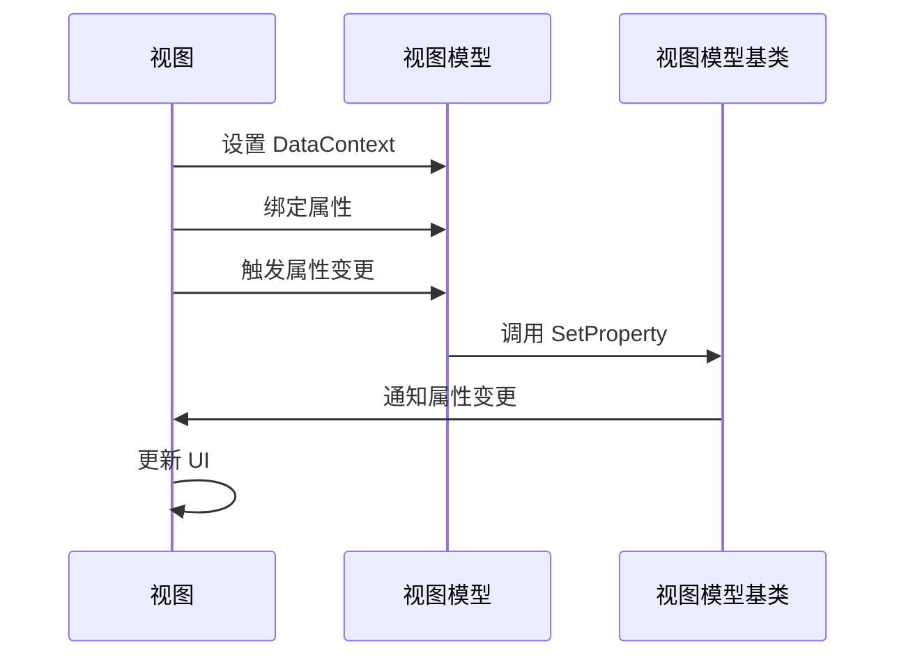

# Chapter 5: 视图模型基类

## 从上一章过渡

在上一章 [视图定位器](04_视图定位器_.md) 中，我们学习了如何根据视图模型找到对应的视图。通过视图定位器，我们可以更轻松地管理应用程序中的视图和视图模型，提高代码的模块化和可维护性。在这一章中，我们将学习视图模型基类的概念，了解如何通过这个基类来提供一些基本功能，如属性变更通知。

## 什么是视图模型基类？

视图模型基类是所有视图模型的父类，提供了一些基本功能，如属性变更通知。可以将其比作一个模板，所有视图模型都按照这个模板来构建。通过使用视图模型基类，我们可以在多个视图模型中复用这些基本功能，减少代码重复。

### 中心用例

假设我们正在开发一个简单的Avalonia应用程序，其中包含多个视图模型，如 `MainWindowViewModel` 和 `Page1ViewModel`。我们希望这些视图模型能够支持属性变更通知，以便在属性发生变化时自动更新UI。通过使用视图模型基类，我们可以轻松实现这一功能。

## 如何使用视图模型基类

### 1. 创建视图模型基类

首先，我们需要创建一个视图模型基类 `ViewModelBase`，继承自 `ObservableObject`。`ObservableObject` 是来自 `CommunityToolkit.Mvvm` 库的一个类，提供了属性变更通知的功能。

#### 示例代码

```csharp
using CommunityToolkit.Mvvm.ComponentModel;

namespace AvaloniaWithDependencyInjection.ViewModels
{
    public class ViewModelBase : ObservableObject
    {
    }
}
```

#### 代码解释

1. **继承自 `ObservableObject`**：
   - `ViewModelBase` 继承自 `ObservableObject`，这意味着 `ViewModelBase` 自动支持属性变更通知。

### 2. 创建具体的视图模型

接下来，我们创建具体的视图模型 `MainWindowViewModel`，并继承自 `ViewModelBase`。通过这样做，`MainWindowViewModel` 将自动继承属性变更通知的功能。

#### 示例代码

```csharp
namespace AvaloniaWithDependencyInjection.ViewModels
{
    public class MainWindowViewModel : ViewModelBase
    {
        private string _data;

        public string Data
        {
            get => _data;
            set => SetProperty(ref _data, value);
        }

        public MainWindowViewModel()
        {
            Data = "Hello, World!";
        }
    }
}
```

#### 代码解释

1. **属性变更通知**：
   - `Data` 属性使用 `SetProperty` 方法来设置值。`SetProperty` 方法会自动通知UI属性已发生变化。

2. **构造函数**：
   - 在构造函数中，我们将 `Data` 属性的初始值设置为 `"Hello, World!"`。

### 3. 使用视图模型

最后，我们在视图中使用 `MainWindowViewModel`。在视图中，我们可以绑定到 `Data` 属性，当属性变化时，UI会自动更新。

#### 示例代码

```xml
<Window xmlns="https://github.com/avaloniaui"
        xmlns:local="clr-namespace:AvaloniaWithDependencyInjection.Views"
        xmlns:vm="clr-namespace:AvaloniaWithDependencyInjection.ViewModels"
        x:Class="AvaloniaWithDependencyInjection.Views.MainWindow"
        Title="Avalonia With Dependency Injection Example" Width="800" Height="450">
    <StackPanel>
        <TextBlock Text="{Binding Data}" />
        <Button Content="Change Data" Click="OnButtonClicked" />
    </StackPanel>
</Window>
```

#### 代码解释

1. **数据绑定**：
   - `TextBlock` 绑定到 `Data` 属性，当 `Data` 属性变化时，`TextBlock` 会自动更新。

2. **按钮点击事件**：
   - `Button` 具有 `Click` 事件，当按钮被点击时，调用 `OnButtonClicked` 方法。

#### 代码解释

```csharp
using Avalonia.Controls;

namespace AvaloniaWithDependencyInjection.Views
{
    public partial class MainWindow : Window
    {
        public MainWindow()
        {
            InitializeComponent();
            DataContext = new MainWindowViewModel();
        }

        private void OnButtonClicked(object sender, Avalonia.Interactivity.RoutedEventArgs e)
        {
            var viewModel = (MainWindowViewModel)DataContext;
            viewModel.Data = "Data Changed!";
        }
    }
}
```

1. **设置 DataContext**：
   - 在构造函数中，将 `MainWindowViewModel` 实例设置为 `MainWindow` 的 `DataContext`。

2. **处理按钮点击事件**：
   - 在 `OnButtonClicked` 方法中，获取 `MainWindowViewModel` 实例，并更改 `Data` 属性的值。由于 `MainWindowViewModel` 继承自 `ViewModelBase`，属性变更通知会在更改 `Data` 时自动发生，UI会自动更新。

## 内部实现

### 视图模型基类的工作原理

1. **属性变更通知**：
   - `ViewModelBase` 继承自 `ObservableObject`，`ObservableObject` 提供了 `SetProperty` 方法。当调用 `SetProperty` 时，会触发属性变更通知，UI会自动更新。

2. **数据绑定**：
   - 视图中的控件（如 `TextBlock`）绑定到视图模型中的属性（如 `Data`）。当属性值变化时，控件会自动更新显示的内容。

### 序列图



## 结论

通过本章，我们学习了视图模型基类的概念，了解了如何通过这个基类来提供属性变更通知的功能。通过使用视图模型基类，我们可以在多个视图模型中复用这些基本功能，减少代码重复，提高代码的可维护性。希望你现在能够理解视图模型基类的重要性和使用方法。

接下来，我们将学习导航服务的相关内容。请继续阅读：[导航服务](06_导航服务_.md)。

---

Generated by [AI Codebase Knowledge Builder](https://github.com/The-Pocket/Tutorial-Codebase-Knowledge)