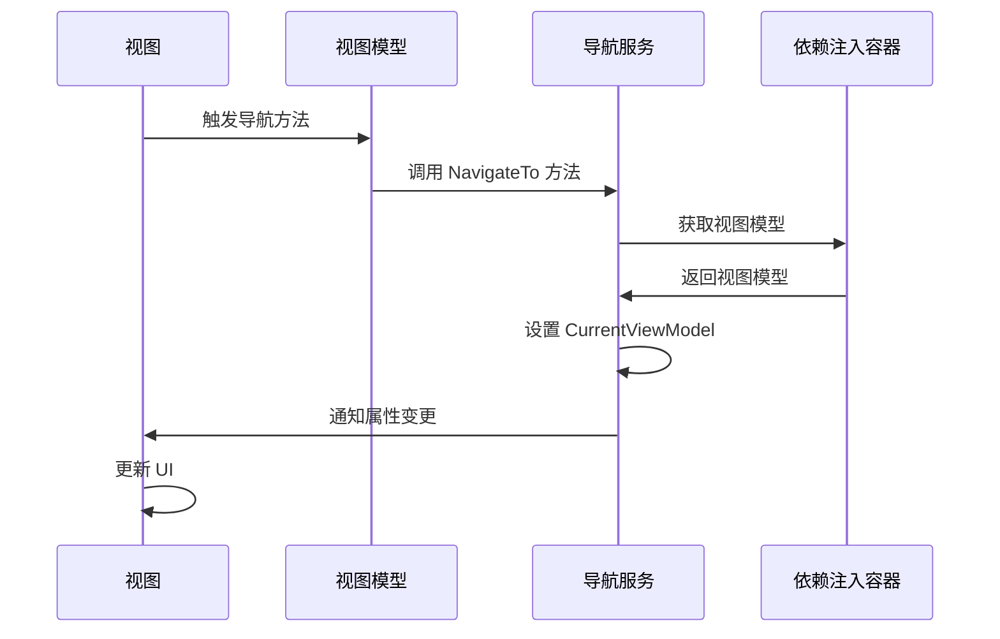

# Chapter 6: 导航服务

## 从上一章过渡

在上一章 [视图模型基类](05_视图模型基类_.md) 中，我们学习了如何通过视图模型基类来提供属性变更通知的功能。通过视图模型基类，我们可以在多个视图模型中复用这些基本功能，减少代码重复。在这一章中，我们将学习导航服务的概念，了解如何在不同视图模型之间进行导航。

## 什么是导航服务？

导航服务用于在不同视图模型之间进行导航。可以将其比作一个旅游指南，帮助用户在各个页面之间移动。例如，假设你有一款应用，其中包含多个页面，如主页、设置页和帮助页。通过使用导航服务，用户可以轻松地从一个页面跳转到另一个页面。

### 中心用例

假设我们正在开发一个简单的Avalonia应用程序，其中包含多个页面，如 `Page1` 和 `Page2`。我们希望用户可以通过点击按钮从 `Page1` 导航到 `Page2`，再从 `Page2` 返回到 `Page1`。通过使用导航服务，我们可以轻松实现这一功能。

## 如何使用导航服务

### 1. 创建导航服务接口

首先，我们需要创建一个导航服务接口 `INavigationService`，定义导航的基本方法。

#### 示例代码

```csharp
using AvaloniaWithDependencyInjection.ViewModels;

namespace AvaloniaWithDependencyInjection.Services;
public interface INavigationService
{
    ViewModelBase CurrentViewModel { get; }
    void NavigateTo<T>() where T : ViewModelBase;
}
```

#### 代码解释

1. **CurrentViewModel 属性**：
   - 获取当前显示的视图模型。

2. **NavigateTo 方法**：
   - 导航到指定的视图模型。

### 2. 创建导航服务类

接下来，我们创建一个导航服务类 `NavigationService`，实现 `INavigationService` 接口。

#### 示例代码

```csharp
using System;
using CommunityToolkit.Mvvm.ComponentModel;
using Microsoft.Extensions.DependencyInjection;
using AvaloniaWithDependencyInjection.ViewModels;

namespace AvaloniaWithDependencyInjection.Services;
public partial class NavigationService : ObservableObject, INavigationService
{
    [ObservableProperty]
    private ViewModelBase _currentViewModel;

    private readonly IServiceProvider _serviceProvider;

    public NavigationService(IServiceProvider serviceProvider)
    {
        _serviceProvider = serviceProvider;

        // 设置初始页面
        NavigateTo<Page1ViewModel>();
    }

    public void NavigateTo<T>() where T : ViewModelBase
    {
        var viewModel = _serviceProvider.GetRequiredService<T>();
        CurrentViewModel = viewModel;
    }
}
```

#### 代码解释

1. **ObservableProperty 属性**：
   - 使用 `ObservableProperty` 特性声明 `CurrentViewModel` 属性，使其支持属性变更通知。

2. **ServiceProvider 构造参数**：
   - 通过构造函数注入 `IServiceProvider`，用于获取视图模型实例。

3. **NavigateTo 方法**：
   - 从 `ServiceProvider` 中获取指定的视图模型，并设置为当前显示的视图模型。

### 3. 注册导航服务

我们需要在依赖注入容器中注册导航服务，以便在应用程序中使用它。

#### 示例代码

```csharp
public static class ServiceCollectionExtensions
{
    public static IServiceCollection AddViews(this IServiceCollection services)
    {
        services.AddSingleton<MainWindow>();
        services.AddSingleton<Page1View>();
        services.AddSingleton<Page2View>();

        return services;
    }

    public static IServiceCollection AddViewModels(this IServiceCollection services)
    {
        services.AddSingleton<MainWindowViewModel>();
        services.AddSingleton<Page1ViewModel>();
        services.AddSingleton<Page2ViewModel>();

        return services;
    }

    public static IServiceCollection AddServices(this IServiceCollection services)
    {
        services.AddSingleton<INavigationService, NavigationService>();
        services.AddSingleton<IDataService, DataService>();

        return services;
    }
}
```

#### 代码解释

1. **AddServices 方法**：
   - 注册 `INavigationService` 和 `DataService`。

### 4. 在视图模型中使用导航服务

我们可以在视图模型中注入 `INavigationService`，并通过它进行导航。

#### 示例代码

```csharp
namespace AvaloniaWithDependencyInjection.ViewModels;
public class Page1ViewModel : ViewModelBase
{
    private readonly INavigationService _navigationService;

    public Page1ViewModel(INavigationService navigationService)
    {
        _navigationService = navigationService;
    }

    public void NavigateToPage2()
    {
        _navigationService.NavigateTo<Page2ViewModel>();
    }
}
```

#### 代码解释

1. **构造函数注入**：
   - 通过构造函数注入 `INavigationService`。

2. **NavigateToPage2 方法**：
   - 调用 `NavigationService` 的 `NavigateTo` 方法，导航到 `Page2ViewModel`。

### 5. 在视图中触发导航

最后，我们在视图中绑定按钮点击事件，触发导航。

#### 示例代码

```xml
<Window xmlns="https://github.com/avaloniaui"
        xmlns:local="clr-namespace:AvaloniaWithDependencyInjection.Views"
        xmlns:vm="clr-namespace:AvaloniaWithDependencyInjection.ViewModels"
        x:Class="AvaloniaWithDependencyInjection.Views.Page1View"
        Title="Page 1" Width="800" Height="450">
    <StackPanel>
        <TextBlock Text="This is Page 1" />
        <Button Content="Go to Page 2" Click="OnButtonClicked" />
    </StackPanel>
</Window>
```

#### 代码解释

1. **按钮点击事件**：
   - `Button` 的 `Click` 事件绑定到 `OnButtonClicked` 方法。

#### 示例代码

```csharp
using Avalonia.Controls;

namespace AvaloniaWithDependencyInjection.Views;
public partial class Page1View : Window
{
    public Page1View()
    {
        InitializeComponent();
        DataContext = new Page1ViewModel();
    }

    private void OnButtonClicked(object sender, Avalonia.Interactivity.RoutedEventArgs e)
    {
        var viewModel = (Page1ViewModel)DataContext;
        viewModel.NavigateToPage2();
    }
}
```

#### 代码解释

1. **设置 DataContext**：
   - 在构造函数中，将 `Page1ViewModel` 实例设置为 `Page1View` 的 `DataContext`。

2. **处理按钮点击事件**：
   - 在 `OnButtonClicked` 方法中，获取 `Page1ViewModel` 实例，并调用 `NavigateToPage2` 方法进行导航。

## 内部实现

### 导航服务的工作原理

1. **获取视图模型**：
   - `NavigationService` 通过 `ServiceProvider` 获取指定的视图模型。

2. **设置当前视图模型**：
   - 将获取到的视图模型设置为 `CurrentViewModel`，并触发属性变更通知。

3. **属性变更通知**：
   - 由于 `CurrentViewModel` 属性使用了 `ObservableProperty` 特性，属性变更通知会在设置新值时自动触发，UI会自动更新。

### 序列图



## 结论

通过本章，我们学习了导航服务的概念，了解了如何在不同视图模型之间进行导航。通过使用导航服务，我们可以在多个页面之间轻松地进行切换，提高用户体验。希望你现在能够理解导航服务的重要性和使用方法。

接下来，我们将学习主窗口视图模型的相关内容。请继续阅读：[主窗口视图模型](07_主窗口视图模型_.md)。

---

Generated by [AI Codebase Knowledge Builder](https://github.com/The-Pocket/Tutorial-Codebase-Knowledge)