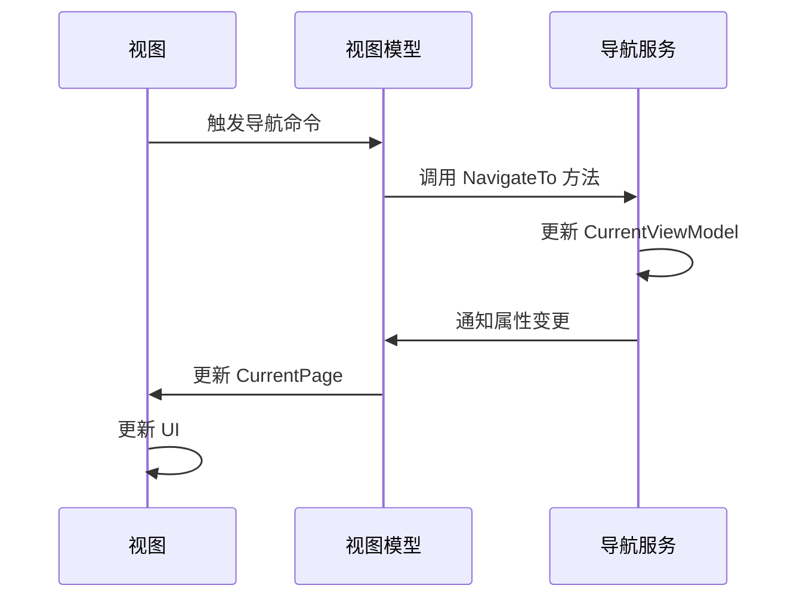

# Chapter 7: 主窗口视图模型

## 从上一章过渡

在上一章 [导航服务](06_导航服务_.md) 中，我们学习了如何在不同视图模型之间进行导航。通过使用导航服务，我们可以在多个页面之间轻松地进行切换，提高用户体验。在这一章中，我们将学习主窗口视图模型的概念，了解如何管理主窗口的内容，包括导航逻辑。

## 什么是主窗口视图模型？

主窗口视图模型管理主窗口的内容，包括导航逻辑。可以将其比作一个房子的控制中心，管理各种房间的开关。主窗口视图模型负责显示当前的视图模型，并处理导航请求。

### 中心用例

假设我们正在开发一个简单的Avalonia应用程序，其中包含多个页面，如 `Page1` 和 `Page2`。我们希望用户可以通过点击按钮从 `Page1` 导航到 `Page2`，再从 `Page2` 返回到 `Page1`。通过使用主窗口视图模型，我们可以轻松实现这一功能。

## 如何使用主窗口视图模型

### 1. 创建主窗口视图模型类

首先，我们需要创建一个主窗口视图模型类 `MainWindowViewModel`，继承自 `ViewModelBase`。通过这样做，`MainWindowViewModel` 将自动继承属性变更通知的功能。

#### 示例代码

```csharp
using CommunityToolkit.Mvvm.ComponentModel;
using CommunityToolkit.Mvvm.Input;
using AvaloniaWithDependencyInjection.Services;

namespace AvaloniaWithDependencyInjection.ViewModels
{
    public partial class MainWindowViewModel : ViewModelBase
    {
        private readonly INavigationService _navigationService;

        [ObservableProperty]
        private ViewModelBase currentPage;

        public MainWindowViewModel(INavigationService navigationService)
        {
            _navigationService = navigationService;
            CurrentPage = _navigationService.CurrentViewModel;

            // 订阅导航服务的属性变化
            ((NavigationService)_navigationService).PropertyChanged += (_, args) =>
            {
                if (args.PropertyName == nameof(INavigationService.CurrentViewModel))
                {
                    CurrentPage = _navigationService.CurrentViewModel;
                }
            };
        }

        [RelayCommand]
        private void NavigateToPage1()
        {
            _navigationService.NavigateTo<Page1ViewModel>();
        }

        [RelayCommand]
        private void NavigateToPage2()
        {
            _navigationService.NavigateTo<Page2ViewModel>();
        }
    }
}
```

#### 代码解释

1. **构造函数注入**：
   - 通过构造函数注入 `INavigationService`。
   - 将 `CurrentPage` 属性设置为导航服务的当前视图模型。
   - 订阅导航服务的属性变化，当导航服务的当前视图模型发生变化时，更新 `CurrentPage` 属性。

2. **导航命令**：
   - `NavigateToPage1` 和 `NavigateToPage2` 方法分别导航到 `Page1ViewModel` 和 `Page2ViewModel`。

### 2. 在视图中绑定主窗口视图模型

接下来，我们在主窗口视图中绑定 `MainWindowViewModel`，并添加按钮来触发导航。

#### 示例代码

```xml
<Window xmlns="https://github.com/avaloniaui"
        xmlns:local="clr-namespace:AvaloniaWithDependencyInjection.Views"
        xmlns:vm="clr-namespace:AvaloniaWithDependencyInjection.ViewModels"
        x:Class="AvaloniaWithDependencyInjection.Views.MainWindow"
        Title="Avalonia With Dependency Injection Example" Width="800" Height="450">
    <StackPanel>
        <Button Content="Go to Page 1" Command="{Binding NavigateToPage1Command}" />
        <Button Content="Go to Page 2" Command="{Binding NavigateToPage2Command}" />
        <ContentControl Content="{Binding CurrentPage}" />
    </StackPanel>
</Window>
```

#### 代码解释

1. **按钮绑定**：
   - `Button` 的 `Command` 属性绑定到 `MainWindowViewModel` 中的 `NavigateToPage1Command` 和 `NavigateToPage2Command`。
   - 当按钮被点击时，会调用相应的命令方法，触发导航。

2. **内容绑定**：
   - `ContentControl` 的 `Content` 属性绑定到 `MainWindowViewModel` 中的 `CurrentPage` 属性。
   - 当 `CurrentPage` 属性变化时，`ContentControl` 会自动显示新的视图模型。

### 3. 初始化主窗口

最后，我们在 `App.axaml.cs` 文件中初始化主窗口，并设置其 `DataContext` 为 `MainWindowViewModel`。

#### 示例代码

```csharp
public partial class App : Application
{
    public override void Initialize()
    {
        AvaloniaXamlLoader.Load(this);
    }

    public override void OnFrameworkInitializationCompleted()
    {
        if (ApplicationLifetime is IClassicDesktopStyleApplicationLifetime desktop)
        {
            var mainWindow = Program.ServiceProvider?.GetRequiredService<MainWindow>();
            var mainViewModel = Program.ServiceProvider?.GetRequiredService<MainWindowViewModel>();

            if (mainWindow != null && mainViewModel != null)
            {
                mainWindow.DataContext = mainViewModel;
                desktop.MainWindow = mainWindow;
            }
        }

        base.OnFrameworkInitializationCompleted();
    }
}
```

#### 代码解释

1. **获取主窗口和视图模型**：
   - 从依赖注入服务中获取主窗口和主窗口视图模型。
   - 将 `MainWindowViewModel` 设置为 `MainWindow` 的 `DataContext`。
   - 设置应用程序的主窗口。

## 内部实现

### 主窗口视图模型的工作原理

1. **初始化**：
   - 在 `MainWindowViewModel` 的构造函数中，将 `CurrentPage` 属性设置为导航服务的当前视图模型。
   - 订阅导航服务的属性变化，当导航服务的当前视图模型发生变化时，更新 `CurrentPage` 属性。

2. **导航命令**：
   - `NavigateToPage1` 和 `NavigateToPage2` 方法调用导航服务的 `NavigateTo` 方法，导航到指定的视图模型。

3. **属性变更通知**：
   - 由于 `CurrentPage` 属性使用了 `ObservableProperty` 特性，属性变更通知会在设置新值时自动触发，UI会自动更新。

### 序列图



## 结论

通过本章，我们学习了主窗口视图模型的概念，了解了如何管理主窗口的内容，包括导航逻辑。通过使用主窗口视图模型，我们可以在多个页面之间轻松地进行切换，提高用户体验。希望你现在能够理解主窗口视图模型的重要性和使用方法。

接下来，我们将学习主窗口视图的相关内容。请继续阅读：[主窗口视图](08_主窗口视图_.md)。

---

Generated by [AI Codebase Knowledge Builder](https://github.com/The-Pocket/Tutorial-Codebase-Knowledge)