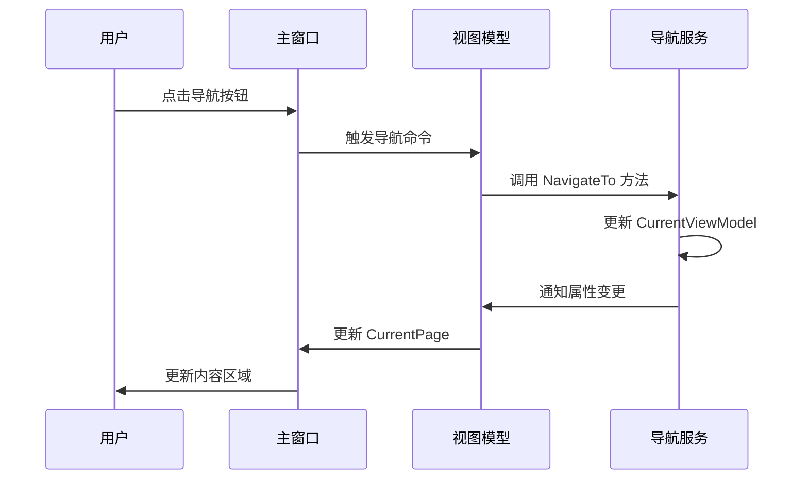

# Chapter 8: 主窗口视图

## 从上一章过渡

在上一章 [主窗口视图模型](07_主窗口视图模型_.md) 中，我们学习了如何管理主窗口的内容，包括导航逻辑。通过使用主窗口视图模型，我们可以在多个页面之间轻松地进行切换，提高用户体验。在这一章中，我们将学习主窗口视图的概念，了解如何设计和实现主窗口的用户界面。

## 什么是主窗口视图？

主窗口视图是应用程序的主界面，包含导航栏和内容区域。可以将其比作一个房子的主体结构，包括入口和主要活动区域。通过设计一个友好的主窗口视图，我们可以为用户提供一个清晰的界面，使他们能够轻松地导航和使用应用程序。

### 中心用例

假设我们正在开发一个简单的Avalonia应用程序，其中包含多个页面，如 `Page1` 和 `Page2`。我们希望用户可以通过点击按钮从 `Page1` 导航到 `Page2`，再从 `Page2` 返回到 `Page1`。通过使用主窗口视图，我们可以轻松实现这一功能。

## 如何设计主窗口视图

### 1. **定义主窗口的布局**

首先，我们需要定义主窗口的布局。主窗口通常包含两个主要部分：导航栏和内容区域。

#### 示例代码

```xml
<Window xmlns="https://github.com/avaloniaui"
        xmlns:x="http://schemas.microsoft.com/winfx/2006/xaml"
        xmlns:vm="using:AvaloniaWithDependencyInjection.ViewModels"
        xmlns:d="http://schemas.microsoft.com/expression/blend/2008"
        xmlns:mc="http://schemas.openxmlformats.org/markup-compatibility/2006"
        mc:Ignorable="d" d:DesignWidth="800" d:DesignHeight="450"
        x:Class="AvaloniaWithDependencyInjection.Views.MainWindow"
        x:DataType="vm:MainWindowViewModel"
        Icon="/Assets/avalonia-logo.ico"
        Title="Avalonia With Dependency Injection Example">

    <Design.DataContext>
        <vm:MainWindowViewModel/>
    </Design.DataContext>

    <Grid>
        <Grid.ColumnDefinitions>
            <ColumnDefinition Width="200" />
            <ColumnDefinition Width="*" />
        </Grid.ColumnDefinitions>

        <!-- 左侧导航栏 -->
        <Border Grid.Column="0" Background="Gray">
            <StackPanel Margin="0,20,0,0">
                <Button Name="页面1"
                        Command="{Binding NavigateToPage1Command}"
                        HorizontalAlignment="Stretch"
                        Height="50"
                        Margin="10,5"
                        Classes="NavButton">
                    <StackPanel Orientation="Horizontal">
                        <TextBlock Text="Page1" VerticalAlignment="Center" FontSize="15"/>
                    </StackPanel>
                </Button>

                <Button Name="页面2"
                        Command="{Binding NavigateToPage2Command}"
                        HorizontalAlignment="Stretch"
                        Height="50"
                        Margin="10,5"
                        Classes="NavButton">
                    <StackPanel Orientation="Horizontal">
                        <TextBlock Text="Page2" VerticalAlignment="Center" FontSize="15"/>
                    </StackPanel>
                </Button>
            </StackPanel>
        </Border>

        <!-- 右侧内容区域 -->
        <ContentControl Grid.Column="1"
                        Content="{Binding CurrentPage}"
                        Margin="20"/>
    </Grid>

    <Window.Styles>
        <Style Selector="Button.NavButton">
            <Setter Property="Background" Value="Transparent"/>
            <Setter Property="Foreground" Value="White"/>
            <Setter Property="Padding" Value="20,10"/>
            <Setter Property="Template">
                <ControlTemplate>
                    <Panel>
                        <Border Name="PART_Background"
                                Background="{TemplateBinding Background}"
                                CornerRadius="4"/>
                        <ContentPresenter Name="PART_ContentPresenter"
                                         Content="{TemplateBinding Content}"
                                         Padding="{TemplateBinding Padding}"
                                         HorizontalContentAlignment="Left"/>
                    </Panel>
                </ControlTemplate>
            </Setter>
        </Style>
        <Style Selector="Button.NavButton:pointerover /template/ Border#PART_Background">
            <Setter Property="Background" Value="#2D2D2D"/>
        </Style>
    </Window.Styles>
</Window>
```

#### 代码解释

1. **定义网格布局**：
   - 使用 `Grid` 定义主窗口的布局，包含两列：左侧导航栏和右侧内容区域。

2. **左侧导航栏**：
   - 使用 `Border` 定义导航栏的背景颜色。
   - 使用 `StackPanel` 垂直排列导航按钮。
   - 每个按钮绑定到 `MainWindowViewModel` 中的导航命令 `NavigateToPage1Command` 和 `NavigateToPage2Command`。

3. **右侧内容区域**：
   - 使用 `ContentControl` 绑定到 `MainWindowViewModel` 中的 `CurrentPage` 属性，显示当前的视图模型。

### 2. **初始化主窗口**

接下来，我们需要在 `App.axaml.cs` 文件中初始化主窗口，并设置其 `DataContext` 为 `MainWindowViewModel`。

#### 示例代码

```csharp
public partial class App : Application
{
    public override void Initialize()
    {
        AvaloniaXamlLoader.Load(this);
    }

    public override void OnFrameworkInitializationCompleted()
    {
        if (ApplicationLifetime is IClassicDesktopStyleApplicationLifetime desktop)
        {
            var mainWindow = Program.ServiceProvider?.GetRequiredService<MainWindow>();
            var mainViewModel = Program.ServiceProvider?.GetRequiredService<MainWindowViewModel>();

            if (mainWindow != null && mainViewModel != null)
            {
                mainWindow.DataContext = mainViewModel;
                desktop.MainWindow = mainWindow;
            }
        }

        base.OnFrameworkInitializationCompleted();
    }
}
```

#### 代码解释

1. **获取主窗口和视图模型**：
   - 从依赖注入服务中获取主窗口和主窗口视图模型。
   - 将 `MainWindowViewModel` 设置为 `MainWindow` 的 `DataContext`。
   - 设置应用程序的主窗口。

## 内部实现

### 主窗口视图的工作原理

1. **定义布局**：
   - 在 `MainWindow.axaml` 文件中，定义主窗口的布局，包含导航栏和内容区域。

2. **导航按钮**：
   - 每个导航按钮绑定到 `MainWindowViewModel` 中的相应导航命令。

3. **内容显示**：
   - `ContentControl` 绑定到 `MainWindowViewModel` 中的 `CurrentPage` 属性，显示当前的视图模型。

### 序列图



## 结论

通过本章，我们学习了主窗口视图的概念，了解了如何设计和实现主窗口的用户界面，包括导航栏和内容区域。通过使用主窗口视图，我们可以为用户提供一个清晰的界面，使他们能够轻松地导航和使用应用程序。希望你现在能够理解主窗口视图的重要性和使用方法。

接下来，请继续阅读：[页面视图模型](09_页面视图模型_.md)。

---

Generated by [AI Codebase Knowledge Builder](https://github.com/The-Pocket/Tutorial-Codebase-Knowledge)