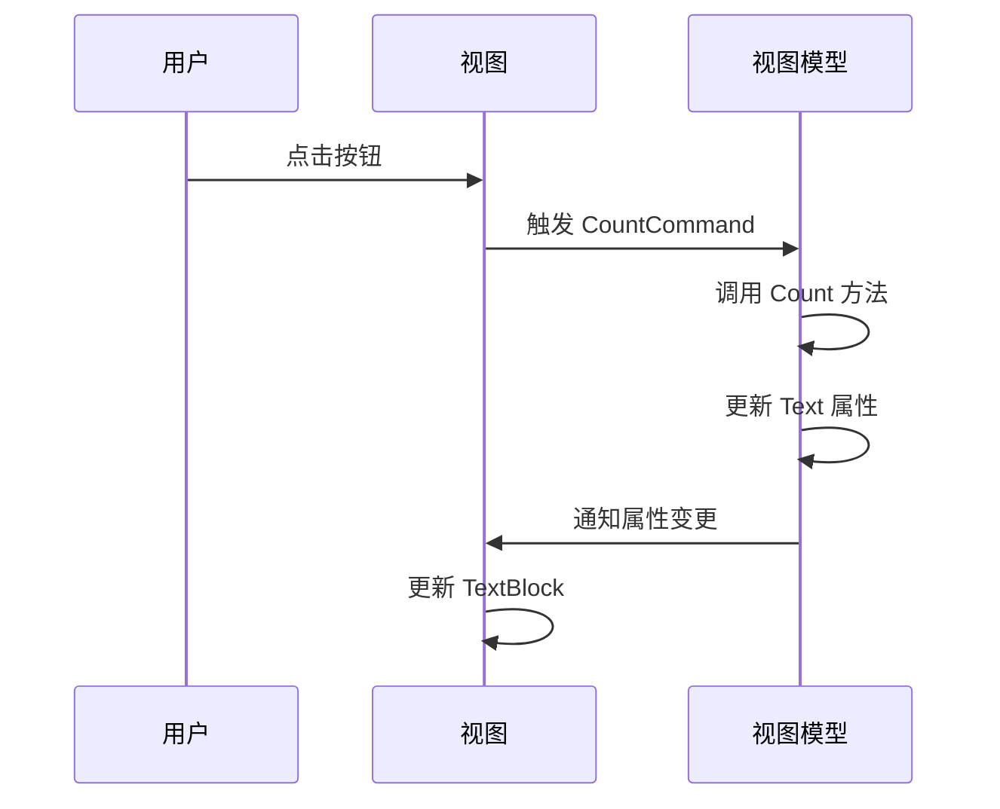

# Chapter 9: 页面视图模型

## 从上一章过渡

在上一章 [主窗口视图](08_主窗口视图_.md) 中，我们学习了如何设计和实现主窗口的用户界面，包括导航栏和内容区域。通过这些知识，我们能够创建一个清晰的界面，使用户能够轻松地导航和使用应用程序。在这一章中，我们将学习页面视图模型的概念，了解如何管理具体页面的逻辑和数据。

## 什么是页面视图模型？

页面视图模型（Page ViewModel）是每个具体页面的控制器，管理页面的逻辑和数据。可以将其比作一个房间的管理员，负责管理房间内的所有事务。通过使用页面视图模型，我们可以将页面的逻辑和UI分离，使代码更加模块化和易于维护。

### 中心用例

假设我们正在开发一个简单的Avalonia应用程序，其中包含多个页面，如 `Page1` 和 `Page2`。我们希望用户能够点击按钮，页面上的文本会增加一个计数器。通过使用页面视图模型，我们可以轻松实现这一功能。

## 如何使用页面视图模型

### 1. 创建页面视图模型类

首先，我们需要为每个页面创建一个视图模型类。这些类继承自 `ViewModelBase`，以便自动继承属性变更通知的功能。

#### 示例代码

```csharp
using CommunityToolkit.Mvvm.ComponentModel;
using CommunityToolkit.Mvvm.Input;

namespace AvaloniaWithDependencyInjection.ViewModels
{
    public partial class Page1ViewModel : ViewModelBase
    {
        private int countNum = 0;

        [ObservableProperty]
        private string text = "你还没点击";

        [RelayCommand]
        public void Count()
        {
            countNum++;
            Text = $"你点击了{countNum}次";
        }
    }
}
```

#### 代码解释

1. **继承自 `ViewModelBase`**：
   - `Page1ViewModel` 继承自 `ViewModelBase`，自动支持属性变更通知。

2. **属性变更通知**：
   - `text` 属性使用 `ObservableProperty` 特性，使其支持属性变更通知。

3. **Count 方法**：
   - `Count` 方法是通过 `[RelayCommand]` 特性定义的命令方法，当按钮被点击时调用。
   - 每次调用 `Count` 方法时，`countNum` 会增加1，`Text` 属性会更新为新的计数值。

### 2. 在视图中绑定页面视图模型

接下来，我们在页面的视图中绑定 `Page1ViewModel`，并添加按钮来触发计数器增加。

#### 示例代码

```xml
<UserControl xmlns="https://github.com/avaloniaui"
             xmlns:x="http://schemas.microsoft.com/winfx/2006/xaml"
             xmlns:vm="clr-namespace:AvaloniaWithDependencyInjection.ViewModels"
             x:Class="AvaloniaWithDependencyInjection.Views.Page1View"
             x:DataType="vm:Page1ViewModel"
             Width="800" Height="450">
    <StackPanel>
        <TextBlock Text="{Binding Text}" HorizontalAlignment="Center" FontSize="20"/>
        <Button Content="点击增加" Command="{Binding CountCommand}" HorizontalAlignment="Center" Margin="20"/>
    </StackPanel>
</UserControl>
```

#### 代码解释

1. **数据绑定**：
   - `TextBlock` 的 `Text` 属性绑定到 `Page1ViewModel` 中的 `Text` 属性，当 `Text` 属性变化时，`TextBlock` 会自动更新。

2. **按钮绑定**：
   - `Button` 的 `Command` 属性绑定到 `Page1ViewModel` 中的 `CountCommand`，当按钮被点击时，会调用 `Count` 方法。

### 3. 初始化页面

最后，我们确保在应用程序中正确初始化页面，并设置其 `DataContext` 为相应的视图模型。

#### 示例代码

```csharp
using Avalonia.Controls;

namespace AvaloniaWithDependencyInjection.Views
{
    public partial class Page1View : UserControl
    {
        public Page1View()
        {
            InitializeComponent();
            DataContext = new Page1ViewModel();
        }
    }
}
```

#### 代码解释

1. **设置 DataContext**：
   - 在构造函数中，将 `Page1ViewModel` 实例设置为 `Page1View` 的 `DataContext`。

## 内部实现

### 页面视图模型的工作原理

1. **属性变更通知**：
   - `Page1ViewModel` 继承自 `ViewModelBase`，自动支持属性变更通知。

2. **命令方法**：
   - `Count` 方法通过 `[RelayCommand]` 特性定义，当按钮被点击时调用。
   - `Count` 方法增加 `countNum` 的值，并更新 `Text` 属性。

3. **数据绑定**：
   - 视图中的 `TextBlock` 绑定到 `Page1ViewModel` 中的 `Text` 属性。
   - 视图中的 `Button` 绑定到 `Page1ViewModel` 中的 `CountCommand`。

### 序列图



## 结论

通过本章，我们学习了页面视图模型的概念，了解了如何管理具体页面的逻辑和数据。通过使用页面视图模型，我们可以将页面的逻辑和UI分离，使代码更加模块化和易于维护。希望你现在能够理解页面视图模型的重要性和使用方法。

接下来，请继续阅读：[页面视图](10_页面视图_.md)。

---

Generated by [AI Codebase Knowledge Builder](https://github.com/The-Pocket/Tutorial-Codebase-Knowledge)