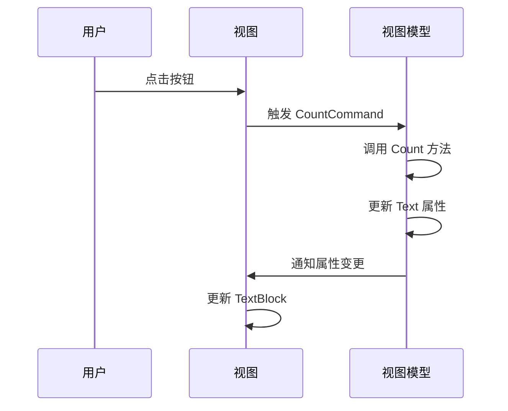

# Chapter 10: 页面视图


## 从上一章过渡

在上一章 [页面视图模型](09_页面视图模型_.md) 中，我们学习了如何管理具体页面的逻辑和数据。通过使用页面视图模型，我们能够将页面的逻辑和UI分离，使代码更加模块化和易于维护。在这一章中，我们将学习页面视图的概念，了解如何设计和实现具体页面的用户界面。

## 什么是页面视图？

页面视图是每个具体页面的用户界面。可以将其比作一个房间的具体布局，包括家具和装饰。通过使用页面视图，我们可以为用户提供一个清晰的界面，使他们能够轻松地与应用程序进行交互。

### 中心用例

假设我们正在开发一个简单的Avalonia应用程序，其中包含多个页面，如 `Page1` 和 `Page2`。我们希望用户能够点击按钮，页面上的文本会增加一个计数器。通过使用页面视图，我们可以轻松实现这一功能。

## 如何设计和实现页面视图

### 1. 创建页面视图类

首先，我们需要为每个页面创建一个视图类。这些类通常继承自 `UserControl`，以便自动继承用户控件的功能。

#### 示例代码

```xml
<UserControl xmlns="https://github.com/avaloniaui"
             xmlns:x="http://schemas.microsoft.com/winfx/2006/xaml"
             xmlns:d="http://schemas.microsoft.com/expression/blend/2008"
             xmlns:mc="http://schemas.openxmlformats.org/markup-compatibility/2006"
             mc:Ignorable="d" d:DesignWidth="800" d:DesignHeight="450"
             xmlns:vm="using:AvaloniaWithDependencyInjection.ViewModels"
             x:DataType="vm:Page1ViewModel"
             x:Class="AvaloniaWithDependencyInjection.Views.Page1View">
    <StackPanel>
        <TextBlock Text="{Binding Text}" HorizontalAlignment="Center" FontSize="20"/>
        <Button Content="点我" Command="{Binding CountCommand}" HorizontalAlignment="Center" Margin="20"/>
    </StackPanel>
</UserControl>
```

#### 代码解释

1. **定义命名空间**：
   - 使用 `xmlns` 定义命名空间，以便在XAML中使用Avalonia的控件。

2. **定义布局**：
   - 使用 `StackPanel` 垂直排列控件。
   - `TextBlock` 绑定到 `Page1ViewModel` 中的 `Text` 属性，当 `Text` 属性变化时，`TextBlock` 会自动更新。
   - `Button` 绑定到 `Page1ViewModel` 中的 `CountCommand`，当按钮被点击时，会调用 `Count` 方法。

### 2. 初始化页面视图

接下来，我们在页面视图类中初始化控件，并设置其 `DataContext` 为相应的视图模型。

#### 示例代码

```csharp
using Avalonia;
using Avalonia.Controls;
using Avalonia.Markup.Xaml;

namespace AvaloniaWithDependencyInjection.Views;

public partial class Page1View : UserControl
{
    public Page1View()
    {
        InitializeComponent();
        DataContext = new Page1ViewModel();
    }
}
```

#### 代码解释

1. **初始化控件**：
   - 在构造函数中调用 `InitializeComponent` 方法，初始化XAML资源。
   - 将 `Page1ViewModel` 实例设置为 `Page1View` 的 `DataContext`。

### 3. 创建 `Page2View`

同样的，我们可以为 `Page2` 创建类似的视图类。

#### 示例代码

```xml
<UserControl xmlns="https://github.com/avaloniaui"
             xmlns:x="http://schemas.microsoft.com/winfx/2006/xaml"
             xmlns:d="http://schemas.microsoft.com/expression/blend/2008"
             xmlns:mc="http://schemas.openxmlformats.org/markup-compatibility/2006"
             mc:Ignorable="d" d:DesignWidth="800" d:DesignHeight="450"
             xmlns:vm="using:AvaloniaWithDependencyInjection.ViewModels"
             x:DataType="vm:Page2ViewModel"
             x:Class="AvaloniaWithDependencyInjection.Views.Page2View">
    <StackPanel>
        <TextBlock Text="{Binding Text}" HorizontalAlignment="Center" FontSize="20"/>
        <Button Content="点我" Command="{Binding CountCommand}" HorizontalAlignment="Center" Margin="20"/>
    </StackPanel>
</UserControl>
```

#### 代码解释

1. **定义布局**：
   - 使用 `StackPanel` 垂直排列控件。
   - `TextBlock` 绑定到 `Page2ViewModel` 中的 `Text` 属性。
   - `Button` 绑定到 `Page2ViewModel` 中的 `CountCommand`。

### 4. 初始化 `Page2View`

同样地，我们在 `Page2View` 类中初始化控件，并设置其 `DataContext` 为相应的视图模型。

#### 示例代码

```csharp
using Avalonia;
using Avalonia.Controls;
using Avalonia.Markup.Xaml;

namespace AvaloniaWithDependencyInjection.Views;

public partial class Page2View : UserControl
{
    public Page2View()
    {
        InitializeComponent();
        DataContext = new Page2ViewModel();
    }
}
```

#### 代码解释

1. **初始化控件**：
   - 在构造函数中调用 `InitializeComponent` 方法，初始化XAML资源。
   - 将 `Page2ViewModel` 实例设置为 `Page2View` 的 `DataContext`。

## 内部实现

### 页面视图的工作原理

1. **定义布局**：
   - 在 `UserControl` 中定义页面的布局，使用XAML定义控件的排列和样式。

2. **数据绑定**：
   - 通过 `TextBlock` 和 `Button` 的 `Binding` 属性，将控件绑定到视图模型中的属性和命令。
   - 当视图模型中的属性变化时，控件会自动更新显示的内容。

3. **初始化控件**：
   - 在视图类的构造函数中，调用 `InitializeComponent` 方法，初始化XAML资源。
   - 将视图模型设置为视图的 `DataContext`，使控件能够绑定到视图模型中的属性和命令。

### 序列图



## 结论

通过本章，我们学习了页面视图的概念，了解了如何设计和实现具体页面的用户界面。通过使用页面视图，我们可以为用户提供一个清晰的界面，使他们能够轻松地与应用程序进行交互。希望你现在能够理解页面视图的重要性和使用方法。

接下来，请继续阅读：[完成项目](11_完成项目.md)。

---

Generated by [AI Codebase Knowledge Builder](https://github.com/The-Pocket/Tutorial-Codebase-Knowledge)