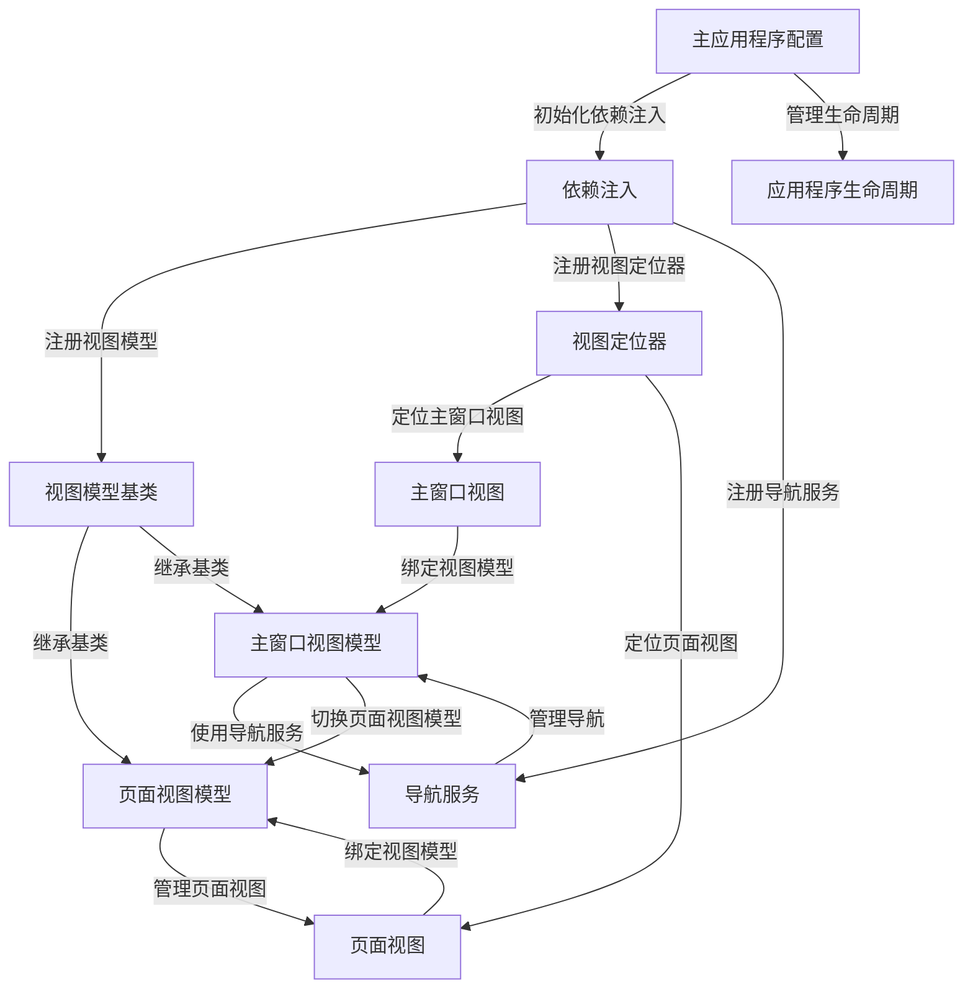

# Tutorial: Avalonia_With_Dependency_Injection_Example

本项目 **Avalonia_With_Dependency_Injection_Example** 是一个使用 *Avalonia UI* 与 *依赖注入* 技术构建的示例应用。它展示了如何通过依赖注入管理应用的 **组件和服务**，并通过 *导航服务* 实现不同视图之间的切换。通过视图模型与视图的分离设计，项目实现了模块化开发，提高了代码的复用性和可维护性。

**Source Repository:** [https://github.com/Ming-jiayou/Avalonia_With_Dependency_Injection_Example](https://github.com/Ming-jiayou/Avalonia_With_Dependency_Injection_Example)

## Chapters

1. [主应用程序配置
](01_主应用程序配置_.md)
2. [依赖注入
](02_依赖注入_.md)
3. [应用程序生命周期
](03_应用程序生命周期_.md)
4. [视图定位器
](04_视图定位器_.md)
5. [视图模型基类
](05_视图模型基类_.md)
6. [导航服务
](06_导航服务_.md)
7. [主窗口视图模型
](07_主窗口视图模型_.md)
8. [主窗口视图
](08_主窗口视图_.md)
9. [页面视图模型
](09_页面视图模型_.md)
10. [页面视图
](10_页面视图_.md)

---

Generated by [AI Codebase Knowledge Builder](https://github.com/The-Pocket/Tutorial-Codebase-Knowledge)