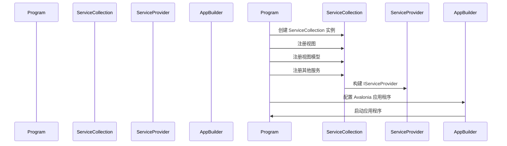

# Chapter 1: 应用程序入口

欢迎来到我们的教程，我们将逐步搭建一个使用依赖注入的 Avalonia 应用程序。在这一章中，我们将介绍如何创建一个简单的应用程序入口点，这是启动任何应用程序的起点。想象一下，应用程序入口就像一扇门，当你打开它时，你走进了一个新的世界。在我们的案例中，这扇门就是 `Program` 类中的 `Main` 方法。

## 应用程序入口的重要性

应用程序入口点（`Main` 方法）是你的应用程序启动的地方。在这个方法中，你可以配置和初始化所有必要的组件，包括依赖注入容器。依赖注入（Dependency Injection）是一种设计模式，它允许你将依赖项作为构造参数传递给类，而不是在类内部创建依赖项。这样可以提高代码的可测试性和可维护性。

### 具体示例

假设我们要开发一个简单的日历应用程序，用户可以查看日期和事件。为了实现这个功能，我们需要设置依赖注入容器，以便在运行时能够轻松地获取和使用各种服务。例如，我们可能需要一个 `DateService` 来获取当前日期，以及一个 `EventService` 来获取事件。

## 开始编码

让我们一步一步地编写 `Program` 类中的 `Main` 方法，了解如何配置依赖注入并启动应用程序。

### 步骤 1: 创建 `Program` 类

首先，我们定义一个 `Program` 类，该类包含 `Main` 方法。`Main` 方法是程序的入口点。

```csharp
namespace AvaloniaWithDependencyInjection
{
    internal sealed class Program
    {
        public static IServiceProvider? ServiceProvider { get; private set; }

        [STAThread]
        public static void Main(string[] args)
        {
            var services = new ServiceCollection();
            
            // 注册服务
            services.AddViews()
                    .AddViewModels()
                    .AddServices();
            
            ServiceProvider = services.BuildServiceProvider();
            
            BuildAvaloniaApp().StartWithClassicDesktopLifetime(args);
        }
    }
}
```

### 代码解释

1. **命名空间和类声明**:
    ```csharp
    namespace AvaloniaWithDependencyInjection
    {
        internal sealed class Program
        {
    ```
    这里我们定义了一个名为 `AvaloniaWithDependencyInjection` 的命名空间，并在其中创建了一个 `Program` 类。`internal sealed` 说明这个类只能在当前程序集中使用，并且不能被继承。

2. **ServiceProvider 属性**:
    ```csharp
    public static IServiceProvider? ServiceProvider { get; private set; }
    ```
    `ServiceProvider` 是一个静态属性，用于存储依赖注入容器。我们将在稍后使用它来解析服务。

3. **Main 方法**:
    ```csharp
    [STAThread]
    public static void Main(string[] args)
    {
        var services = new ServiceCollection();
        
        // 注册服务
        services.AddViews()
                .AddViewModels()
                .AddServices();
        
        ServiceProvider = services.BuildServiceProvider();
        
        BuildAvaloniaApp().StartWithClassicDesktopLifetime(args);
    }
    ```
    - `[STAThread]`: 这是一个属性，确保应用程序以单线程 apartments (STA) 模式运行，这对于 UI 应用程序是非常重要的。
    - `var services = new ServiceCollection();`: 创建一个 `ServiceCollection` 实例，用于注册服务。
    - `services.AddViews()`: 注册视图相关的服务。
    - `services.AddViewModels()`: 注册视图模型相关的服务。
    - `services.AddServices()`: 注册其他服务（如 `DateService` 和 `EventService`）。
    - `ServiceProvider = services.BuildServiceProvider();`: 构建依赖注入容器。
    - `BuildAvaloniaApp().StartWithClassicDesktopLifetime(args);`: 启动 Avalonia 应用程序。

### 步骤 2: 配置 Avalonia 应用程序

接下来，我们需要配置 Avalonia 应用程序。这可以通过 `BuildAvaloniaApp` 方法来完成。

```csharp
public static AppBuilder BuildAvaloniaApp()
    => AppBuilder.Configure<App>()
        .UsePlatformDetect()
        .WithInterFont()
        .LogToTrace();
```

### 代码解释

1. **配置应用程序**:
    ```csharp
    AppBuilder.Configure<App>()
    ```
    使用 `App` 类配置应用程序。

2. **平台检测**:
    ```csharp
    .UsePlatformDetect()
    ```
    自动检测并使用正确的平台。

3. **字体支持**:
    ```csharp
    .WithInterFont()
    ```
    使用 Inter 字体。

4. **日志记录**:
    ```csharp
    .LogToTrace()
    ```
    将日志记录到跟踪输出。

## 序列图

下面是 `Main` 方法调用时的序列图，展示了各个组件之间的交互。



## 内部实现

### 服务集合

`ServiceCollection` 是一个容器，用于注册服务。通过调用 `AddViews`、`AddViewModels` 和 `AddServices` 方法，我们可以注册不同类型的依赖项。

### 构建服务提供者

`BuildServiceProvider` 方法会创建一个 `IServiceProvider` 实例，这个实例可以根据注册的服务解析依赖项。

### 启动应用程序

`BuildAvaloniaApp` 方法配置并启动 Avalonia 应用程序。`StartWithClassicDesktopLifetime` 方法会启动应用程序，并使用经典的桌面生命周期。

## 总结

通过这一章，我们了解了如何创建一个简单的应用程序入口点，并配置依赖注入容器来启动 Avalonia 应用程序。通过 `Main` 方法，我们注册了视图、视图模型和其他服务，并构建了服务提供者。最后，我们配置并启动了 Avalonia 应用程序。

接下来，我们将深入了解 [应用程序类](02_应用程序类_.md)，学习如何配置和初始化应用程序的核心组件。

希望这一章对你有所帮助，祝你编程愉快！

---

Generated by [AI Codebase Knowledge Builder](https://github.com/The-Pocket/Tutorial-Codebase-Knowledge)