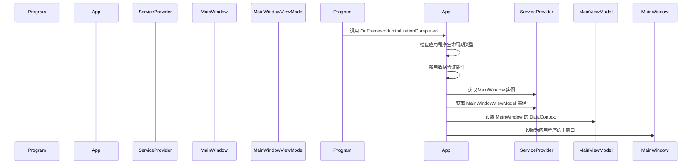

# Chapter 2: 应用程序类

欢迎来到第二章！在上一章中，我们学习了如何创建一个简单的应用程序入口点 [应用程序入口](01_应用程序入口_.md)。现在，我们将深入了解应用程序类（`App` 类），了解它是如何管理应用程序的生命周期和资源的。

## 什么是应用程序类？

应用程序类是应用程序的核心，类似于房子的主控室，管理应用程序的生命周期和资源。它初始化界面和数据绑定。例如，当你打开一个应用程序时，应用程序类会确保所有必要的组件都准备好运行。

### 具体示例

假设我们要开发一个简单的日历应用程序，用户可以查看日期和事件。在启动应用程序时，应用程序类会确保主窗口和视图模型都已经正确初始化，这样用户就可以看到最新的日期和事件。

## 创建应用程序类

让我们一步一步地创建 `App` 类，了解如何配置和初始化应用程序的核心组件。

### 步骤 1: 创建 `App` 类

首先，我们需要定义一个 `App` 类，该类继承自 `Application`。`App` 类包含了一些关键的方法，用于初始化应用程序。

```csharp
namespace AvaloniaWithDependencyInjection
{
    public partial class App : Application
    {
        public override void Initialize()
        {
            AvaloniaXamlLoader.Load(this);
        }

        public override void OnFrameworkInitializationCompleted()
        {
            if (ApplicationLifetime is IClassicDesktopStyleApplicationLifetime desktop)
            {
                // 避免 Avalonia 和 CommunityToolkit 重复验证
                DisableAvaloniaDataAnnotationValidation();

                var mainWindow = Program.ServiceProvider?.GetRequiredService<MainWindow>();
                var mainViewModel = Program.ServiceProvider?.GetRequiredService<MainWindowViewModel>();

                if (mainWindow != null && mainViewModel != null)
                {
                    mainWindow.DataContext = mainViewModel;
                    desktop.MainWindow = mainWindow;
                }
            }

            base.OnFrameworkInitializationCompleted();
        }

        private void DisableAvaloniaDataAnnotationValidation()
        {
            // 获取要移除的插件数组
            var dataValidationPluginsToRemove =
                BindingPlugins.DataValidators.OfType<DataAnnotationsValidationPlugin>().ToArray();

            // 移除每个找到的插件
            foreach (var plugin in dataValidationPluginsToRemove)
            {
                BindingPlugins.DataValidators.Remove(plugin);
            }
        }
    }
}
```

### 代码解释

1. **命名空间和类声明**:
    ```csharp
    namespace AvaloniaWithDependencyInjection
    {
        public partial class App : Application
        ```
    这里我们定义了一个名为 `AvaloniaWithDependencyInjection` 的命名空间，并在其中创建了一个 `App` 类。`App` 类继承自 `Application`，这是 Avalonia 框架中管理应用程序生命周期的核心类。

2. **Initialize 方法**:
    ```csharp
    public override void Initialize()
    {
        AvaloniaXamlLoader.Load(this);
    }
    ```
    `Initialize` 方法用于加载 XAML 资源。`AvaloniaXamlLoader.Load(this)` 会加载 `App.axaml` 文件，该文件包含了应用程序的 XAML 定义。

3. **OnFrameworkInitializationCompleted 方法**:
    ```csharp
    public override void OnFrameworkInitializationCompleted()
    {
        if (ApplicationLifetime is IClassicDesktopStyleApplicationLifetime desktop)
        {
            // 避免 Avalonia 和 CommunityToolkit 重复验证
            DisableAvaloniaDataAnnotationValidation();

            var mainWindow = Program.ServiceProvider?.GetRequiredService<MainWindow>();
            var mainViewModel = Program.ServiceProvider?.GetRequiredService<MainWindowViewModel>();

            if (mainWindow != null && mainViewModel != null)
            {
                mainWindow.DataContext = mainViewModel;
                desktop.MainWindow = mainWindow;
            }
        }

        base.OnFrameworkInitializationCompleted();
    }
    ```
    - **检查应用程序生命周期类型**:
        ```csharp
        if (ApplicationLifetime is IClassicDesktopStyleApplicationLifetime desktop)
        ```
        这里我们检查应用程序的生命周期类型是否为经典的桌面应用程序类型。如果是，则我们可以访问桌面应用程序的 `MainWindow` 属性。

    - **禁用数据验证插件**:
        ```csharp
        DisableAvaloniaDataAnnotationValidation();
        ```
        调用 `DisableAvaloniaDataAnnotationValidation` 方法以避免 Avalonia 和 CommunityToolkit 之间重复的数据验证。

    - **初始化主窗口和视图模型**:
        ```csharp
        var mainWindow = Program.ServiceProvider?.GetRequiredService<MainWindow>();
        var mainViewModel = Program.ServiceProvider?.GetRequiredService<MainWindowViewModel>();

        if (mainWindow != null && mainViewModel != null)
        {
            mainWindow.DataContext = mainViewModel;
            desktop.MainWindow = mainWindow;
        }
        ```
        使用依赖注入容器 `Program.ServiceProvider` 获取 `MainWindow` 和 `MainWindowViewModel` 实例，并将视图模型设置为主窗口的数据上下文。最后，将主窗口设置为应用程序的主窗口。

4. **禁用数据验证插件**:
    ```csharp
    private void DisableAvaloniaDataAnnotationValidation()
    {
        // 获取要移除的插件数组
        var dataValidationPluginsToRemove =
            BindingPlugins.DataValidators.OfType<DataAnnotationsValidationPlugin>().ToArray();

        // 移除每个找到的插件
        foreach (var plugin in dataValidationPluginsToRemove)
        {
            BindingPlugins.DataValidators.Remove(plugin);
        }
    }
    ```
    这个方法用于移除 Avalonia 提供的数据验证插件，以避免与 CommunityToolkit 重复验证。

## 内部实现

### 应用程序启动流程

当应用程序启动时，会发生以下步骤：

1. **入口点调用**:
    `Program.Main` 方法被调用，配置依赖注入容器并启动 Avalonia 应用程序。

2. **初始化应用程序**:
    `App.Initialize` 方法被调用，加载 XAML 资源。

3. **完成框架初始化**:
    `App.OnFrameworkInitializationCompleted` 方法被调用，初始化主窗口和视图模型，并设置主窗口。

4. **启动主窗口**:
    Avalonia 框架启动主窗口，应用程序进入运行状态。

### 简单序列图

下面是 `App` 类启动时的序列图，展示了各个组件之间的交互。



## 内部实现代码

### 主窗口和视图模型的初始化

下面是 `App` 类中 `OnFrameworkInitializationCompleted` 方法的详细实现：

```csharp
public override void OnFrameworkInitializationCompleted()
{
    if (ApplicationLifetime is IClassicDesktopStyleApplicationLifetime desktop)
    {
        // 避免 Avalonia 和 CommunityToolkit 重复验证
        DisableAvaloniaDataAnnotationValidation();

        var mainWindow = Program.ServiceProvider?.GetRequiredService<MainWindow>();
        var mainViewModel = Program.ServiceProvider?.GetRequiredService<MainWindowViewModel>();

        if (mainWindow != null && mainViewModel != null)
        {
            mainWindow.DataContext = mainViewModel; // 设置主窗口的数据上下文
            desktop.MainWindow = mainWindow; // 设置主窗口
        }
    }

    base.OnFrameworkInitializationCompleted();
}
```

- **检查应用程序生命周期类型**:
    ```csharp
    if (ApplicationLifetime is IClassicDesktopStyleApplicationLifetime desktop)
    ```
    确保应用程序是桌面应用程序类型。

- **禁用数据验证插件**:
    ```csharp
    DisableAvaloniaDataAnnotationValidation();
    ```
    调用 `DisableAvaloniaDataAnnotationValidation` 方法以避免重复验证。

- **获取主窗口和视图模型**:
    ```csharp
    var mainWindow = Program.ServiceProvider?.GetRequiredService<MainWindow>();
    var mainViewModel = Program.ServiceProvider?.GetRequiredService<MainWindowViewModel>();
    ```
    使用依赖注入容器获取 `MainWindow` 和 `MainWindowViewModel` 实例。

- **设置主窗口的数据上下文**:
    ```csharp
    if (mainWindow != null && mainViewModel != null)
    {
        mainWindow.DataContext = mainViewModel;
    }
    ```
    将视图模型设置为主窗口的数据上下文。

- **设置应用程序的主窗口**:
    ```csharp
    desktop.MainWindow = mainWindow;
    ```
    将主窗口设置为应用程序的主窗口。

## 总结

通过这一章，我们学习了如何创建和配置应用程序类（`App` 类），管理应用程序的生命周期和资源。我们了解了如何初始化主窗口和视图模型，并将它们设置为主窗口。

接下来，我们将学习 [依赖注入扩展方法](03_依赖注入扩展方法_.md)，了解如何通过扩展方法简化服务的注册和配置。希望这一章对你有所帮助，祝你编程愉快！

---

Generated by [AI Codebase Knowledge Builder](https://github.com/The-Pocket/Tutorial-Codebase-Knowledge)