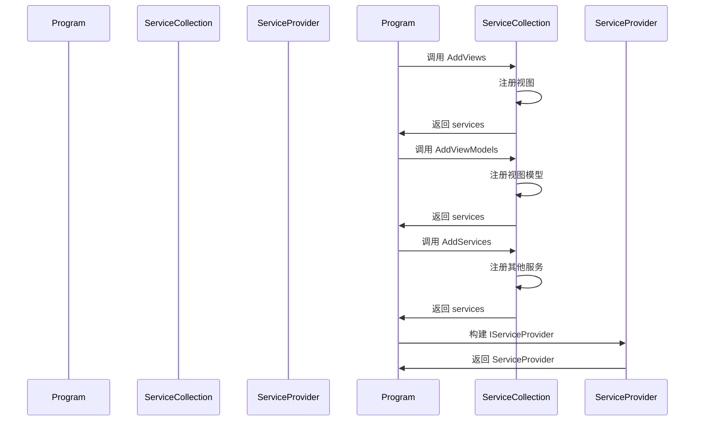

# Chapter 3: 依赖注入扩展方法


欢迎来到第三章！在上一章 [应用程序类](02_应用程序类_.md) 中，我们学习了如何配置和初始化应用程序类。现在，我们将深入了解依赖注入扩展方法，学习如何通过扩展方法简化服务的注册和配置。

## 什么是依赖注入扩展方法？

依赖注入扩展方法是一组工具，用于注册服务，类似于工具箱，帮助应用程序管理依赖关系。通过这些方法，我们可以更方便地注册视图、视图模型和其他服务，而不需要重复编写相似的代码。

### 具体示例

假设我们有一个简单的日历应用程序，用户可以查看日期和事件。为了实现这个功能，我们需要注册一些服务，如 `DateService` 和 `EventService`。通过依赖注入扩展方法，我们可以轻松地在一个地方管理这些服务的注册，从而使代码更加整洁和易于维护。

## 依赖注入扩展方法的实现

让我们一步一步地创建和使用依赖注入扩展方法。

### 步骤 1: 创建扩展方法类

首先，我们需要创建一个静态类 `ServiceCollectionExtensions`，在这个类中定义扩展方法。

```csharp
namespace AvaloniaWithDependencyInjection;

public static class ServiceCollectionExtensions
{
    // 注册视图
    public static IServiceCollection AddViews(this IServiceCollection services)
    {
        services.AddSingleton<MainWindow>();
        services.AddSingleton<Page1View>();
        services.AddSingleton<Page2View>();
        
        return services;
    }
    
    // 注册视图模型
    public static IServiceCollection AddViewModels(this IServiceCollection services)
    {
        services.AddSingleton<MainWindowViewModel>();
        services.AddSingleton<Page1ViewModel>();
        services.AddSingleton<Page2ViewModel>();
        
        return services;
    }

    // 注册其他服务
    public static IServiceCollection AddServices(this IServiceCollection services)
    {
        services.AddSingleton<INavigationService, NavigationService>();
        return services;
    }
}
```

### 代码解释

1. **命名空间和类声明**:
    ```csharp
    namespace AvaloniaWithDependencyInjection;

    public static class ServiceCollectionExtensions
    ```
    这里我们定义了一个名为 `AvaloniaWithDependencyInjection` 的命名空间，并在其中创建了一个静态类 `ServiceCollectionExtensions`。静态类意味着这些方法可以不需要实例化类就可以调用。

2. **AddViews 方法**:
    ```csharp
    public static IServiceCollection AddViews(this IServiceCollection services)
    {
        services.AddSingleton<MainWindow>();
        services.AddSingleton<Page1View>();
        services.AddSingleton<Page2View>();
        
        return services;
    }
    ```
    - `AddViews` 方法通过 `this` 关键字扩展了 `IServiceCollection` 类。
    - `services.AddSingleton<MainWindow>();` 注册 `MainWindow` 作为单例。
    - `services.AddSingleton<Page1View>();` 注册 `Page1View` 作为单例。
    - `services.AddSingleton<Page2View>();` 注册 `Page2View` 作为单例。
    - `return services;` 返回 `services` 对象，以便可以在链式调用中继续使用。

3. **AddViewModels 方法**:
    ```csharp
    public static IServiceCollection AddViewModels(this IServiceCollection services)
    {
        services.AddSingleton<MainWindowViewModel>();
        services.AddSingleton<Page1ViewModel>();
        services.AddSingleton<Page2ViewModel>();
        
        return services;
    }
    ```
    - `AddViewModels` 方法通过 `this` 关键字扩展了 `IServiceCollection` 类。
    - `services.AddSingleton<MainWindowViewModel>();` 注册 `MainWindowViewModel` 作为单例。
    - `services.AddSingleton<Page1ViewModel>();` 注册 `Page1ViewModel` 作为单例。
    - `services.AddSingleton<Page2ViewModel>();` 注册 `Page2ViewModel` 作为单例。
    - `return services;` 返回 `services` 对象，以便可以在链式调用中继续使用。

4. **AddServices 方法**:
    ```csharp
    public static IServiceCollection AddServices(this IServiceCollection services)
    {
        services.AddSingleton<INavigationService, NavigationService>();
        return services;
    }
    ```
    - `AddServices` 方法通过 `this` 关键字扩展了 `IServiceCollection` 类。
    - `services.AddSingleton<INavigationService, NavigationService>();` 注册 `NavigationService` 作为 `INavigationService` 的实现。
    - `return services;` 返回 `services` 对象，以便可以在链式调用中继续使用。

### 使用依赖注入扩展方法

现在我们已经定义了扩展方法，我们可以在 `Program` 类中使用它们来注册服务。让我们回头看看 `Program` 类中的 `Main` 方法。

```csharp
namespace AvaloniaWithDependencyInjection
{
    internal sealed class Program
    {
        public static IServiceProvider? ServiceProvider { get; private set; }

        [STAThread]
        public static void Main(string[] args)
        {
            var services = new ServiceCollection();
            
            // 注册服务
            services.AddViews()
                    .AddViewModels()
                    .AddServices();
            
            ServiceProvider = services.BuildServiceProvider();
            
            BuildAvaloniaApp().StartWithClassicDesktopLifetime(args);
        }
    }
}
```

### 代码解释

1. **创建 `ServiceCollection` 实例**:
    ```csharp
    var services = new ServiceCollection();
    ```
    创建一个 `ServiceCollection` 实例，用于注册服务。

2. **注册服务**:
    ```csharp
    services.AddViews()
            .AddViewModels()
            .AddServices();
    ```
    调用扩展方法 `AddViews`、`AddViewModels` 和 `AddServices` 来注册视图、视图模型和其他服务。

3. **构建 `IServiceProvider`**:
    ```csharp
    ServiceProvider = services.BuildServiceProvider();
    ```
    构建依赖注入容器 `IServiceProvider`。

4. **启动 Avalonia 应用程序**:
    ```csharp
    BuildAvaloniaApp().StartWithClassicDesktopLifetime(args);
    ```
    配置并启动 Avalonia 应用程序。

### 内部实现

#### 服务注册过程

当我们在 `Program` 类中调用 `AddViews`、`AddViewModels` 和 `AddServices` 方法时，会发生以下步骤：

1. **调用 `AddViews` 方法**:
    - 注册 `MainWindow`、`Page1View` 和 `Page2View` 作为单例。
    - 返回 `services` 对象。

2. **调用 `AddViewModels` 方法**:
    - 注册 `MainWindowViewModel`、`Page1ViewModel` 和 `Page2ViewModel` 作为单例。
    - 返回 `services` 对象。

3. **调用 `AddServices` 方法**:
    - 注册 `NavigationService` 作为 `INavigationService` 的实现。
    - 返回 `services` 对象。

4. **构建 `IServiceProvider`**:
    - 构建依赖注入容器 `IServiceProvider`。

#### 简单序列图

下面是依赖注入扩展方法调用时的序列图，展示了各个组件之间的交互。



## 总结

通过这一章，我们学习了如何通过依赖注入扩展方法简化服务的注册和配置。我们定义了扩展方法 `AddViews`、`AddViewModels` 和 `AddServices`，并在 `Program` 类中使用这些方法来注册视图、视图模型和其他服务。这使得代码更加整洁和易于维护。

接下来，我们将学习 [主窗口](04_主窗口_.md)，了解如何创建和配置应用程序的主窗口。希望这一章对你有所帮助，祝你编程愉快！

---

Generated by [AI Codebase Knowledge Builder](https://github.com/The-Pocket/Tutorial-Codebase-Knowledge)