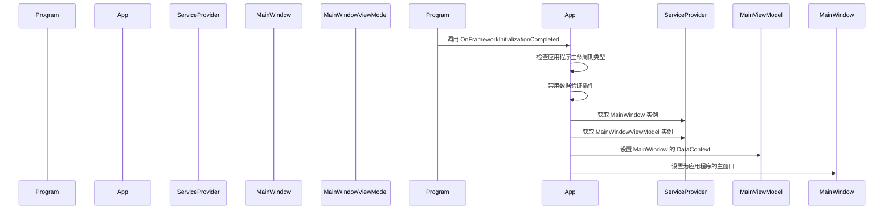

# Chapter 4: 主窗口

欢迎来到第四章！在上一章 [依赖注入扩展方法](03_依赖注入扩展方法_.md) 中，我们学习了如何通过扩展方法简化服务的注册和配置。现在，我们将深入了解主窗口（`MainWindow`），了解它是如何在应用程序中显示主内容的。

## 什么是主窗口？

主窗口是应用程序的主界面，类似于房子的大厅，显示应用程序的主内容。当用户启动应用程序时，首先看到的就是主窗口。主窗口负责显示应用程序的主要功能和信息。

### 具体示例

假设我们有一个简单的日历应用程序，用户可以查看日期和事件。主窗口将显示当前日期、时间以及用户可以浏览和创建事件的功能。

## 创建主窗口

让我们一步一步地创建 `MainWindow`，了解如何在应用程序中配置和使用主窗口。

### 步骤 1: 创建 `MainWindow` 类

首先，我们需要创建一个 `MainWindow` 类，该类继承自 `Window`。`MainWindow` 类用于定义主窗口的界面和行为。

#### 文件: AvaloniaWithDependencyInjection/Views/MainWindow.axaml.cs

```csharp
using Avalonia.Controls;

namespace AvaloniaWithDependencyInjection.Views
{
    public partial class MainWindow : Window
    {
        public MainWindow()
        {
            InitializeComponent();
        }
    }
}
```

### 代码解释

1. **命名空间和类声明**:
    ```csharp
    using Avalonia.Controls;

    namespace AvaloniaWithDependencyInitialization.Views
    {
        public partial class MainWindow : Window
    ```
    这里我们定义了一个名为 `AvaloniaWithDependencyInitialization.Views` 的命名空间，并在其中创建了一个 `MainWindow` 类。`MainWindow` 类继承自 `Window`，这是 Avalonia 框架中定义窗口的基础类。

2. **构造函数**:
    ```csharp
    public MainWindow()
    {
        InitializeComponent();
    }
    ```
    `InitializeComponent` 方法用于加载 XAML 文件并初始化控件。`MainWindow.axaml` 文件定义了主窗口的界面。

### 步骤 2: 定义主窗口的 XAML 文件

接下来，我们需要定义主窗口的 XAML 文件，定义主窗口的界面布局。

#### 文件: AvaloniaWithDependencyInitialization/Views/MainWindow.axaml

```xml
<Window xmlns="https://github.com/avaloniaui"
        xmlns:local="clr-namespace:AvaloniaWithDependencyInitialization.Views"
        Title="Avalonia_with_Dependency_Injection_Example"
        Width="800" Height="600">
    <Grid>
        <TextBlock Text="欢迎来到我们的简单日历应用程序！" HorizontalAlignment="Center" VerticalAlignment="Center" FontSize="24"/>
    </Grid>
</Window>
```

### 代码解释

1. **XAML 命名空间**:
    ```xml
    <Window xmlns="https://github.com/avaloniaui"
            xmlns:local="clr-namespace:AvaloniaWithDependencyInitialization.Views"
    ```
    `xmlns` 属性用于定义 XAML 文件的命名空间。`xmlns:local` 属性用于定义本地命名空间，以便在 XAML 文件中引用本地控件。

2. **Window 根元素**:
    ```xml
    <Window Title="Avalonia_with_Dependency_Injection_Example"
            Width="800" Height="600">
    ```
    `Window` 元素是主窗口的根元素。`Title` 属性定义了窗口的标题，`Width` 和 `Height` 属性定义了窗口的初始宽度和高度。

3. **界面布局**:
    ```xml
    <Grid>
        <TextBlock Text="欢迎来到我们的简单日历应用程序！" HorizontalAlignment="Center" VerticalAlignment="Center" FontSize="24"/>
    </Grid>
    ```
    `Grid` 元素用于定义窗口的布局。在这个例子中，我们使用了一个 `TextBlock` 控件来显示欢迎文本。`HorizontalAlignment` 和 `VerticalAlignment` 属性用于将文本居中显示，`FontSize` 属性用于设置文本的大小。

### 步骤 3: 配置主窗口的视图模型

为了使主窗口能够显示视图模型中的数据，我们需要将视图模型设置为主窗口的数据上下文。

#### 文件: AvaloniaWithDependencyInitialization/App.cs

```csharp
using Avalonia;
using Avalonia.Controls.ApplicationLifetimes;
using Avalonia.Markup.Xaml;

namespace AvaloniaWithDependencyInitialization
{
    public partial class App : Application
    {
        public override void Initialize()
        {
            AvaloniaXamlLoader.Load(this);
        }

        public override void OnFrameworkInitializationCompleted()
        {
            if (ApplicationLifetime is IClassicDesktopStyleApplicationLifetime desktop)
            {
                // 避免 Avalonia 和 CommunityToolkit 重复验证
                DisableAvaloniaDataAnnotationValidation();

                var mainWindow = Program.ServiceProvider?.GetRequiredService<MainWindow>();
                var mainViewModel = Program.ServiceProvider?.GetRequiredService<MainWindowViewModel>();

                if (mainWindow != null && mainViewModel != null)
                {
                    mainWindow.DataContext = mainViewModel;
                    desktop.MainWindow = mainWindow;
                }
            }

            base.OnFrameworkInitializationCompleted();
        }

        private void DisableAvaloniaDataAnnotationValidation()
        {
            // 获取要移除的插件数组
            var dataValidationPluginsToRemove =
                BindingPlugins.DataValidators.OfType<DataAnnotationsValidationPlugin>().ToArray();

            // 移除每个找到的插件
            foreach (var plugin in dataValidationPluginsToRemove)
            {
                BindingPlugins.DataValidators.Remove(plugin);
            }
        }
    }
}
```

### 代码解释

1. **初始化应用程序**:
    ```csharp
    public override void Initialize()
    {
        AvaloniaXamlLoader.Load(this);
    }
    ```
    `Initialize` 方法用于加载 XAML 资源。`AvaloniaXamlLoader.Load(this)` 会加载 `App.axaml` 文件，该文件包含了应用程序的 XAML 定义。

2. **完成框架初始化**:
    ```csharp
    public override void OnFrameworkInitializationCompleted()
    {
        if (ApplicationLifetime is IClassicDesktopStyleApplicationLifetime desktop)
        {
            // 避免 Avalonia 和 CommunityToolkit 重复验证
            DisableAvaloniaDataAnnotationValidation();

            var mainWindow = Program.ServiceProvider?.GetRequiredService<MainWindow>();
            var mainViewModel = Program.ServiceProvider?.GetRequiredService<MainWindowViewModel>();

            if (mainWindow != null && mainViewModel != null)
            {
                mainWindow.DataContext = mainViewModel;
                desktop.MainWindow = mainWindow;
            }
        }

        base.OnFrameworkInitializationCompleted();
    }
    ```
    - **检查应用程序生命周期类型**:
        ```csharp
        if (ApplicationLifetime is IClassicDesktopStyleApplicationLifetime desktop)
        ```
        确保应用程序是桌面应用程序类型。

    - **禁用数据验证插件**:
        ```csharp
        DisableAvaloniaDataAnnotationValidation();
        ```
        调用 `DisableAvaloniaDataAnnotationValidation` 方法以避免重复验证。

    - **获取主窗口和视图模型**:
        ```csharp
        var mainWindow = Program.ServiceProvider?.GetRequiredService<MainWindow>();
        var mainViewModel = Program.ServiceProvider?.GetRequiredService<MainWindowViewModel>();
        ```
        使用依赖注入容器 `Program.ServiceProvider` 获取 `MainWindow` 和 `MainWindowViewModel` 实例。

    - **设置主窗口的数据上下文**:
        ```csharp
        if (mainWindow != null && mainViewModel != null)
        {
            mainWindow.DataContext = mainViewModel;
        }
        ```
        将视图模型设置为主窗口的数据上下文。

    - **设置应用程序的主窗口**:
        ```csharp
        desktop.MainWindow = mainWindow;
        ```
        将主窗口设置为应用程序的主窗口。

## 内部实现

### 主窗口的显示流程

当应用程序启动时，会发生以下步骤：

1. **入口点调用**:
    `Program.Main` 方法被调用，配置依赖注入容器并启动 Avalonia 应用程序。

2. **初始化应用程序**:
    `App.Initialize` 方法被调用，加载 XAML 资源。

3. **完成框架初始化**:
    `App.OnFrameworkInitializationCompleted` 方法被调用，初始化主窗口和视图模型，并设置主窗口。

4. **启动主窗口**:
    Avalonia 框架启动主窗口，应用程序进入运行状态。

### 简单序列图

下面是 `App` 类启动主窗口时的序列图，展示了各个组件之间的交互。



## 内部实现代码

### 主窗口的初始化

下面是 `App` 类中 `OnFrameworkInitializationCompleted` 方法的详细实现：

```csharp
public override void OnFrameworkInitializationCompleted()
{
    if (ApplicationLifetime is IClassicDesktopStyleApplicationLifetime desktop)
    {
        // 避免 Avalonia 和 CommunityToolkit 重复验证
        DisableAvaloniaDataAnnotationValidation();

        var mainWindow = Program.ServiceProvider?.GetRequiredService<MainWindow>();
        var mainViewModel = Program.ServiceProvider?.GetRequiredService<MainWindowViewModel>();

        if (mainWindow != null && mainViewModel != null)
        {
            mainWindow.DataContext = mainViewModel; // 设置主窗口的数据上下文
            desktop.MainWindow = mainWindow; // 设置主窗口
        }
    }

    base.OnFrameworkInitializationCompleted();
}
```

- **检查应用程序生命周期类型**:
    ```csharp
    if (ApplicationLifetime is IClassicDesktopStyleApplicationLifetime desktop)
    ```
    确保应用程序是桌面应用程序类型。

- **禁用数据验证插件**:
    ```csharp
    DisableAvaloniaDataAnnotationValidation();
    ```
    调用 `DisableAvaloniaDataAnnotationValidation` 方法以避免重复验证。

- **获取主窗口和视图模型**:
    ```csharp
    var mainWindow = Program.ServiceProvider?.GetRequiredService<MainWindow>();
    var mainViewModel = Program.ServiceProvider?.GetRequiredService<MainWindowViewModel>();
    ```
    使用依赖注入容器获取 `MainWindow` 和 `MainWindowViewModel` 实例。

- **设置主窗口的数据上下文**:
    ```csharp
    if (mainWindow != null && mainViewModel != null)
    {
        mainWindow.DataContext = mainViewModel;
    }
    ```
    将视图模型设置为主窗口的数据上下文。

- **设置应用程序的主窗口**:
    ```csharp
    desktop.MainWindow = mainWindow;
    ```
    将主窗口设置为应用程序的主窗口。

## 总结

通过这一章，我们学习了如何创建和配置应用程序的主窗口（`MainWindow`），了解了主窗口如何显示应用程序的主内容。我们定义了主窗口的 XAML 文件，配置了视图模型，并将主窗口设置为应用程序的主窗口。

接下来，我们将学习 [主窗口视图模型](05_主窗口视图模型_.md)，了解如何创建和配置主窗口的视图模型。希望这一章对你有所帮助，祝你编程愉快！

---

Generated by [AI Codebase Knowledge Builder](https://github.com/The-Pocket/Tutorial-Codebase-Knowledge)