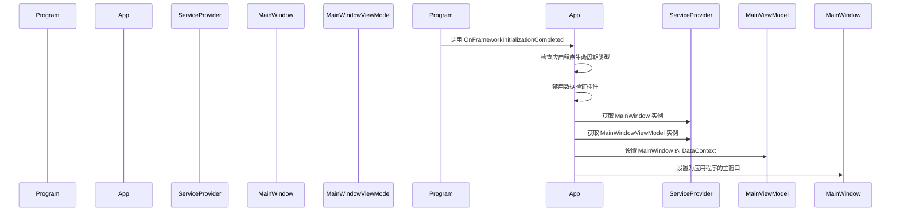

# Chapter 5: 主窗口视图模型

在上一章 [主窗口](04_主窗口_.md) 中，我们学习了如何创建和配置应用程序的主窗口。现在，我们将深入了解主窗口视图模型（`MainWindowViewModel`），了解它是如何管理和控制主窗口的数据和用户交互的。

## 什么是主窗口视图模型？

主窗口视图模型是应用程序的主控视图模型，类似于仪表盘，管理主窗口的数据显示和用户交互。它负责协调视图与数据之间的交互，确保用户界面能够正确显示和响应用户的操作。

### 具体示例

假设我们有一个简单的日历应用程序，用户可以查看日期和事件。主窗口视图模型将管理显示当前日期、时间以及用户可以浏览和创建事件的功能。用户可以通过按钮导航到不同的页面，如 "页面1" 和 "页面2"。

## 创建主窗口视图模型

让我们一步一步地创建 `MainWindowViewModel`，了解如何在应用程序中配置和使用主窗口视图模型。

### 步骤 1: 定义 `MainWindowViewModel` 类

首先，我们需要定义一个 `MainWindowViewModel` 类，该类继承自 `ViewModelBase`。`MainWindowViewModel` 类用于管理主窗口的数据和用户交互。

#### 文件: AvaloniaWithDependencyInjection/ViewModels/MainWindowViewModel.cs

```csharp
using CommunityToolkit.Mvvm.ComponentModel;
using CommunityToolkit.Mvvm.Input;
using AvaloniaWithDependencyInjection.Services;

namespace AvaloniaWithDependencyInjection.ViewModels
{
    public partial class MainWindowViewModel : ViewModelBase
    {
        private readonly INavigationService _navigationService;

        [ObservableProperty]
        private ViewModelBase currentPage;

        public MainWindowViewModel(INavigationService navigationService)
        {
            _navigationService = navigationService;
            CurrentPage = _navigationService.CurrentViewModel;

            // 订阅导航服务的属性变化
            ((NavigationService)_navigationService).PropertyChanged += (_, args) =>
            {
                if (args.PropertyName == nameof(INavigationService.CurrentViewModel))
                {
                    CurrentPage = _navigationService.CurrentViewModel;
                }
            };
        }

        [RelayCommand]
        private void NavigateToPage1()
        {
            _navigationService.NavigateTo<Page1ViewModel>();
        }

        [RelayCommand]
        private void NavigateToPage2()
        {
            _navigationService.NavigateTo<Page2ViewModel>();
        }
    }
}
```

### 代码解释

1. **命名空间和类声明**:
    ```csharp
    using CommunityToolkit.Mvvm.ComponentModel;
    using CommunityToolkit.Mvvm.Input;
    using AvaloniaWithDependencyInjection.Services;

    namespace AvaloniaWithDependencyInjection.ViewModels
    {
        public partial class MainWindowViewModel : ViewModelBase
    ```
    这里我们定义了一个名为 `AvaloniaWithDependencyInjection.ViewModels` 的命名空间，并在其中创建了一个 `MainWindowViewModel` 类。`MainWindowViewModel` 类继承自 `ViewModelBase`，这是一个基类，提供了一些帮助管理视图模型属性和命令的方法。

2. **字段和属性**:
    ```csharp
    private readonly INavigationService _navigationService;

    [ObservableProperty]
    private ViewModelBase currentPage;
    ```
    - `_navigationService` 是一个私有字段，用于存储导航服务的实例。
    - `CurrentPage` 是一个可观察属性，用于存储当前显示的视图模型。

3. **构造函数**:
    ```csharp
    public MainWindowViewModel(INavigationService navigationService)
    {
        _navigationService = navigationService;
        CurrentPage = _navigationService.CurrentViewModel;

        // 订阅导航服务的属性变化
        ((NavigationService)_navigationService).PropertyChanged += (_, args) =>
        {
            if (args.PropertyName == nameof(INavigationService.CurrentViewModel))
            {
                CurrentPage = _navigationService.CurrentViewModel;
            }
        };
    }
    ```
    - 构造函数接受一个 `INavigationService` 参数，并将其存储在 `_navigationService` 字段中。
    - 初始化 `CurrentPage` 属性为导航服务的当前视图模型。
    - 订阅导航服务的属性变化，以便在导航服务的当前视图模型发生变化时，更新 `CurrentPage` 属性。

4. **导航命令**:
    ```csharp
    [RelayCommand]
    private void NavigateToPage1()
    {
        _navigationService.NavigateTo<Page1ViewModel>();
    }

    [RelayCommand]
    private void NavigateToPage2()
    {
        _navigationService.NavigateTo<Page2ViewModel>();
    }
    ```
    - `NavigateToPage1` 和 `NavigateToPage2` 是命令方法，用于导航到 "页面1" 和 "页面2"。
    - 使用 `[RelayCommand]` 属性将这些方法转换为可绑定的命令。

### 使用主窗口视图模型

为了使主窗口能够显示视图模型中的数据，我们需要将视图模型设置为主窗口的数据上下文。

#### 文件: AvaloniaWithDependencyInitialization/App.cs

```csharp
using Avalonia;
using Avalonia.Controls.ApplicationLifetimes;
using Avalonia.Markup.Xaml;

namespace AvaloniaWithDependencyInitialization
{
    public partial class App : Application
    {
        public override void Initialize()
        {
            AvaloniaXamlLoader.Load(this);
        }

        public override void OnFrameworkInitializationCompleted()
        {
            if (ApplicationLifetime is IClassicDesktopStyleApplicationLifetime desktop)
            {
                // 避免 Avalonia 和 CommunityToolkit 重复验证
                DisableAvaloniaDataAnnotationValidation();

                var mainWindow = Program.ServiceProvider?.GetRequiredService<MainWindow>();
                var mainViewModel = Program.ServiceProvider?.GetRequiredService<MainWindowViewModel>();

                if (mainWindow != null && mainViewModel != null)
                {
                    mainWindow.DataContext = mainViewModel;
                    desktop.MainWindow = mainWindow;
                }
            }

            base.OnFrameworkInitializationCompleted();
        }

        private void DisableAvaloniaDataAnnotationValidation()
        {
            // 获取要移除的插件数组
            var dataValidationPluginsToRemove =
                BindingPlugins.DataValidators.OfType<DataAnnotationsValidationPlugin>().ToArray();

            // 移除每个找到的插件
            foreach (var plugin in dataValidationPluginsToRemove)
            {
                BindingPlugins.DataValidators.Remove(plugin);
            }
        }
    }
}
```

### 代码解释

1. **初始化应用程序**:
    ```csharp
    public override void Initialize()
    {
        AvaloniaXamlLoader.Load(this);
    }
    ```
    `Initialize` 方法用于加载 XAML 资源。`AvaloniaXamlLoader.Load(this)` 会加载 `App.axaml` 文件，该文件包含了应用程序的 XAML 定义。

2. **完成框架初始化**:
    ```csharp
    public override void OnFrameworkInitializationCompleted()
    {
        if (ApplicationLifetime is IClassicDesktopStyleApplicationLifetime desktop)
        {
            // 避免 Avalonia 和 CommunityToolkit 重复验证
            DisableAvaloniaDataAnnotationValidation();

            var mainWindow = Program.ServiceProvider?.GetRequiredService<MainWindow>();
            var mainViewModel = Program.ServiceProvider?.GetRequiredService<MainWindowViewModel>();

            if (mainWindow != null && mainViewModel != null)
            {
                mainWindow.DataContext = mainViewModel;
                desktop.MainWindow = mainWindow;
            }
        }

        base.OnFrameworkInitializationCompleted();
    }
    ```
    - **检查应用程序生命周期类型**:
        ```csharp
        if (ApplicationLifetime is IClassicDesktopStyleApplicationLifetime desktop)
        ```
        确保应用程序是桌面应用程序类型。

    - **禁用数据验证插件**:
        ```csharp
        DisableAvaloniaDataAnnotationValidation();
        ```
        调用 `DisableAvaloniaDataAnnotationValidation` 方法以避免重复验证。

    - **获取主窗口和视图模型**:
        ```csharp
        var mainWindow = Program.ServiceProvider?.GetRequiredService<MainWindow>();
        var mainViewModel = Program.ServiceProvider?.GetRequiredService<MainWindowViewModel>();
        ```
        使用依赖注入容器 `Program.ServiceProvider` 获取 `MainWindow` 和 `MainWindowViewModel` 实例。

    - **设置主窗口的数据上下文**:
        ```csharp
        if (mainWindow != null && mainViewModel != null)
        {
            mainWindow.DataContext = mainViewModel; // 设置主窗口的数据上下文
            desktop.MainWindow = mainWindow; // 设置主窗口
        }
        ```
        将视图模型设置为主窗口的数据上下文，并将主窗口设置为应用程序的主窗口。

### 内部实现

#### 主窗口视图模型的显示流程

当应用程序启动时，会发生以下步骤：

1. **入口点调用**:
    `Program.Main` 方法被调用，配置依赖注入容器并启动 Avalonia 应用程序。

2. **初始化应用程序**:
    `App.Initialize` 方法被调用，加载 XAML 资源。

3. **完成框架初始化**:
    `App.OnFrameworkInitializationCompleted` 方法被调用，初始化主窗口和视图模型，并设置主窗口。

4. **启动主窗口**:
    Avalonia 框架启动主窗口，应用程序进入运行状态。

#### 简单序列图

下面是 `App` 类启动主窗口视图模型时的序列图，展示了各个组件之间的交互。



### 代码块解释

#### 主窗口视图模型的内部实现

1. **订阅导航服务属性变化**:
    ```csharp
    ((NavigationService)_navigationService).PropertyChanged += (_, args) =>
    {
        if (args.PropertyName == nameof(INavigationService.CurrentViewModel))
        {
            CurrentPage = _navigationService.CurrentViewModel;
        }
    };
    ```
    这段代码订阅了导航服务的属性变化，当导航服务的当前视图模型发生变化时，更新 `CurrentPage` 属性。

2. **导航命令**:
    ```csharp
    [RelayCommand]
    private void NavigateToPage1()
    {
        _navigationService.NavigateTo<Page1ViewModel>();
    }

    [RelayCommand]
    private void NavigateToPage2()
    {
        _navigationService.NavigateTo<Page2ViewModel>();
    }
    ```
    这些命令方法用于导航到不同的页面。使用 `[RelayCommand]` 属性将这些方法转换为可绑定的命令。

## 总结

通过这一章，我们学习了如何创建和配置主窗口视图模型（`MainWindowViewModel`），了解了主窗口视图模型如何管理和控制主窗口的数据和用户交互。我们定义了 `MainWindowViewModel` 类，配置了导航命令，并将视图模型设置为主窗口的数据上下文。

接下来，我们将学习 [视图定位器](06_视图定位器_.md)，了解如何通过视图定位器实现视图和视图模型的自动绑定。希望这一章对你有所帮助，祝你编程愉快！

---

Generated by [AI Codebase Knowledge Builder](https://github.com/The-Pocket/Tutorial-Codebase-Knowledge)