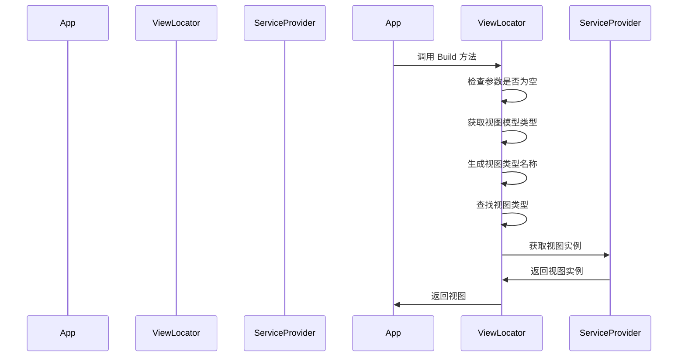

# Chapter 6: 视图定位器

在上一章 [主窗口视图模型](05_主窗口视图模型_.md) 中，我们学习了如何创建和配置主窗口视图模型，管理主窗口的数据和用户交互。现在，我们将深入了解视图定位器（`ViewLocator`），了解它是如何实现视图和视图模型的自动绑定的。

## 视图定位器的作用

视图定位器是一个查找视图的工具，类似于图书馆的索引卡片，帮助找到与视图模型匹配的视图。通过视图定位器，我们可以自动将视图模型绑定到对应的视图，而不需要手动编写大量的绑定代码。

### 具体示例

假设我们有一个简单的应用程序，包含一个主窗口（`MainWindow`）和两个页面（`Page1` 和 `Page2`）。我们希望在用户点击按钮时，能够自动导航到不同的页面。视图定位器可以帮助我们实现这个功能，自动将视图模型绑定到对应的视图。

## 创建视图定位器

让我们一步一步地创建视图定位器，了解如何在应用程序中使用它来实现视图和视图模型的自动绑定。

### 步骤 1: 创建 `ViewLocator` 类

首先，我们需要创建一个 `ViewLocator` 类，该类继承自 `IDataTemplate`。`ViewLocator` 类用于查找与视图模型匹配的视图。

#### 文件: AvaloniaWithDependencyInjection/ViewLocator.cs

```csharp
using System;
using Avalonia.Controls;
using Avalonia.Controls.Templates;
using AvaloniaWithDependencyInjection.ViewModels;
using AvaloniaWithDependencyInjection.Views;
using Microsoft.Extensions.DependencyInjection;

namespace AvaloniaWithDependencyInitialization
{
    public class ViewLocator : IDataTemplate
    {
        public Control? Build(object? param)
        {
            if (param is null)
                return null;

            var viewModelType = param.GetType();
            var viewTypeName = viewModelType.FullName!.Replace("ViewModel", "View", StringComparison.Ordinal);
            var viewType = Type.GetType(viewTypeName);

            if (viewType != null)
            {
                // 尝试从依赖注入容器中获取视图
                var view = Program.ServiceProvider?.GetService(viewType) as Control;
                if (view != null)
                {
                    return view;
                }

                // 如果视图未注册，则回退到创建新实例
                return (Control)Activator.CreateInstance(viewType)!;
            }

            return new TextBlock { Text = "未找到: " + viewTypeName };
        }

        public bool Match(object? data)
        {
            return data is ViewModelBase;
        }
    }
}
```

### 代码解释

1. **命名空间和类声明**:
    ```csharp
    using System;
    using Avalonia.Controls;
    using Avalonia.Controls.Templates;
    using AvaloniaWithDependencyInitialization.ViewModels;
    using AvaloniaWithDependencyInitialization.Views;
    using Microsoft.Extensions.DependencyInjection;

    namespace AvaloniaWithDependencyInitialization
    {
        public class ViewLocator : IDataTemplate
    ```
    这里我们定义了一个名为 `AvaloniaWithDependencyInitialization` 的命名空间，并在其中创建了一个 `ViewLocator` 类。`ViewLocator` 类继承自 `IDataTemplate`，这是一个接口，用于定义数据模板。

2. **Build 方法**:
    ```csharp
    public Control? Build(object? param)
    {
        if (param is null)
            return null;

        var viewModelType = param.GetType();
        var viewTypeName = viewModelType.FullName!.Replace("ViewModel", "View", StringComparison.Ordinal);
        var viewType = Type.GetType(viewTypeName);

        if (viewType != null)
        {
            // 尝试从依赖注入容器中获取视图
            var view = Program.ServiceProvider?.GetService(viewType) as Control;
            if (view != null)
            {
                return view;
            }

            // 如果视图未注册，则回退到创建新实例
            return (Control)Activator.CreateInstance(viewType)!;
        }

        return new TextBlock { Text = "未找到: " + viewTypeName };
    }
    ```
    - **检查参数是否为空**:
        ```csharp
        if (param is null)
            return null;
        ```
        如果参数为空，返回 `null`。

    - **获取视图模型类型**:
        ```csharp
        var viewModelType = param.GetType();
        ```
        获取传递的参数（视图模型）的类型。

    - **生成视图类型名称**:
        ```csharp
        var viewTypeName = viewModelType.FullName!.Replace("ViewModel", "View", StringComparison.Ordinal);
        ```
        通过替换 `ViewModel` 为 `View` 生成视图类型名称。

    - **查找视图类型**:
        ```csharp
        var viewType = Type.GetType(viewTypeName);
        ```
        使用 `Type.GetType` 方法查找视图类型。

    - **从依赖注入容器中获取视图**:
        ```csharp
        var view = Program.ServiceProvider?.GetService(viewType) as Control;
        if (view != null)
        {
            return view;
        }
        ```
        从依赖注入容器中获取视图实例。如果找到视图实例，返回该实例。

    - **回退到创建新实例**:
        ```csharp
        return (Control)Activator.CreateInstance(viewType)!;
        ```
        如果视图未注册在依赖注入容器中，使用 `Activator.CreateInstance` 创建一个新实例。

    - **返回未找到的提示**:
        ```csharp
        return new TextBlock { Text = "未找到: " + viewTypeName };
        ```
        如果未找到视图类型，返回一个 `TextBlock` 控件，显示未找到的提示。

3. **Match 方法**:
    ```csharp
    public bool Match(object? data)
    {
        return data is ViewModelBase;
    }
    ```
    `Match` 方法用于检查数据是否是 `ViewModelBase` 的实例。如果是，返回 `true`，否则返回 `false`。

### 使用视图定位器

为了使视图定位器生效，我们需要在应用程序中注册和使用它。

#### 文件: AvaloniaWithDependencyInitialization/App.xaml

```xml
<Application xmlns="https://github.com/avaloniaui"
             xmlns:local="clr-namespace:AvaloniaWithDependencyInitialization"
             x:Class="AvaloniaWithDependencyInitialization.App">
    <Application.DataTemplates>
        <local:ViewLocator />
    </Application.DataTemplates>
</Application>
```

### 代码解释

1. **XAML 命名空间**:
    ```xml
    <Application xmlns="https://github.com/avaloniaui"
                 xmlns:local="clr-namespace:AvaloniaWithDependencyInitialization"
    ```
    `xmlns` 属性用于定义 XAML 文件的命名空间。`xmlns:local` 属性用于定义本地命名空间，以便在 XAML 文件中引用本地控件。

2. **注册视图定位器**:
    ```xml
    <Application.DataTemplates>
        <local:ViewLocator />
    </Application.DataTemplates>
    ```
    在应用程序中注册 `ViewLocator`，使其在应用程序中生效。

### 内部实现

#### 视图定位器的工作流程

当视图定位器被调用时，会发生以下步骤：

1. **检查参数是否为空**:
   - 如果参数为空，返回 `null`。
2. **获取视图模型类型**:
   - 获取传递的参数（视图模型）的类型。
3. **生成视图类型名称**:
   - 通过替换 `ViewModel` 为 `View` 生成视图类型名称。
4. **查找视图类型**:
   - 使用 `Type.GetType` 方法查找视图类型。
5. **从依赖注入容器中获取视图**:
   - 从依赖注入容器中获取视图实例。如果找到视图实例，返回该实例。
6. **回退到创建新实例**:
   - 如果视图未注册在依赖注入容器中，使用 `Activator.CreateInstance` 创建一个新实例。
7. **返回未找到的提示**:
   - 如果未找到视图类型，返回一个 `TextBlock` 控件，显示未找到的提示。

#### 简单序列图

下面是视图定位器工作时的序列图，展示了各个组件之间的交互。



### 代码块解释

#### 视图定位器的内部实现

1. **从依赖注入容器中获取视图**:
    ```csharp
    var view = Program.ServiceProvider?.GetService(viewType) as Control;
    if (view != null)
    {
        return view;
    }
    ```
    这段代码尝试从依赖注入容器中获取视图实例。如果找到视图实例，返回该实例。

2. **回退到创建新实例**:
    ```csharp
    return (Control)Activator.CreateInstance(viewType)!;
    ```
    如果视图未注册在依赖注入容器中，使用 `Activator.CreateInstance` 创建一个新实例并返回。

## 总结

通过这一章，我们学习了如何创建和配置视图定位器（`ViewLocator`），了解了视图定位器如何实现视图和视图模型的自动绑定。我们定义了 `ViewLocator` 类，注册了视图定位器，并了解了它的工作流程。

接下来，我们将学习 [导航服务](07_导航服务_.md)，了解如何通过导航服务实现页面之间的导航。希望这一章对你有所帮助，祝你编程愉快！

---

Generated by [AI Codebase Knowledge Builder](https://github.com/The-Pocket/Tutorial-Codebase-Knowledge)