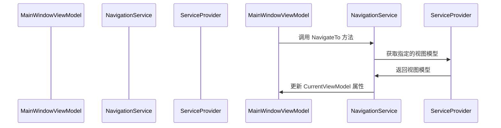

# Chapter 7: 导航服务

欢迎来到第七章！在上一章 [视图定位器](06_视图定位器_.md) 中，我们学习了如何创建和配置视图定位器，实现视图和视图模型的自动绑定。现在，我们将深入了解导航服务（`NavigationService`），了解它是如何实现页面之间的导航的。

## 什么是导航服务？

导航服务是一个管理页面导航的工具，类似于交通控制中心，负责切换不同页面的显示。通过导航服务，我们可以在用户点击按钮时，轻松地导航到不同的页面，而不需要手动编写大量的导航代码。

### 示例

假设我们有一个简单的应用程序，包含一个主窗口（`MainWindow`）和两个页面（`Page1` 和 `Page2`）。我们希望在用户点击按钮时，能够自动导航到不同的页面。导航服务可以帮助我们实现这个功能。

## 创建导航服务

让我们一步一步地创建导航服务，了解如何在应用程序中使用它来实现页面之间的导航。

### 步骤 1: 定义 `INavigationService` 接口

首先，我们需要定义一个 `INavigationService` 接口，该接口定义了导航服务的基本方法。

#### 文件: AvaloniaWithDependencyInjection/Services/INavigationService.cs

```csharp
using AvaloniaWithDependencyInitialization.ViewModels;

namespace AvaloniaWithDependencyInitialization.Services;

public interface INavigationService
{
    ViewModelBase CurrentViewModel { get; }
    void NavigateTo<T>() where T : ViewModelBase;
}
```

### 代码解释

1. **命名空间和接口声明**:
    ```csharp
    using AvaloniaWithDependencyInitialization.ViewModels;
    
    namespace AvaloniaWithDependencyInitialization.Services;
    
    public interface INavigationService
    ```
    这里我们定义了一个名为 `AvaloniaWithDependencyInitialization.Services` 的命名空间，并在其中创建了一个 `INavigationService` 接口。

2. **属性和方法**:
    ```csharp
    public interface INavigationService
    {
        ViewModelBase CurrentViewModel { get; }
        void NavigateTo<T>() where T : ViewModelBase;
    }
    ```
    - `CurrentViewModel` 属性用于获取当前显示的视图模型。
    - `NavigateTo<T>` 方法用于导航到指定的视图模型。

### 步骤 2: 实现 `NavigationService` 类

接下来，我们需要实现 `NavigationService` 类，该类继承自 `ObservableObject`，并实现了 `INavigationService` 接口。

#### 文件: AvaloniaWithDependencyInitialization/Services/NavigationService.cs

```csharp
using System;
using CommunityToolkit.Mvvm.ComponentModel;
using Microsoft.Extensions.DependencyInjection;
using AvaloniaWithDependencyInitialization.ViewModels;

namespace AvaloniaWithDependencyInitialization.Services;

public partial class NavigationService : ObservableObject, INavigationService
{
    [ObservableProperty]
    private ViewModelBase _currentViewModel;

    private readonly IServiceProvider _serviceProvider;

    public NavigationService(IServiceProvider serviceProvider)
    {
        _serviceProvider = serviceProvider;

        // 设置初始页面
        NavigateTo<Page1ViewModel>();
    }

    public void NavigateTo<T>() where T : ViewModelBase
    {
        var viewModel = _serviceProvider.GetRequiredService<T>();
        CurrentViewModel = viewModel;
    }
}
```

### 代码解释

1. **命名空间和类声明**:
    ```csharp
    using System;
    using CommunityToolkit.Mvvm.ComponentModel;
    using Microsoft.Extensions.DependencyInjection;
    using AvaloniaWithDependencyInitialization.ViewModels;
    
    namespace AvaloniaWithDependencyInitialization.Services;
    
    public partial class NavigationService : ObservableObject, INavigationService
    ```
    这里我们定义了一个名为 `AvaloniaWithDependencyInitialization.Services` 的命名空间，并在其中创建了一个 `NavigationService` 类。`NavigationService` 类继承自 `ObservableObject`，并实现了 `INavigationService` 接口。

2. **属性和字段**:
    ```csharp
    [ObservableProperty]
    private ViewModelBase _currentViewModel;
    
    private readonly IServiceProvider _serviceProvider;
    ```
    - `_currentViewModel` 是一个可观察属性，用于存储当前显示的视图模型。
    - `_serviceProvider` 是一个私有字段，用于存储依赖注入容器的实例。

3. **构造函数**:
    ```csharp
    public NavigationService(IServiceProvider serviceProvider)
    {
        _serviceProvider = serviceProvider;
    
        // 设置初始页面
        NavigateTo<Page1ViewModel>();
    }
    ```
    - 构造函数接受一个 `IServiceProvider` 参数，并将其存储在 `_serviceProvider` 字段中。
    - 调用 `NavigateTo<Page1ViewModel>()` 方法，设置初始页面为 `Page1`。

4. **导航方法**:
    ```csharp
    public void NavigateTo<T>() where T : ViewModelBase
    {
        var viewModel = _serviceProvider.GetRequiredService<T>();
        CurrentViewModel = viewModel;
    }
    ```
    - `NavigateTo<T>` 方法用于导航到指定的视图模型。
    - 使用依赖注入容器 `_serviceProvider` 获取指定的视图模型。
    - 更新 `CurrentViewModel` 属性，使界面显示新的视图模型。

### 使用导航服务

为了使导航服务生效，我们需要在主窗口视图模型中使用它。

#### 文件: AvaloniaWithDependencyInitialization/ViewModels/MainWindowViewModel.cs

```csharp
using CommunityToolkit.Mvvm.ComponentModel;
using CommunityToolkit.Mvvm.Input;
using AvaloniaWithDependencyInitialization.Services;

namespace AvaloniaWithDependencyInitialization.ViewModels
{
    public partial class MainWindowViewModel : ViewModelBase
    {
        private readonly INavigationService _navigationService;

        [ObservableProperty]
        private ViewModelBase currentPage;

        public MainWindowViewModel(INavigationService navigationService)
        {
            _navigationService = navigationService;
            CurrentPage = _navigationService.CurrentViewModel;

            // 订阅导航服务的属性变化
            ((NavigationService)_navigationService).PropertyChanged += (_, args) =>
            {
                if (args.PropertyName == nameof(INavigationService.CurrentViewModel))
                {
                    CurrentPage = _navigationService.CurrentViewModel;
                }
            };
        }

        [RelayCommand]
        private void NavigateToPage1()
        {
            _navigationService.NavigateTo<Page1ViewModel>();
        }

        [RelayCommand]
        private void NavigateToPage2()
        {
            _navigationService.NavigateTo<Page2ViewModel>();
        }
    }
}
```

### 代码解释

1. **字段和属性**:
    ```csharp
    private readonly INavigationService _navigationService;
    
    [ObservableProperty]
    private ViewModelBase currentPage;
    ```
    - `_navigationService` 是一个私有字段，用于存储导航服务的实例。
    - `CurrentPage` 是一个可观察属性，用于存储当前显示的视图模型。

2. **构造函数**:
    ```csharp
    public MainWindowViewModel(INavigationService navigationService)
    {
        _navigationService = navigationService;
        CurrentPage = _navigationService.CurrentViewModel;
    
        // 订阅导航服务的属性变化
        ((NavigationService)_navigationService).PropertyChanged += (_, args) =>
        {
            if (args.PropertyName == nameof(INavigationService.CurrentViewModel))
            {
                CurrentPage = _navigationService.CurrentViewModel;
            }
        };
    }
    ```
    - 构造函数接受一个 `INavigationService` 参数，并将其存储在 `_navigationService` 字段中。
    - 初始化 `CurrentPage` 属性为导航服务的当前视图模型。
    - 订阅导航服务的属性变化，以便在导航服务的当前视图模型发生变化时，更新 `CurrentPage` 属性。

3. **导航命令**:
    ```csharp
    [RelayCommand]
    private void NavigateToPage1()
    {
        _navigationService.NavigateTo<Page1ViewModel>();
    }
    
    [RelayCommand]
    private void NavigateToPage2()
    {
        _navigationService.NavigateTo<Page2ViewModel>();
    }
    ```
    - `NavigateToPage1` 和 `NavigateToPage2` 是命令方法，用于导航到 "页面1" 和 "页面2"。
    - 使用 `[RelayCommand]` 属性将这些方法转换为可绑定的命令。

### 内部实现

#### 导航服务的工作流程

当导航服务被调用时，会发生以下步骤：

1. **从依赖注入容器中获取视图模型**:
    - 导航服务使用依赖注入容器 `_serviceProvider` 获取指定的视图模型。
2. **更新当前视图模型**:
    - 更新 `CurrentViewModel` 属性，使界面显示新的视图模型。

#### 示例序列图

下面是导航服务工作时的序列图，展示了各个组件之间的交互。



### 代码块解释

#### 获取视图模型

```csharp
var viewModel = _serviceProvider.GetRequiredService<T>();
```
这段代码从依赖注入容器中获取指定的视图模型。

#### 更新当前视图模型

```csharp
CurrentViewModel = viewModel;
```
这段代码更新 `CurrentViewModel` 属性，使界面显示新的视图模型。

### 总结

通过这一章，我们学习了如何创建和配置导航服务（`NavigationService`），了解了导航服务如何实现页面之间的导航。我们定义了 `INavigationService` 接口，实现了 `NavigationService` 类，并在主窗口视图模型中使用了导航服务。

接下来，我们将学习 [页面视图](08_页面视图_.md)，了解如何创建和配置应用程序的页面视图。希望这一章对你有所帮助，祝你编程愉快！

---

Generated by [AI Codebase Knowledge Builder](https://github.com/The-Pocket/Tutorial-Codebase-Knowledge)