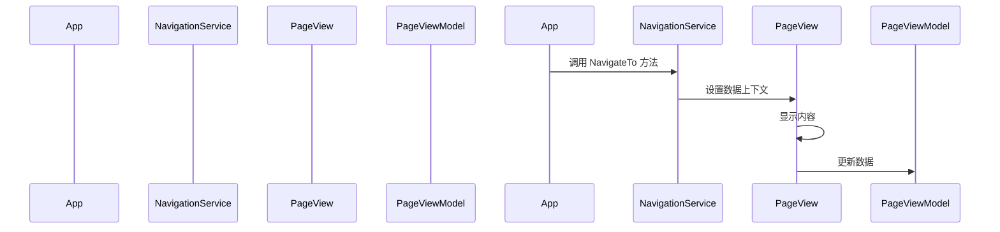

# Chapter 8: 页面视图


在上一章 [导航服务](07_导航服务_.md) 中，我们学习了如何创建和配置导航服务，实现页面之间的导航。现在，我们将深入了解页面视图，了解它是如何在应用程序中显示各个页面的内容和功能的。

## 什么是页面视图？

页面视图是应用程序的各个页面，类似于书籍的各个章节，每个页面有自己的内容和功能。通过页面视图，我们可以将应用程序的不同部分组织成多个页面，用户可以通过导航服务在这些页面之间进行切换。

### 示例

假设我们有一个简单的日历应用程序，包含一个主窗口（`MainWindow`）和两个页面（`Page1` 和 `Page2`）。用户可以通过点击按钮导航到这两个页面。每个页面都有自己的内容和功能，例如 `Page1` 可能显示当前日期，而 `Page2` 可能显示事件列表。

## 创建页面视图

让我们一步一步地创建页面视图，了解如何在应用程序中使用它。

### 步骤 1: 创建 `Page1View` 页面

首先，我们需要创建一个 `Page1View` 页面，该页面显示“欢迎来到 Page1！”的文本和一个按钮。

#### 文件: AvaloniaWithDependencyInjection/Views/Page1View.axaml

```xml
<UserControl xmlns="https://github.com/avaloniaui"
             xmlns:x="http://schemas.microsoft.com/winfx/2006/xaml"
             xmlns:d="http://schemas.microsoft.com/expression/blend/2008"
             xmlns:mc="http://schemas.openxmlformats.org/markup-compatibility/2006"
             mc:Ignorable="d" d:DesignWidth="800" d:DesignHeight="450"
             xmlns:vm="using:AvaloniaWithDependencyInjection.ViewModels"
             x:DataType="vm:Page1ViewModel"
             x:Class="AvaloniaWithDependencyInjection.Views.Page1View">

    <StackPanel>
        <TextBlock Text="欢迎来到 Page1！" FontSize="24" HorizontalAlignment="Center" VerticalAlignment="Center"/>
        <Button Content="点我" Command="{Binding CountCommand}" HorizontalAlignment="Center" VerticalAlignment="Center" Margin="10"/>
        <TextBlock Text="{Binding Text}" FontSize="16" HorizontalAlignment="Center" VerticalAlignment="Center"/>
    </StackPanel>
</UserControl>
```

### 代码解释

1. **命名空间和页面声明**:
    ```xml
    xmlns="https://github.com/avaloniaui"
    xmlns:x="http://schemas.microsoft.com/winfx/2006/xaml"
    xmlns:d="http://schemas.microsoft.com/expression/blend/2008"
    xmlns:mc="http://schemas.openxmlformats.org/markup-compatibility/2006"
    xmlns:vm="using:AvaloniaWithDependencyInjection.ViewModels"
    x:DataType="vm:Page1ViewModel"
    x:Class="AvaloniaWithDependencyInjection.Views.Page1View"
    ```
    这里我们定义了一个命名空间，并声明了 `Page1View` 页面的基本属性。

2. **页面内容**:
    ```xml
    <StackPanel>
        <TextBlock Text="欢迎来到 Page1！" FontSize="24" HorizontalAlignment="Center" VerticalAlignment="Center"/>
        <Button Content="点我" Command="{Binding CountCommand}" HorizontalAlignment="Center" VerticalAlignment="Center" Margin="10"/>
        <TextBlock Text="{Binding Text}" FontSize="16" HorizontalAlignment="Center" VerticalAlignment="Center"/>
    </StackPanel>
    ```
    - `<TextBlock>` 控件用于显示欢迎文本。
    - `<Button>` 控件用于显示一个按钮，并绑定到 `CountCommand` 命令。
    - 另一个 `<TextBlock>` 控件用于显示绑定的文本属性。

### 步骤 2: 创建 `Page2View` 页面

接下来，我们需要创建一个 `Page2View` 页面，该页面显示“欢迎来到 Page2！”的文本和一个按钮。

#### 文件: AvaloniaWithDependencyInjection/Views/Page2View.axaml

```xml
<UserControl xmlns="https://github.com/avaloniaui"
             xmlns:x="http://schemas.microsoft.com/winfx/2006/xaml"
             xmlns:d="http://schemas.microsoft.com/expression/blend/2008"
             xmlns:mc="http://schemas.openxmlformats.org/markup-compatibility/2006"
             mc:Ignorable="d" d:DesignWidth="800" d:DesignHeight="450"
             xmlns:vm="using:AvaloniaWithDependencyInjection.ViewModels"
             x:DataType="vm:Page2ViewModel"
             x:Class="AvaloniaWithDependencyInjection.Views.Page2View">

    <StackPanel>
        <TextBlock Text="欢迎来到 Page2！" FontSize="24" HorizontalAlignment="Center" VerticalAlignment="Center"/>
        <Button Content="点我" Command="{Binding CountCommand}" HorizontalAlignment="Center" VerticalAlignment="Center" Margin="10"/>
        <TextBlock Text="{Binding Text}" FontSize="16" HorizontalAlignment="Center" VerticalAlignment="Center"/>
    </StackPanel>
</UserControl>
```

### 代码解释

1. **命名空间和页面声明**:
    ```xml
    xmlns="https://github.com/avaloniaui"
    xmlns:x="http://schemas.microsoft.com/winfx/2006/xaml"
    xmlns:d="http://schemas.microsoft.com/expression/blend/2008"
    xmlns:mc="http://schemas.openxmlformats.org/markup-compatibility/2006"
    xmlns:vm="using:AvaloniaWithDependencyInjection.ViewModels"
    x:DataType="vm:Page2ViewModel"
    x:Class="AvaloniaWithDependencyInjection.Views.Page2View"
    ```
    这里我们定义了一个命名空间，并声明了 `Page2View` 页面的基本属性。

2. **页面内容**:
    ```xml
    <StackPanel>
        <TextBlock Text="欢迎来到 Page2！" FontSize="24" HorizontalAlignment="Center" VerticalAlignment="Center"/>
        <Button Content="点我" Command="{Binding CountCommand}" HorizontalAlignment="Center" VerticalAlignment="Center" Margin="10"/>
        <TextBlock Text="{Binding Text}" FontSize="16" HorizontalAlignment="Center" VerticalAlignment="Center"/>
    </StackPanel>
    ```
    - `<TextBlock>` 控件用于显示欢迎文本。
    - `<Button>` 控件用于显示一个按钮，并绑定到 `CountCommand` 命令。
    - 另一个 `<TextBlock>` 控件用于显示绑定的文本属性。

### 步骤 3: 创建页面视图模型

为了使页面能够显示视图模型中的数据，我们需要创建页面视图模型。

#### 文件: AvaloniaWithDependencyInitialization/ViewModels/Page1ViewModel.cs

```csharp
using CommunityToolkit.Mvvm.ComponentModel;
using CommunityToolkit.Mvvm.Input;

namespace AvaloniaWithDependencyInitialization.ViewModels
{
    public partial class Page1ViewModel : ViewModelBase
    {
        [ObservableProperty]
        private int count;

        [ObservableProperty]
        private string text;

        public Page1ViewModel()
        {
            Text = "这是 Page1 的内容";
        }

        [RelayCommand]
        private void Count()
        {
            Count++;
            Text = $"点击了 {Count} 次";
        }
    }
}
```

### 代码解释

1. **命名空间和类声明**:
    ```csharp
    using CommunityToolkit.Mvvm.ComponentModel;
    using CommunityToolkit.Mvvm.Input;

    namespace AvaloniaWithDependencyInitialization.ViewModels
    {
        public partial class Page1ViewModel : ViewModelBase
    ```
    这里我们定义了一个命名空间，并创建了一个 `Page1ViewModel` 类，该类继承自 `ViewModelBase`。

2. **属性**:
    ```csharp
    [ObservableProperty]
    private int count;

    [ObservableProperty]
    private string text;
    ```
    - `count` 属性用于存储点击次数。
    - `text` 属性用于存储显示的文本。

3. **构造函数**:
    ```csharp
    public Page1ViewModel()
    {
        Text = "这是 Page1 的内容";
    }
    ```
    - 构造函数初始化 `Text` 属性。

4. **命令**:
    ```csharp
    [RelayCommand]
    private void Count()
    {
        Count++;
        Text = $"点击了 {Count} 次";
    }
    ```
    - `Count` 方法用于增加 `count` 属性的值，并更新 `text` 属性。

#### 文件: AvaloniaWithDependencyInitialization/ViewModels/Page2ViewModel.cs

```csharp
using CommunityToolkit.Mvvm.ComponentModel;
using CommunityToolkit.Mvvm.Input;

namespace AvaloniaWithDependencyInitialization.ViewModels
{
    public partial class Page2ViewModel : ViewModelBase
    {
        [ObservableProperty]
        private int count;

        [ObservableProperty]
        private string text;

        public Page2ViewModel()
        {
            Text = "这是 Page2 的内容";
        }

        [RelayCommand]
        private void Count()
        {
            Count++;
            Text = $"点击了 {Count} 次";
        }
    }
}
```

### 代码解释

1. **命名空间和类声明**:
    ```csharp
    using CommunityToolkit.Mvvm.ComponentModel;
    using CommunityToolkit.Mvvm.Input;

    namespace AvaloniaWithDependencyInitialization.ViewModels
    {
        public partial class Page2ViewModel : ViewModelBase
    ```
    这里我们定义了一个命名空间，并创建了一个 `Page2ViewModel` 类，该类继承自 `ViewModelBase`。

2. **属性**:
    ```csharp
    [ObservableProperty]
    private int count;

    [ObservableProperty]
    private string text;
    ```
    - `count` 属性用于存储点击次数。
    - `text` 属性用于存储显示的文本。

3. **构造函数**:
    ```csharp
    public Page2ViewModel()
    {
        Text = "这是 Page2 的内容";
    }
    ```
    - 构造函数初始化 `Text` 属性。

4. **命令**:
    ```csharp
    [RelayCommand]
    private void Count()
    {
        Count++;
        Text = $"点击了 {Count} 次";
    }
    ```
    - `Count` 方法用于增加 `count` 属性的值，并更新 `text` 属性。

### 内部实现

#### 页面视图的工作流程

当页面视图被调用时，会发生以下步骤：

1. **创建页面视图**:
    - 应用程序通过 XAML 文件创建页面视图。
2. **设置数据上下文**:
    - 使用导航服务将视图模型设置为页面视图的数据上下文。
3. **显示内容**:
    - 页面视图根据数据上下文显示内容。

#### 简单序列图

下面是页面视图工作时的序列图，展示了各个组件之间的交互。



### 代码块解释

#### 创建页面视图

```xml
<UserControl xmlns="https://github.com/avaloniaui"
             xmlns:x="http://schemas.microsoft.com/winfx/2006/xaml"
             xmlns:d="http://schemas.microsoft.com/expression/blend/2008"
             xmlns:mc="http://schemas.openxmlformats.org/markup-compatibility/2006"
             mc:Ignorable="d" d:DesignWidth="800" d:DesignHeight="450"
             xmlns:vm="using:AvaloniaWithDependencyInjection.ViewModels"
             x:DataType="vm:Page1ViewModel"
             x:Class="AvaloniaWithDependencyInjection.Views.Page1View">

    <StackPanel>
        <TextBlock Text="欢迎来到 Page1！" FontSize="24" HorizontalAlignment="Center" VerticalAlignment="Center"/>
        <Button Content="点我" Command="{Binding CountCommand}" HorizontalAlignment="Center" VerticalAlignment="Center" Margin="10"/>
        <TextBlock Text="{Binding Text}" FontSize="16" HorizontalAlignment="Center" VerticalAlignment="Center"/>
    </StackPanel>
</UserControl>
```
这段代码定义了 `Page1View` 页面的界面和布局。

#### 创建页面视图模型

```csharp
using CommunityToolkit.Mvvm.ComponentModel;
using CommunityToolkit.Mvvm.Input;

namespace AvaloniaWithDependencyInitialization.ViewModels
{
    public partial class Page1ViewModel : ViewModelBase
    {
        [ObservableProperty]
        private int count;

        [ObservableProperty]
        private string text;

        public Page1ViewModel()
        {
            Text = "这是 Page1 的内容";
        }

        [RelayCommand]
        private void Count()
        {
            Count++;
            Text = $"点击了 {Count} 次";
        }
    }
}
```
这段代码定义了 `Page1ViewModel` 类，管理 `Page1View` 页面的数据和用户交互。

### 总结

通过这一章，我们学习了如何创建和配置页面视图（`PageView`），了解了页面视图如何在应用程序中显示各个页面的内容和功能。我们定义了 `Page1View` 和 `Page2View` 页面，创建了页面视图模型，并了解了页面视图的内部实现。

接下来，我们将学习 [页面视图模型](09_页面视图模型_.md)，了解如何创建和配置页面视图模型。希望这一章对你有所帮助，祝你编程愉快！

---

Generated by [AI Codebase Knowledge Builder](https://github.com/The-Pocket/Tutorial-Codebase-Knowledge)