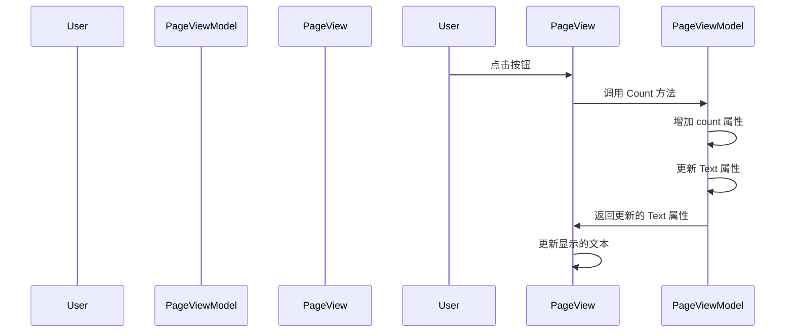

# Chapter 9: 页面视图模型

在上一章 [页面视图](08_页面视图_.md) 中，我们学习了如何创建和配置页面视图，显示各个页面的内容和功能。现在，我们将深入了解页面视图模型，了解它是如何管理和控制页面的数据和用户交互的。

## 什么是页面视图模型？

页面视图模型是每个页面的数据和逻辑处理，类似于页面的脚本，管理页面的数据显示和用户交互。通过页面视图模型，我们可以将页面的数据和功能与用户界面分离，使代码更加清晰和易于维护。

### 示例

假设我们有一个简单的日历应用程序，包含一个主窗口（`MainWindow`）和两个页面（`Page1` 和 `Page2`）。每个页面都有自己的内容和功能，例如 `Page1` 可能显示当前日期，而 `Page2` 可能显示事件列表。页面视图模型负责管理这些页面的数据和用户交互。

## 页面视图模型的作用

页面视图模型的主要作用是将页面的数据和逻辑与用户界面分离。这样，我们可以更方便地管理和更新页面的内容，而不影响用户界面。页面视图模型通常包含以下内容：

1. **数据属性**：用于存储页面的数据，例如当前日期、事件列表等。
2. **命令**：用于处理用户的交互，例如按钮点击事件。
3. **逻辑处理**：用于处理页面的业务逻辑，例如验证用户输入、调用服务等。

### 创建页面视图模型

让我们一步一步地创建页面视图模型，了解如何在应用程序中使用它。

### 步骤 1: 创建 `Page1ViewModel` 类

首先，我们需要创建一个 `Page1ViewModel` 类，该类负责管理 `Page1View` 页面的数据和用户交互。

#### 文件: AvaloniaWithDependencyInjection/ViewModels/Page1ViewModel.cs

```csharp
using CommunityToolkit.Mvvm.ComponentModel;
using CommunityToolkit.Mvvm.Input;

namespace AvaloniaWithDependencyInjection.ViewModels
{
    public partial class Page1ViewModel : ViewModelBase
    {
        [ObservableProperty]
        private int count;

        [ObservableProperty]
        private string text;

        public Page1ViewModel()
        {
            Text = "你还没点击";
        }

        [RelayCommand]
        private void Count()
        {
            count++;
            Text = $"你点击了 {count} 次";
        }
    }
}
```

### 代码解释

1. **命名空间和类声明**:
    ```csharp
    using CommunityToolkit.Mvvm.ComponentModel;
    using CommunityToolkit.Mvvm.Input;

    namespace AvaloniaWithDependencyInjection.ViewModels
    {
        public partial class Page1ViewModel : ViewModelBase
    ```
    这里我们定义了一个命名空间，并创建了一个 `Page1ViewModel` 类，该类继承自 `ViewModelBase`。

2. **数据属性**:
    ```csharp
    [ObservableProperty]
    private int count;

    [ObservableProperty]
    private string text;
    ```
    - `count` 属性用于存储点击次数。
    - `text` 属性用于存储显示的文本。

3. **构造函数**:
    ```csharp
    public Page1ViewModel()
    {
        Text = "你还没点击";
    }
    ```
    - 构造函数初始化 `Text` 属性。

4. **命令**:
    ```csharp
    [RelayCommand]
    private void Count()
    {
        count++;
        Text = $"你点击了 {count} 次";
    }
    ```
    - `Count` 方法用于增加 `count` 属性的值，并更新 `text` 属性。

### 步骤 2: 创建 `Page2ViewModel` 类

接下来，我们需要创建一个 `Page2ViewModel` 类，该类负责管理 `Page2View` 页面的数据和用户交互。

#### 文件: AvaloniaWithDependencyInjection/ViewModels/Page2ViewModel.cs

```csharp
using CommunityToolkit.Mvvm.ComponentModel;
using CommunityToolkit.Mvvm.Input;

namespace AvaloniaWithDependencyInjection.ViewModels
{
    public partial class Page2ViewModel : ViewModelBase
    {
        [ObservableProperty]
        private int count;

        [ObservableProperty]
        private string text;

        public Page2ViewModel()
        {
            Text = "你还没点击";
        }

        [RelayCommand]
        private void Count()
        {
            count++;
            Text = $"你点击了 {count} 次";
        }
    }
}
```

### 代码解释

1. **命名空间和类声明**:
    ```csharp
    using CommunityToolkit.Mvvm.ComponentModel;
    using CommunityToolkit.Mvvm.Input;

    namespace AvaloniaWithDependencyInjection.ViewModels
    {
        public partial class Page2ViewModel : ViewModelBase
    ```
    这里我们定义了一个命名空间，并创建了一个 `Page2ViewModel` 类，该类继承自 `ViewModelBase`。

2. **数据属性**:
    ```csharp
    [ObservableProperty]
    private int count;

    [ObservableProperty]
    private string text;
    ```
    - `count` 属性用于存储点击次数。
    - `text` 属性用于存储显示的文本。

3. **构造函数**:
    ```csharp
    public Page2ViewModel()
    {
        Text = "你还没点击";
    }
    ```
    - 构造函数初始化 `Text` 属性。

4. **命令**:
    ```csharp
    [RelayCommand]
    private void Count()
    {
        count++;
        Text = $"你点击了 {count} 次";
    }
    ```
    - `Count` 方法用于增加 `count` 属性的值，并更新 `text` 属性。

### 内部实现

#### 页面视图模型的工作流程

当页面视图模型被调用时，会发生以下步骤：

1. **初始化属性**:
    - 构造函数初始化页面视图模型的属性，例如 `Text` 属性。
2. **处理用户交互**:
    - 用户点击按钮时，调用 `Count` 方法。
3. **更新属性**:
    - `Count` 方法增加 `count` 属性的值，并更新 `Text` 属性。
4. **更新界面**:
    - 页面视图根据 `Text` 属性的变化更新显示的内容。

#### 简单序列图

下面是页面视图模型工作时的序列图，展示了各个组件之间的交互。



### 总结

通过这一章，我们学习了如何创建和配置页面视图模型，了解了页面视图模型如何管理和控制页面的数据和用户交互。我们定义了 `Page1ViewModel` 和 `Page2ViewModel` 类，管理页面的数据和用户交互。

接下来，我们将学习 [视图模型基类](10_视图模型基类_.md)，了解如何创建和配置视图模型基类，以便在所有视图模型中重用公共功能。希望这一章对你有所帮助，祝你编程愉快！

---

Generated by [AI Codebase Knowledge Builder](https://github.com/The-Pocket/Tutorial-Codebase-Knowledge)