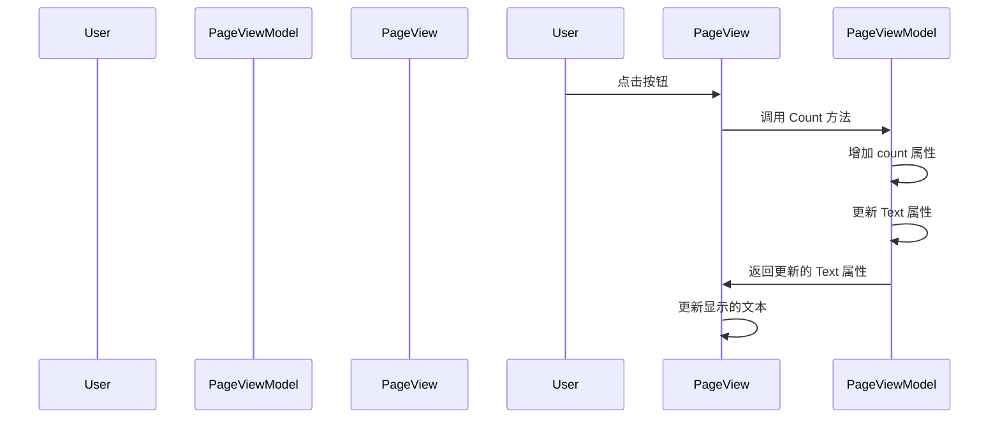

# Chapter 10: 视图模型基类

在上一章 [页面视图模型](09_页面视图模型_.md) 中，我们学习了如何创建和配置页面视图模型，管理和控制页面的数据和用户交互。现在，我们将深入了解视图模型基类（`ViewModelBase`），了解它是如何为所有视图模型提供公共功能的。

## 什么是视图模型基类？

视图模型基类是所有视图模型的基类，类似于所有房子的根基，提供基本属性和方法。通过视图模型基类，我们可以在所有视图模型中重用公共功能，例如属性的可观察性、命令的绑定等。

### 示例

假设我们有一个简单的日历应用程序，包含一个主窗口（`MainWindow`）和两个页面（`Page1` 和 `Page2`）。每个页面都有自己的内容和功能，例如 `Page1` 可能显示当前日期，而 `Page2` 可能显示事件列表。视图模型基类可以帮助我们在所有页面的视图模型中重用公共的功能，例如属性的更新和命令的绑定。

## 视图模型基类的实现

让我们一步一步地创建视图模型基类，了解如何在应用程序中使用它。

### 步骤 1: 定义 `ViewModelBase` 类

首先，我们需要定义一个 `ViewModelBase` 类，该类继承自 `ObservableObject`。`ViewModelBase` 类提供了一些基本属性和方法，以便在所有视图模型中重用。

#### 文件: AvaloniaWithDependencyInjection/ViewModels/ViewModelBase.cs

```csharp
using CommunityToolkit.Mvvm.ComponentModel;

namespace AvaloniaWithDependencyInjection.ViewModels
{
    public class ViewModelBase : ObservableObject
    {
    }
}
```

### 代码解释

1. **命名空间和类声明**:
    ```csharp
    using CommunityToolkit.Mvvm.ComponentModel;

    namespace AvaloniaWithDependencyInjection.ViewModels
    {
        public class ViewModelBase : ObservableObject
    ```
    这里我们定义了一个命名空间 `AvaloniaWithDependencyInjection.ViewModels`，并在其中创建了一个 `ViewModelBase` 类。`ViewModelBase` 类继承自 `ObservableObject`，这是一个基类，提供了一些帮助管理属性和命令的方法。

2. **基类功能**:
    - `ObservableObject` 类提供了一些基本功能，例如属性的可观察性，可以通过 `[ObservableProperty]` 属性标签实现。

### 步骤 2: 在视图模型中使用 `ViewModelBase`

接下来，我们需要在页面视图模型中使用 `ViewModelBase` 类。

#### 文件: AvaloniaWithDependencyInjection/ViewModels/Page1ViewModel.cs

```csharp
using CommunityToolkit.Mvvm.ComponentModel;
using CommunityToolkit.Mvvm.Input;

namespace AvaloniaWithDependencyInjection.ViewModels
{
    public partial class Page1ViewModel : ViewModelBase
    {
        [ObservableProperty]
        private int count;

        [ObservableProperty]
        private string text;

        public Page1ViewModel()
        {
            Text = "你还没点击";
        }

        [RelayCommand]
        private void Count()
        {
            count++;
            Text = $"你点击了 {count} 次";
        }
    }
}
```

### 代码解释

1. **继承 `ViewModelBase`**:
    ```csharp
    public partial class Page1ViewModel : ViewModelBase
    ```
    `Page1ViewModel` 类继承自 `ViewModelBase`，可以使用 `ViewModelBase` 提供的所有功能。

2. **数据属性**:
    ```csharp
    [ObservableProperty]
    private int count;

    [ObservableProperty]
    private string text;
    ```
    - `count` 属性用于存储点击次数。
    - `text` 属性用于存储显示的文本。使用 `[ObservableProperty]` 属性标签使这些属性在更新时自动通知界面。

3. **构造函数**:
    ```csharp
    public Page1ViewModel()
    {
        Text = "你还没点击";
    }
    ```
    - 构造函数初始化 `Text` 属性。

4. **命令**:
    ```csharp
    [RelayCommand]
    private void Count()
    {
        count++;
        Text = $"你点击了 {count} 次";
    }
    ```
    - `Count` 方法用于增加 `count` 属性的值，并更新 `text` 属性。

### 内部实现

#### 视图模型基类的工作流程

当视图模型基类被调用时，会发生以下步骤：

1. **初始化属性**:
    - 构造函数初始化视图模型的属性。
2. **处理用户交互**:
    - 用户点击按钮时，调用命令方法。
3. **更新属性**:
    - 命令方法更新数据属性。
4. **通知界面**:
    - 通过 `ObservableObject` 类提供的功能，自动通知界面更新显示的内容。

#### 简单序列图

下面是视图模型基类工作时的序列图，展示了各个组件之间的交互。



### 代码块解释

#### 视图模型基类

```csharp
using CommunityToolkit.Mvvm.ComponentModel;

namespace AvaloniaWithDependencyInjection.ViewModels
{
    public class ViewModelBase : ObservableObject
    {
    }
}
```
这段代码定义了 `ViewModelBase` 类，提供了一些基本属性和方法，以便在所有视图模型中重用。

#### 页面视图模型

```csharp
using CommunityToolkit.Mvvm.ComponentModel;
using CommunityToolkit.Mvvm.Input;

namespace AvaloniaWithDependencyInjection.ViewModels
{
    public partial class Page1ViewModel : ViewModelBase
    {
        [ObservableProperty]
        private int count;

        [ObservableProperty]
        private string text;

        public Page1ViewModel()
        {
            Text = "你还没点击";
        }

        [RelayCommand]
        private void Count()
        {
            count++;
            Text = $"你点击了 {count} 次";
        }
    }
}
```
这段代码定义了 `Page1ViewModel` 类，管理 `Page1View` 页面的数据和用户交互。

### 总结

通过这一章，我们学习了如何创建和配置视图模型基类（`ViewModelBase`），了解了视图模型基类如何为所有视图模型提供公共功能，如属性的可观察性和命令的绑定。我们定义了 `ViewModelBase` 类，并在页面视图模型中使用了它。

接下来，我们将学习 [安全性处理](11_安全性处理.md)，了解如何在应用程序中处理安全性问题。希望这一章对你有所帮助，祝你编程愉快！

[安全性处理](11_安全性处理.md)

---

Generated by [AI Codebase Knowledge Builder](https://github.com/The-Pocket/Tutorial-Codebase-Knowledge)