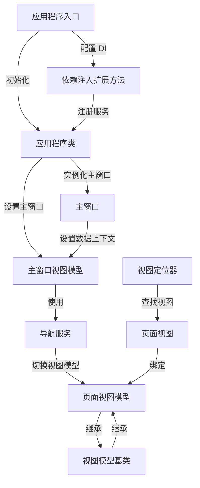

# Tutorial: Avalonia_With_Dependency_Injection_Example

本项目 **Avalonia_With_Dependency_Injection_Example** 展示了如何使用 *依赖注入*（Dependency Injection, DI）技术来构建一个 Avalonia 应用程序。它通过将视图、视图模型和服务的实例化过程委托给 DI 容器，简化了组件间的依赖管理和实例化，从而提高了代码的可维护性和可测试性。应用程序的核心功能包括 **导航服务** 的实现，让页面之间可以无缝切换，以及通过 **视图定位器** 动态查找和关联视图和视图模型。

**Source Repository:** [https://github.com/Ming-jiayou/Avalonia_With_Dependency_Injection_Example](https://github.com/Ming-jiayou/Avalonia_With_Dependency_Injection_Example)

## Chapters

1. [应用程序入口
](01_应用程序入口_.md)
2. [应用程序类
](02_应用程序类_.md)
3. [依赖注入扩展方法
](03_依赖注入扩展方法_.md)
4. [主窗口
](04_主窗口_.md)
5. [主窗口视图模型
](05_主窗口视图模型_.md)
6. [视图定位器
](06_视图定位器_.md)
7. [导航服务
](07_导航服务_.md)
8. [页面视图
](08_页面视图_.md)
9. [页面视图模型
](09_页面视图模型_.md)
10. [视图模型基类
](10_视图模型基类_.md)

---

Generated by [AI Codebase Knowledge Builder](https://github.com/The-Pocket/Tutorial-Codebase-Knowledge)