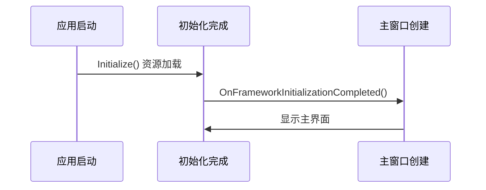

# Chapter 1: 应用程序生命周期管理


想象你的应用是一位可爱的电子宠物 🐱。从按下开机键的那一刻开始，它需要经历：唤醒(初始化)→玩耍(运行)→睡觉(关闭)。这就是**应用程序生命周期管理**要负责的完整流程！

## 为什么需要生命周期管理？

就像建造房子需要监理一样，我们需要一个"管家"来确保：

1. **启动时**：正确加载所有资源(XAML/配置)
2. **运行时**：创建主窗口并准备数据
3. **退出时**：安全保存状态和清理

观察下面这个最简单的例子：

```csharp
public override void Initialize()
{
    // 这里像准备食材的阶段
    AvaloniaXamlLoader.Load(this); // 加载XAML界面配方
}
```

> 💡 类比：就像做菜前要先备齐食材，这里加载了所有界面设计(XAML文件)

## 关键生命阶段解析



### 1. 初始化阶段
```csharp
public override void Initialize()
{
    AvaloniaXamlLoader.Load(this); // 加载所有XAML界面
    base.Initialize(); // 调用父类初始化
}
```
- `AvaloniaXamlLoader`：就像拆开乐高包装，把零件都倒出来
- 这个方法必须最先调用！

### 2. 框架就绪阶段
当基础框架准备好后：

```csharp
public override void OnFrameworkInitializationCompleted()
{
    if (ApplicationLifetime is IClassicDesktopStyleApplicationLifetime desktop)
    {
        desktop.MainWindow = new MainWindow(); // 创建主窗口
    }
    base.OnFrameworkInitializationCompleted(); // 重要！
}
```

> ⚠️ 注意：`base.OnFrameworkInitializationCompleted()` 必须调用，就像做完菜要关煤气一样重要！

## 依赖注入版本对比

传统方式直接`new`对象：
```csharp
desktop.MainWindow = new MainWindow() {
    DataContext = new MainWindowViewModel() // 直接创建实例
};
```

使用[依赖注入容器](02_依赖注入容器_.md)的更优雅方式：
```csharp
var mainWindow = Program.ServiceProvider?.GetRequiredService<MainWindow>();
var mainViewModel = Program.ServiceProvider?.GetRequiredService<MainWindowViewModel>();
mainWindow.DataContext = mainViewModel;
```

优势：
- 对象创建交给专业容器管理
- 方便进行单元测试
- 自动解决依赖关系

## 实战小技巧

关闭默认数据验证（防止冲突）：
```csharp
private void DisableAvaloniaDataAnnotationValidation()
{
    // 移除内置的数据注解验证
    var pluginsToRemove = BindingPlugins.DataValidators
        .OfType<DataAnnotationsValidationPlugin>()
        .ToArray();
    
    foreach (var plugin in pluginsToRemove)
    {
        BindingPlugins.DataValidators.Remove(plugin);
    }
}
```
> 🔧 作用：当我们使用[页面视图模型基类](06_页面视图模型基类_.md)时避免验证冲突

## 总结

今天我们学会了：
- 应用生命周期的三大阶段 📈
- 初始化资源的正确方式 🧰
- 主窗口创建的最佳实践 🖼️
- 验证冲突的解决方法 ⚔️

接下来我们要认识应用背后的魔力师：[依赖注入容器](02_依赖注入容器_.md)，它会帮我们自动管理所有对象的生产线！

---

Generated by [AI Codebase Knowledge Builder](https://github.com/The-Pocket/Tutorial-Codebase-Knowledge)