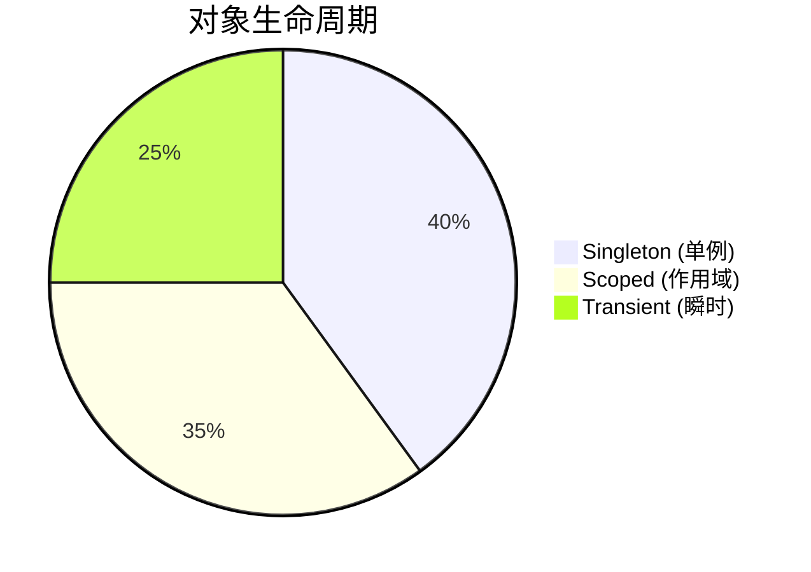
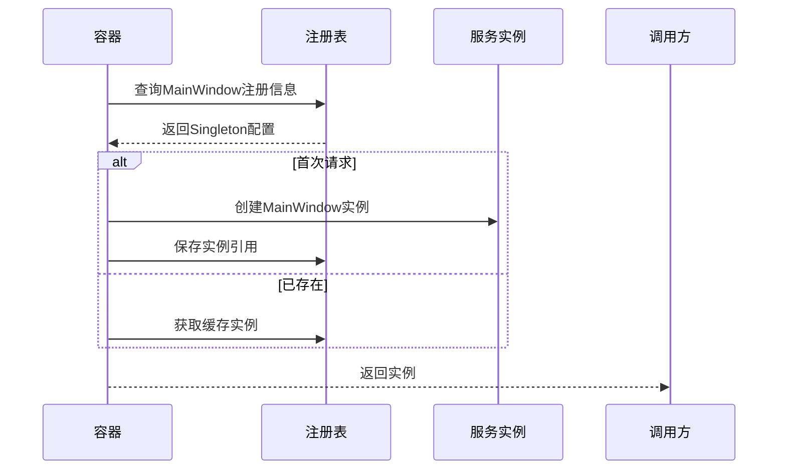

# Chapter 2: 依赖注入容器

还记得上章学习[应用程序生命周期管理](01_应用程序生命周期管理_.md)时，我们像拼积木一样手动组装各个组件吗？🧱 现在请想象有个魔法工具箱，能自动为你找到最合适的零件并组装成型——这就是**依赖注入容器**的神奇之处！

## 餐厅后厨的智慧 🍳

假设你是一家餐厅的老板：

| 传统方式 | 依赖注入方式 |
|---------|-------------|
| 每次有订单时：<br>1. 亲自去市场买食材<br>2. 现切现炒<br>3. 手动摆盘 | 只需：<br>1. 告诉后厨"我要番茄炒蛋"<br>2. 管家自动：<br> - 从仓库取鸡蛋<br> - 调用炒菜师傅<br> - 用青花瓷盘装盘 |

```csharp
// 传统方式：手动创建所有依赖
var chef = new Chef(); 
var waiter = new Waiter(chef); 
var restaurant = new Restaurant(waiter);

// 依赖注入方式：只需声明需求
public Restaurant(IWaiter waiter) { ... }
```

## 容器的三大超能力 ✨

### 1. 自动装配
就像智能冰箱能自动补货：
```csharp
services.AddSingleton<IFridge, SmartFridge>();
// 之后所有需要IFridge的地方都会自动获得SmartFridge
```

### 2. 生命周期管理
三种常用"保鲜模式"：



### 3. 依赖解析
自动解决"先有鸡还是先有蛋"的问题：
```csharp
// 容器会自动按正确顺序创建：
// Logger → Database → UserService
services.AddTransient<IUserService>(sp => 
    new UserService(
        sp.GetRequiredService<Database>(),
        sp.GetRequiredService<ILogger>())
);
```

## 实战：注册Avalonia服务 🛠️

观察项目中的注册代码：
```csharp
// Program.cs
var services = new ServiceCollection();
services.AddViews()    // 注册所有界面
       .AddViewModels() // 注册所有ViewModel
       .AddServices();  // 注册服务
```

服务扩展类的实现：
```csharp
// ServiceCollectionExtensions.cs
public static IServiceCollection AddViews(this IServiceCollection services)
{
    services.AddSingleton<MainWindow>(); // 主窗口单例
    services.AddSingleton<Page1View>();  // 页面1
    return services;
}
```

> 💡 小贴士：窗口类通常注册为单例(Singleton)，因为一个应用通常只需要一个主窗口实例

## 内部机制揭秘 🔍

当调用`GetRequiredService`时：



## 核心价值总结 💎

1. **解耦神器**：各个组件不再相互纠缠
2. **测试友好**：轻松替换模拟对象
3. **可维护性**：修改实现不影响使用者

## 下章预告 🚀

现在我们已经装备了智能管家([依赖注入容器](02_依赖注入容器_.md))，接下来要认识第一位重要角色：[主窗口视图模型](03_主窗口视图模型_.md)——它就像餐厅的店长，负责协调所有业务逻辑！

---

Generated by [AI Codebase Knowledge Builder](https://github.com/The-Pocket/Tutorial-Codebase-Knowledge)